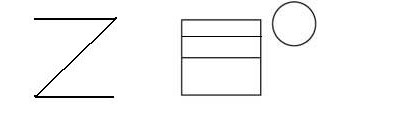
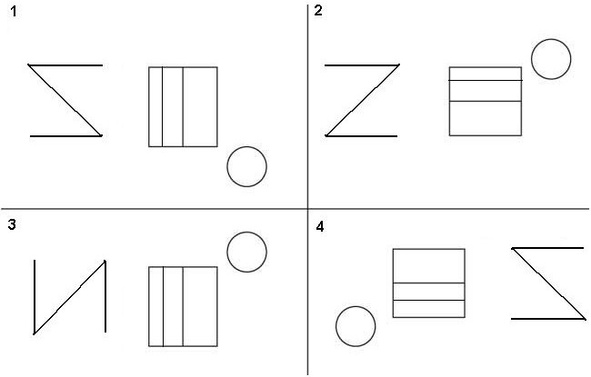

Om leermoeilijkheden bij kinderen te identificeren, kan het **visueel geheugen** onderzocht worden via de <a href="https://en.wikipedia.org/wiki/Benton_Visual_Retention_Test" target="_blank">Benton Visual Retention Test</a> (BVRT). Er zijn verschillende varianten van deze test, maar één variant werkt als volgt. Het kind krijgt tien afbeeldingen gelijkaardig aan onderstaande gedurende tien seconden te zien. 

{:data-caption="Een voorbeeldkaart uit de BVRT methode M." width="399px"}

Daarna moet hij/zij deze afbeelding trachten te selecteren uit vier mogelijkheden.
{:data-caption="Voorbeeldoplossingen uit de BVRT methode M." width="650px"}

De onderzoeker telt vervolgens het aantal correcte antwoorden. Deze score vormt de basis voor statistische analyses die kunnen onthullen welke kinderen leermoeilijkheden hebben.

## Gegeven

Uit grootschalig onderzoek bepaalde men de volgende kansverdeling voor de score $$X$$ uit de Benton Visual Retention Test.

| score $$x_i$$ | kans $$\mathcal{P}(X = x_i)$$| 
|:--:|:-------:|
| 0  | 0.00013 |
| 1  | 0.00158 |
| 2  | 0.01094 |
| 3  | 0.04328 |
| 4  | 0.11205 |
| 5  | 0.20140 |
| 6  | 0.24922 |
| 7  | 0.21341 |
| 8  | 0.12184 |
| 9  | 0.04003 |
| 10 | 0.00612 |
{:class="table table-striped table-condensed" style="width:auto;margin-left:auto;margin-right:auto;"}

## Gevraagd

Maak twee vectoren `scores` en `kansen` die de corresponderende waarden bevatten.

Maak een staafdiagram van deze kansverdeling. Geef de horizontale as het label `Score` en de vertical as `Kans`.