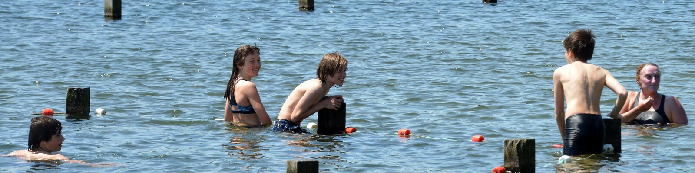

Elke week wordt de waterkwaliteit van de Blaarmeersen gecontroleerd. De resultaten vind je terug op <a href="https://kwaliteitzwemwater.be/nl/blaarmeersen/blaarmeersen-zwemsportzone-gent?page=0">deze website</a>.

{:data-caption="Een foto van de Blaarmeersen door stad Gent." width="55%"}

Bij zwemvijvers controleert men de waterstalen op de aanwezigheid van *intestinale enterokokken* en de *E. coli* bacterieen. Van deze stalen worden via een petrischaal het <a href="https://nl.wikipedia.org/wiki/Kiemgetal" target="_blank">**kiemgetal**</a> in CFU per 100 ml bepaald. Dit kiemgetal wordt weergeven op de bovenstaande website.

## De waterkwaliteit 'ophalen'

Onderaan vind je de (lastige) code om de gegevens uit de website te extraheren. De details van die code zijn niet belangrijk. Een **voorsmaakje** van de dataset via `head(data)` resulteert in:

```
       datum kwaliteit enterococcus e_coli temp
1 12-09-2023 Zeer goed           15     61 23.4
2 04-09-2023 Zeer goed           15     30 21.4
3 29-08-2023 Zeer goed           30     15 19.9
4 21-08-2023 Zeer goed           15     15 22.9
5 14-08-2023 Zeer goed           15     15 23.7
6 07-08-2023 Zeer goed           15     15 19.1
```

## Gegeven

Gebruik deze dataset (met de bijbehorende vectoren) om de volgende vragen te beantwoorden.

## Gevraagd

- Maak een variabele `vrije_plaatsen` waarin je voor elke parking uitrekent hoeveel plaatsen er nog vrij zijn. Gebruik de functie `floor()` om het aantal vrije plaatsen **naar beneden af te ronden**. Indien er uit je berekening volgt dat er `77.52` plaatsen vrij zijn, betekent dit dat er eigenlijk slechts `77` plaatsen vrij zijn.

- Maak een variabele `veel_plaats` die bestaat uit een vector met **booleaanse waarden** van de parkings waar nog minstens 75% van de plaatsen vrij zijn.

- **Selecteer** nu de parkings waar veel plaats is en sla dit op in de variabele `parking_met_veel_plaats`.