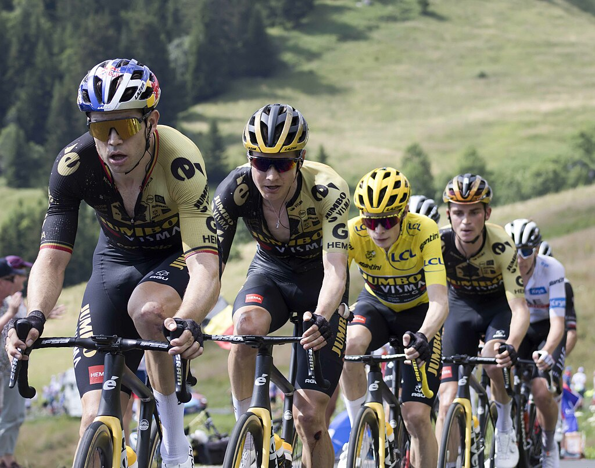

De <a href="https://nl.wikipedia.org/wiki/Ronde_van_Frankrijk" target="_blank">Tour de France</a> is een jaarlijkse wielerwedstrijd die hoofdzakelijk door Frankrijk voert. De ronde van Frankrijk bestaat als sinds 1903 en ging bijna onafgebroken door.

{:data-caption="De kopmannen van het team Jumbo-Visma in de Tour van 2023." width="45%"}

## Gegeven

In deze <a href="https://github.com/rfordatascience/tidytuesday/blob/master/data/2020/2020-04-07/tdf_winners.csv" target="_blank">dataset</a> vind je heel wat gegevens over de voorbije winnaars van de Tour tot 2019.

Deze gegevens kan je importeren in R via:

```R
# Gegevens ophalen en enkele manipulaties
data <- read.csv("https://raw.githubusercontent.com/rfordatascience/tidytuesday/master/data/2020/2020-04-07/tdf_winners.csv",
                 header = TRUE,
                 colClasses = c("NULL", rep("character", 2), "NULL", rep("numeric", 8), rep("NULL", 7)) )
data <- na.omit(data)
colnames(data)[1:2] <- c("year", "winner")
data$year <- substr(data$year, 1, 4)
rownames(data) <- seq_len(nrow(data))
```

Een **voorsmaakje** van de dataframe via `tail(data)` resulteert in:

```
   year          winner distance time_overall time_margin stage_wins stages_led height weight age
60 2014 Vincenzo Nibali   3660.5     89.98500  0.11861111          4         19   1.80     65  29
61 2015    Chris Froome   3360.3     84.77056  0.01694444          1         16   1.86     69  30
62 2016    Chris Froome   3529.0     89.08000  0.06777778          2         14   1.86     69  31
63 2017    Chris Froome   3540.0     86.34861  0.01500000          0         15   1.86     69  32
64 2018  Geraint Thomas   3349.0     83.28694  0.01694444          2         11   1.83     71  32
65 2019     Egan Bernal   3349.0     82.95000  0.01694444          0          2   1.75     60  22
```

Zoals je merkt bestaat de dataset uit heel wat vectoren, **tien om exact** te zijn. Er werden wat edities uit de gegevens verwijderd doordat er informatie verloren is gegaan doorheen de jaren, maar daar moet je je geen zorgen over maken.

## Gevraagd

- Bereken de gemiddelde snelheid van elke winnaar, sla dit resultaat op in de vector `avg_speed` en **rond af op 2 cijfers**.

- De vector `data$time_margin` stelt het tijdsverschil (in uren) voor die de gele trui behaalde op de tweede plaats. Reken dit om naar minuten en bewaar dit in de vector `marge_minuten`. Rond opnieuw af **op 2 cijfers**.

- In welke jaren was het echt spannend en was het tijdverschil tussen de winnaar en de zilveren medaille **minder dan** één minuut. Sla dit op in de vector `spannende_jaren`. Sla de bijbehorende tijdsmarge op in de vector `spannende_marge_seconden`, waarbij je deze tijdsmarge omrekent naar seconden.

- Zijn er renners die meer ritten gewonnen hebben (`data$stage_wins`) dan dat ze in het geel (`data$stages_led`) reden? Sla dit op in de vector `speciale_winnaars`.

- Amerika wordt in de dataset verschillende keer vertegenwoordigd. **Selecteer** de jaren waarop er een Amerikaan won in de vector `jaren_amerika`. De Amerikaanse winnaars waren <a href="https://nl.wikipedia.org/wiki/Greg_LeMond" target="_blank">Greg LeMond</a> en <a href="https://nl.wikipedia.org/wiki/Lance_Armstrong" target="_blank">Lance Armstrong</a>. 

{: .callout.callout-info}
>#### Tip
>
> Gelijkheid controleren doe je via `==`. Noteer dus `data$winner == "Lance Armstrong"`.


{: .callout.callout-secondary}
>#### Als achtergrondinformatie
>
> Lance Armstrong verloor zijn titels echter in 2013 nadat hij toegaf <a href="https://nl.wikipedia.org/wiki/Lance_Armstrong#Doping" target="_blank">doping</a> te hebben gebruikt.