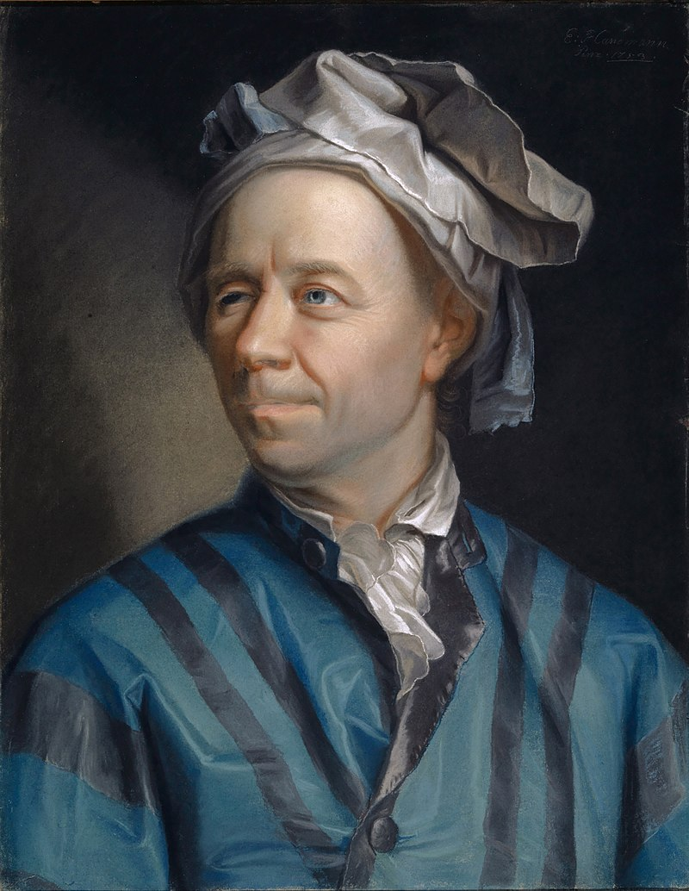

Het was wiskundige genie <a href="https://en.wikipedia.org/wiki/Leonhard_Euler" target="_blank">Leonard Euler</a> die in 1734 het beroemde Bazel-probleem oplostte.

Dit probleem behandelde de oneindige som van inverse kwadraten, namelijk:

$$
 \sum_{n=1}^\infty \dfrac{1}{n^2} = \dfrac{1}{1^2} + \dfrac{1}{2^2} + \dfrac{1}{3^2} + \dfrac{1}{4^2} + \ldots = ?
$$

Men wist reeds dat dit convergeerde, maar het was Euler die bewees dat dit enigszins verassend convergeert naar $$\dfrac{\pi^2}{6}$$!

{:data-caption="Leonard Euler, je nieuwe held!" width="35%"}

## Gevraagd

- Maak een vector `rij10` aan met de natuurlijke getallen van 1 tot 10. 

- Bereken daarna $$\displaystyle \sum_{n=1}^{10} \dfrac{1}{n^2}$$ en sla dit getal op in `resultaat10`.

- Herhaal nu met analoge variabelen `rij100`, `rij1000` en `rij10000`. Sla het resultaat van de gelijkaardige sommen analoog op in bijbehorende variabelen.

- Je kan **controleren** of het resultaat inderdaad Eulers vondst benaderde via `pi^2 / 6`.

 
{: .callout.callout-info}
>#### Tips
>
> - Een vector met de natuurlijke van 1 tot 10 kan je gemakkelijk aanmaken via `rij10 <- 1:10`.
> - Dit is geen oefening op het rekenkundig gemiddelde, maar je gebruikt **natuurlijk** de `sum()` functie.