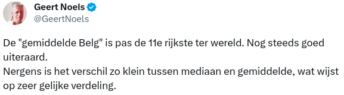

## Helft van de Belgen bezit meer dan 230.000 euro en daarmee zijn we het rijkste volk ter wereld

Volgens <a href="https://www.vrt.be/vrtnws/nl/2023/08/16/belgen-zijn-de-rijksten-ter-wereld-helft-van-volwassenen-heeft/">dit artikel</a> van VRT.NWS
Voor het eerst in de geschiedenis zijn de Belgen, met een **mediaanvermogen van zo’n 228 594 euro**, het rijkste volk ter wereld. Dat blijkt uit het jaarlijkse Global Wealth rapport van de bank Credit Suisse, nu opgegaan in UBS. 

Volgens econoom Geert Noels ligt het **gemiddeld vermogen** ligt dichtbij het **mediaanvermogen**. Dat feit getuigt, volgens hem, van een vrij **gelijke verdeling van het vermogen in de samenleving en de herverdelende kracht van onze welvaartsstaat.**

{:data-caption="Geert Noels op X." width="577px"}

Rector van de UGent, Rik Van de Walle, is het **niet eens met die hypothese** en maakt dat ook kenbaar via X, voorheen Twitter. 

## Gevraagd
Gegeven wat je kent over het gemiddelde en de mediaan, maak een schema en argumenteer volgende twee casussen: 

* Hoe ziet de verdeling van de dataset eruit indien econoom Geert Noels gelijk heeft?
* Hoe ziet de verdeling van de dataset eruit indien rector Rik Van de Walle gelijk heeft? 