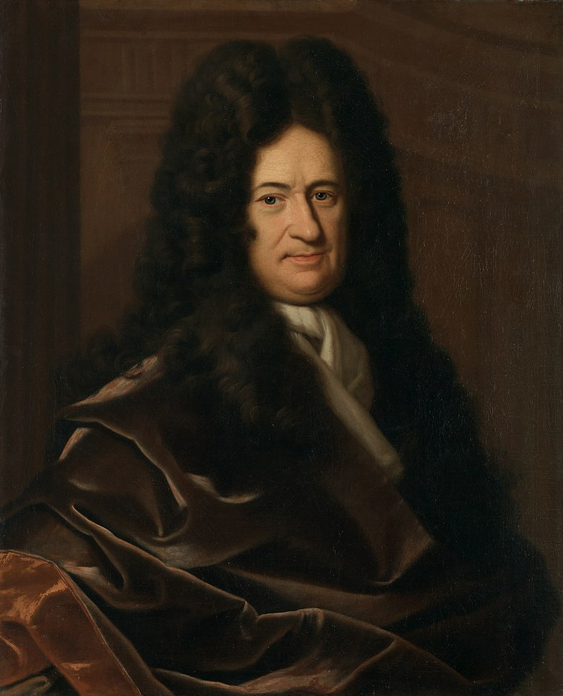

De Leibniz formule is een alternerende benadering voor het getal $$\pi$$, gevonden door <a href="https://nl.wikipedia.org/wiki/Gottfried_Wilhelm_Leibniz" target="_blank">Gottfried Wilhelm Leibniz</a>. Leibniz was één van de grootste denkers uit de 17e eeuw.

Hij kon in 1673 aantonen dat de oneindige som

$$
  1 -\dfrac{1}{3} + \dfrac{1}{5} - \dfrac{1}{7}+\dfrac{1}{9}-\ldots = ?
$$

convergeert naar $$\dfrac{\pi}{4}$$!

{:data-caption="Gottfried Wilhelm Leibniz, schilderij door Christoph Bernhard Francke." width="33%"}

## Gevraagd

Maak een functie `leibniz(aantal)` waarbij `aantal` het aantal termen in de som voorstelt. Zo geldt dat `leibniz(2)` overeenkomt met $$1-\dfrac{1}{3} = 0,66\ldots$$.

- Laat R het resultaat van de som afronden op **6 cijfers na de komma**.

- Je kan **controleren** of het resultaat inderdaad $$\dfrac{\pi}{4}$$ benadert. Probeer bijvoorbeeld `leibniz(10000)` uit te rekenen en controleer of dit ongeveer gelijk is aan `pi / 4`.


 #### Voorbeelden

De eerste `10` termen van de som optellen resulteert in:

 ```R
> leibniz(10)
0.76046
 ```

 De eerste `100` termen van de som optellen resulteert in:

 ```R
> leibniz(100)
0.782898
 ```
 
{: .callout.callout-info}
>#### Tips
>
> - Oneven getallen maak je met de formule `2 * n - 1`.
> - Het alternateren kan je gemakkelijk regelen via `(-1)^(1:n)`. Indien de exponent even is, is dit `1`, anders is dit `-1`.