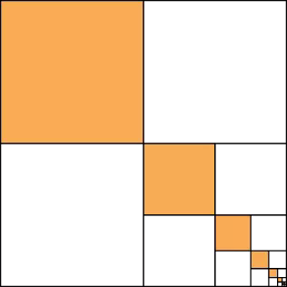

<div class="text-end">
    <a class="btn btn-filled with-icon" href="https://dodona.be/nl/courses/2690" target="_blank"><i class="mdi mdi-backburger mdi-24" title="link"></i>Link naar de vorige oefeningen</a>
</div>

<div class="text-end" style="margin-top:15px">
    <a class="btn btn-filled with-icon" href="https://webr.r-wasm.org/latest/" target="_blank"><i class="mdi mdi-cloud-tags mdi-24" title="link"></i>Link naar WebR</a>
</div>

Onderstaande reeks is één van de eerste oneindige reeksen die bepaald werd in de geschiedenis van de wiskunde. De Griekse wiskundige Archimedes bepaalde de som hiervan reeds in 200 voor Christus.

$$
\dfrac{1}{3} = \sum_{n=1}^\infty \dfrac{1}{4^n}
$$

Er bestaat een *ontroerend* mooi meetkundig argument voor deze reekssom. In onderstaand vierkant stelt het oranje deel deze oneindige som voor, eerst één vierde, daarna één zestiende, enz... De groene en blauwe oppervlaktes werden echter net op dezelfde manier opgebouwd. Alles samen krijg je dus de oppervlakte van het volledige vierkant. Dat betekent dat één gekleurd deel één derde van het volledige vierkant vormt.

{:data-caption="De som van Archimedes" .light-only width="20%"}

{:data-caption="De som van Archimedes" .dark-only width="20%"}

## Gevraagd

Maak een functie `archimedes(aantal)` waarbij `aantal` het aantal termen uit de som voorstelt. Zo geldt dat `archimedes(3)` overeenkomt met 

$$
\sum_{n=1}^3 \dfrac{1}{4^n} = \dfrac{1}{4} + \dfrac{1}{16} + \dfrac{1}{64} \approx 0,328\ldots
$$

- Laat R het resultaat van het product afronden op **9 cijfers na de komma**.

#### Voorbeelden

De eerste `3` termen van de som optellen resulteert in:

 ```R
 > archimedes(3)
0.328125
 ```

 De eerste `10` termen van de som optellen resulteert in:

 ```R
 > archimedes(10)
 0.333333
 ```
