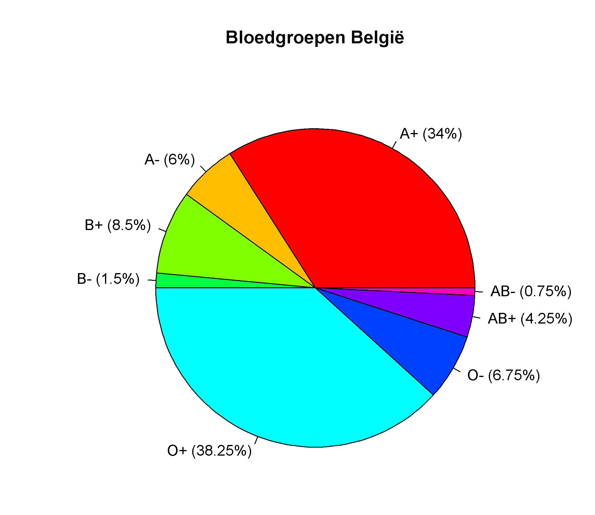
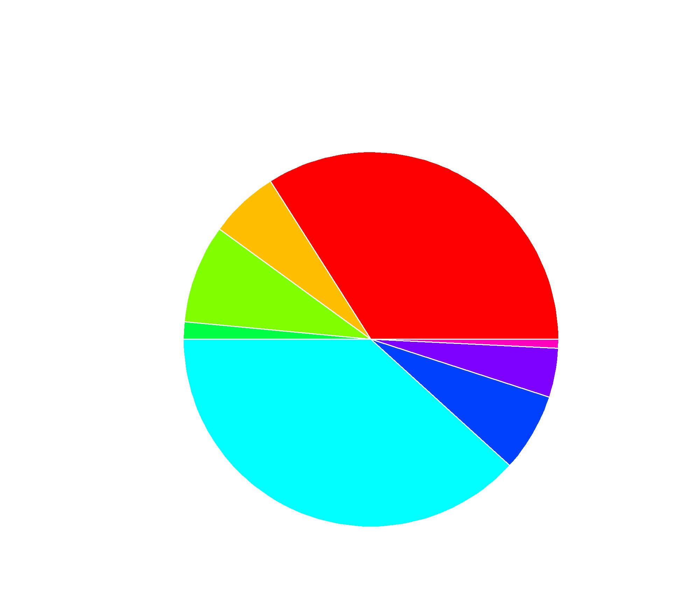

## Gegeven

Er bestaan vier verschillende **bloedgroepen**: A, B, AB of O. Welke bloedgroep jij hebt, wordt bepaald door piepkleine proteïnen (of eiwitten) die zich op het oppervlak van je rode bloedcellen bevinden. Om het verhaal nog iets ingewikkelder te maken, bestaat er nog een tweede indeling van bloedtypes: de **rhesusfactor**. De rhesusfactor is een specifiek eiwit dat je wel of niet op je rode bloedcellen hebt. Heb je dit eiwit, dan ben je rhesus-positief (bv. A+ of O+), zoals ongeveer 85% van alle Europeanen. Heb je dit eiwit níét, dan behoor je tot de kleine groep mensen (15%) die rhesus-negatief is.

{:data-caption="Bloed geven blijft belangrijk." width="40%"}

Het aandeel van elke bloedgroep en rhesusfactor in de Belgische bevolking vinden we in <a href="https://www.libelle.be/gezond/bloedgroep-bloed-geven/" target="_blank">dit artikel</a> terug.

| Bloedgroep    | Rhesusfactor  | Percentage    |
|:-------------:|:-------------:|:-------------:|
| A             | +             | 34%           |
| A             | -             | 6%            |
| B             | +             | 8,5%          | 
| B             | -             | 1,5%          |
| O             | +             | 38,25%        |
| O             | -             | 6,75%         |
| AB            | +             | 4,25%         |
| AB            | -             | 0,75%         |
{:class="table table-striped table-condensed" style="width:auto;margin-left:auto;margin-right:auto;"}

## Gevraagd

Maak onderstaand schijfdiagram van deze gegevens. Je merkt dat de labels een samenvoegsels zijn van de vector `type` en `percentage`. Dit doe je door in een nieuwe variabele `bloedlabels` de functie `paste0()` te gebruiken als volgt `paste0(type," (", percentage, "%)")`. Deze functie **plakt** de variabelen aan elkaar (zonder een spatie tussen te voegen).

{: .callout.callout-info}
>#### Tip
> Gebruik opnieuw de functie `rainbow()` om de verschillende kleuren automatisch aan te laten maken. 

{:data-caption="Afvalanalyse 2020." .light-only width="480px"}

{:data-caption="Afvalanalyse 2020." .dark-only width="480px"}
