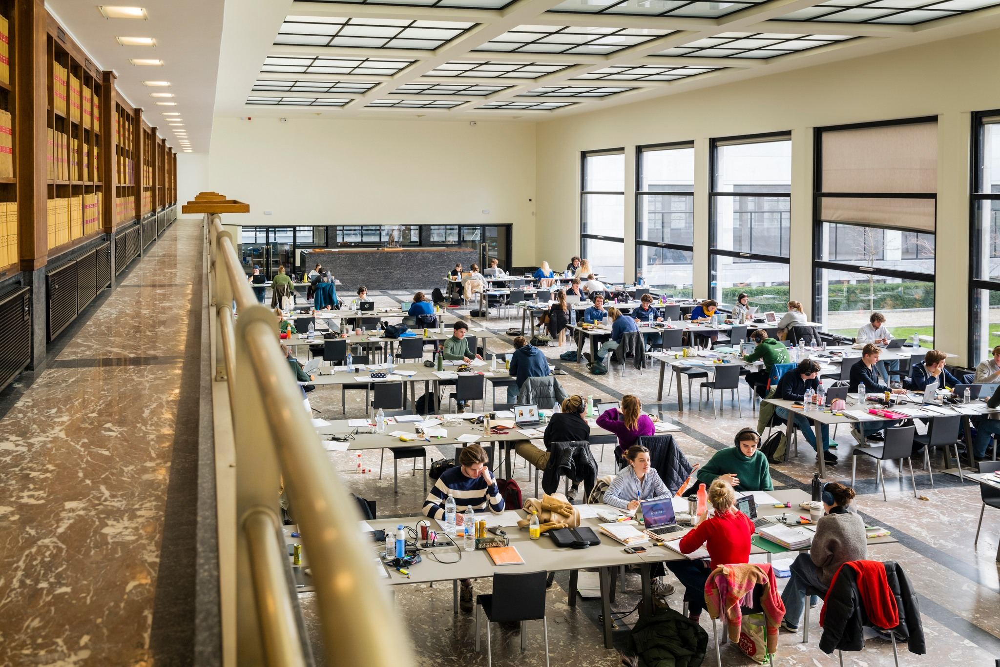
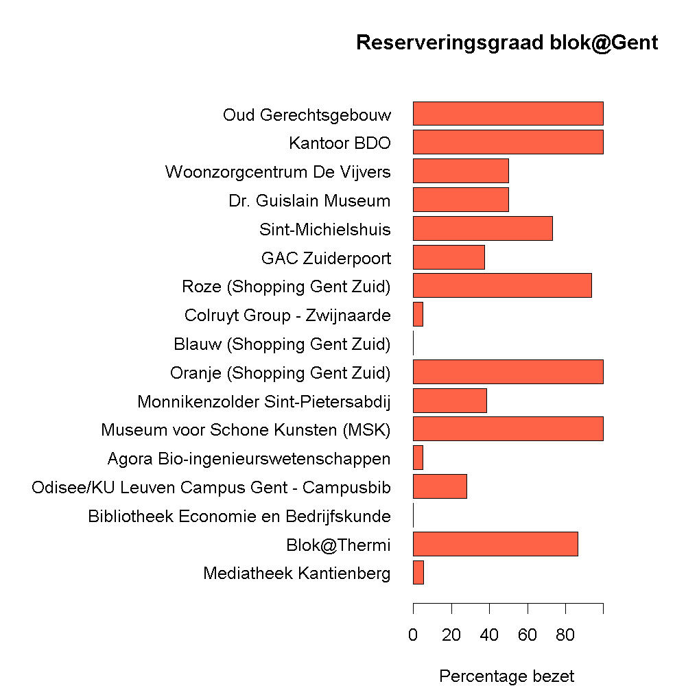
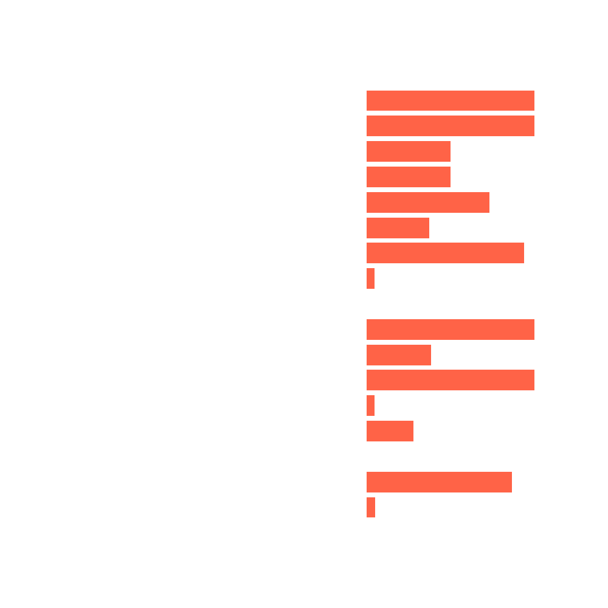

## Gegeven
Elk jaar zijn er heel wat verschillende locaties waar studenten samen kunnen gaan studeren. Sommige studenten blokken beter met mensen om zich heen die ook vlijtig aan het werk zijn.

{:data-caption="Blok in de boekentoren." width="40%"}

Gent geeft op zijn <a href="https://data.stad.gent/explore/dataset/bloklocaties-gent/table/" target="_blank">Open Data portaal</a> een overzicht van het aantal plaatsen en de beschikbaar capaciteit per plaats. De data kan je inlezen via de volgende code.

```R
# Importeert de data van Stad Gent
data <- read.csv2("https://data.stad.gent/api/explore/v2.1/catalog/datasets/bloklocaties-gent/exports/csv",
                  sep = ";",
                  colClasses = c("NULL", "character", rep("NULL", 5), rep("numeric", 2), rep("NULL", 4), "character", rep("NULL", 5)) )
colnames(data) <- c("naam", "capaciteit", "gereserveerd", "status")
data <- data[data$status == "Reserveerbaar" & data$capaciteit != 0, 1:3]
data <- data[order(data$capaciteit, decreasing=TRUE),]
rownames(data) <- seq_len(nrow(data))
```

Hierbij werden enkel de informatie van de bloklocaties waar je dient te reserveren opgehaald. Een voorsmaakje van deze dataframe bepaal je via `head(data)`.

```
                                      naam capaciteit gereserveerd
1                   Mediatheek Kantienberg        205           10
2                              Blok@Thermi        200          172
3    Bibliotheek Economie en Bedrijfskunde        160            0
4 Odisee/KU Leuven Campus Gent - Campusbib         50           14
5        Agora Bio-ingenieurswetenschappen         40            2
6         Museum voor Schone Kunsten (MSK)         40           40
```

## Gevraagd

Maak onderstaand staafdiagram met de reserveringsgraad na, gebruik hiervoor de volgende richtlijnen.

- Maak een vector `reserveringsgraad` aan, waar je het percentage gereserveerde plaatsen berekent. Rond hier af op **1 cijfer na de komma**.
- Maak het staafdiagram, kies zelf een kleur uit dit <a href="http://www.stat.columbia.edu/~tzheng/files/Rcolor.pdf" target="_blank">document</a>. Gebruik enkele extra argumenten om het staafdiagram horizontaal te plaatsen, namelijk `horiz = TRUE` en `las = 1`. Om de linkermarge te vergroten geef je het commando `par(mar = c(4,20,4,4))` in **voordat** je `barplot()` oproept.

{:data-caption="Reserveringsgraad blok@Gent" .light-only width="480px"}

{:data-caption="Reserveringsgraad blok@Gent" .dark-only width="480px"}
