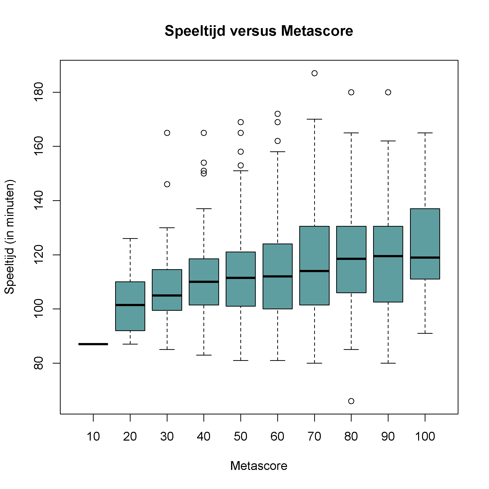

## Gegeven
In de vorige oefening ging je een hoeveelheid filmdata ophalen. Deze kwam uiteindelijk in een dataframe van onderstaande vorm terecht.

```
                    title year runtime rating  votes revenue_millions metascore
1 Guardians of the Galaxy 2014     121    8.1 757074           333.13        76
2              Prometheus 2012     124    7.0 485820           126.46        65
3                   Split 2016     117    7.3 157606           138.12        62
4                    Sing 2016     108    7.2  60545           270.32        59
5           Suicide Squad 2016     123    6.2 393727           325.02        40
6          The Great Wall 2016     103    6.1  56036            45.13        42
```

## Gevraagd

We onderzoeken nu met behulp van een boxplot of *betere* films ook langer zijn?

- Aan elke film werd een **metascore** toegekend. Het is via een vrij eenvoudige berekening mogelijk om deze **af te ronden op een tiental**. Werk hiervoor als volgt. Eerst deel je de metascore door 10, daarna rond je dit resultaat af op een geheel en tot slot vermenigvuldig je opnieuw met 10. Sla dit op in de variabele `metascore_afgerond`.

- Maak nu een boxplot waar je de speeltijd uitzet ten opzichte van deze afgeronde metascore. Kies zelf een kleur en zorg dat de titels overeenkomen met onderstaand voorbeeld.

{:data-caption="Speeltijd versus metascore." .light-only width="480px"}

{:data-caption="Speeltijd versus metascore." .dark-only width="480px"}
