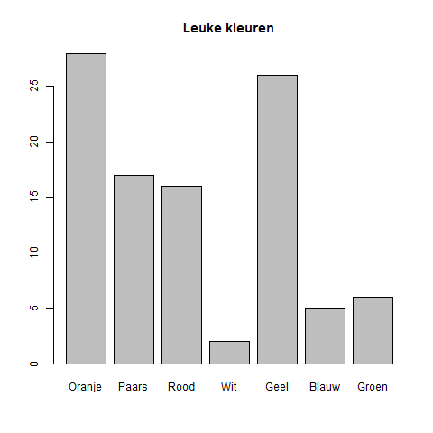
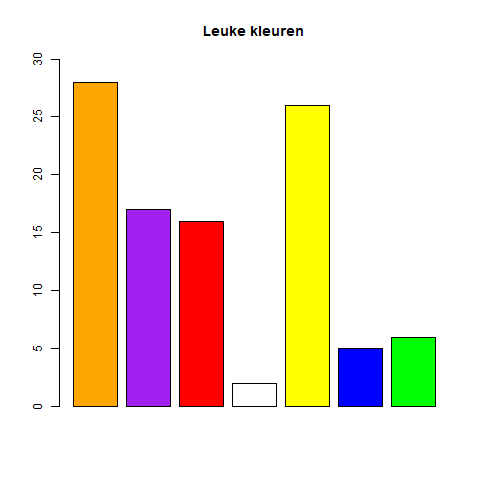
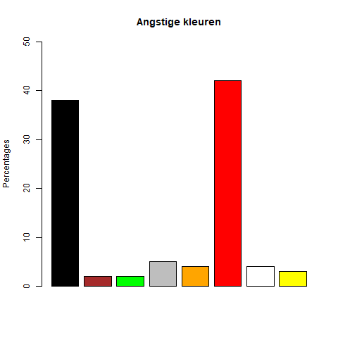

Een staafdiagram is een eenvoudige manier om gegevens te visualiseren. Deze wordt gebruikt bij **kwalitatieve gegevens**, voor kwantitatieve gegevens bestaan er andere grafische weergaven.

In R kan je zeer snel een grafiek maken met behulp van de functie `barplot()`. Dit ziet er meestal als volgt uit:

```R
barplot(gegevens, main = "Grafiektitel", xlab = "x-as", col = "blue", names.arg = xlabels, ylim = c(0,10)) 
```

Hierbij stelt `gegevens` de data voor die voorgesteld moet worden. Dit kunnen bijvoorbeeld aantallen of percentages zijn. `main` vormt de titel van de grafiek, `xlab` de eventuele tekst die op de x-as moet verschijnen (`ylab` bestaat ook), `col` de kleur van de grafiek (of de **vector** van kleuren) en `names.arg` eventueel een vector met de labels van de staven (die op de x-as verschijnen). De laatste parameter `ylim` bepaalt de onder- en bovengrenzen van de y-as, hierbij heeft de y-as een bereik van 0 tot en met 10.

## Kleur en psychologie

Mensen hechten aan kleuren een bepaalde waarde, of associëren met een bepaald gevoel een zekere kleur. Joe Hallock voerde een <a href="https://joehallock.com/edu/COM498/index.html" target="_blanc">onderzoek</a> uit naar welke kleuren mensen toekenden aan bepaalde gevoelens. Uit het onderzoek bleek dat men bij het woord "Leuk" aan deze kleuren dacht:

| Kleur     | Percentage |
|:---------:|:----------:|
| Oranje    | 28%        |
| Paars     | 17%        |
| Rood      | 16%        |
| Wit       | 2%         |
| Geel      | 26%        |
| Blauw     | 5%         |
| Groen     | 6%         |
{:class="table table-striped table-condensed" style="width:auto;margin-left:auto;margin-right:auto;"}

De volgende code levert leidt nu tot onderstaande grafiek.

```R
kleuren <- c("Oranje", "Paars", "Rood", "Wit", "Geel", "Blauw", "Groen")
percentages <- c(28, 17, 16, 2, 26, 5, 6)

barplot(percentages, main = "Leuke kleuren", names.arg = kleuren)
```

{:data-caption="Een staafdiagram" width="480px"}

Iets mooier wordt dit door de kleuren te gebruiken in plaats van de benamingen en de y-as een bereik te geven van 0 tot en met 30.

```R
kleuren <- c("Oranje", "Paars", "Rood", "Wit", "Geel", "Blauw", "Groen")
staaf_kleuren <- c("orange", "purple", "red", "white", "yellow", "blue", "green")
percentages <- c(28, 17, 16, 2, 26, 5, 6)

barplot(percentages, main = "Leuke kleuren", col = staaf_kleuren, ylim = c(0,30))
```

{:data-caption="Een staafdiagram" width="480px"}

## Gegeven
In hetzelfde onderzoek werd nagegaan welke kleuren met associeert met angst. Dit leidde tot onderstaande resultaten.

| Kleur     | Percentage |
|:---------:|:----------:|
| Zwart     | 38%        |
| Bruin     | 2%         |
| Groen     | 2%         |
| Grijs     | 5%         |
| Oranje    | 4%         |
| Rood      | 42%        |
| Wit       | 4%         |
| Geel      | 3%         |
{:class="table table-striped table-condensed" style="width:auto;margin-left:auto;margin-right:auto;"}

## Gevraagd

Vul de gegeven code aan en maak onderstaande grafiek.

{:data-caption="Een staafdiagram" width="480px"}