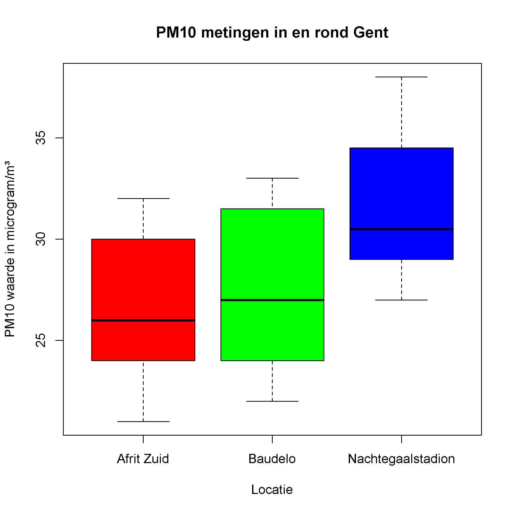

## Gegeven

Op de <a href="https://geo.irceline.be/www/pm10_24hmean_EN.html" target="_blank">website</a> van de Intergewestelijke Cel voor het Leefmilieu (IRCEL) kan men controleren hoe het zit met de luchtkwaliteit. Op verschillende plaatsen in België meet men bijvoorbeeld continu de hoeveelheid <a href="https://www.irceline.be/nl/documentatie/faq/wat-is-fijnstof" target="_blank">PM10 fijnstofdeeltjes</a>. 

{:data-caption="Uitstoot van wagens tijdens de spits." width="40%"}

Je kan de meetgegevens van IRCEL inladen via deze code

```R
# Data inlezen van de Intergewestelijke Cel voor het Leefmilieu
locaties <- c("BETR701" = "Baudelo", "BETR702" = "Afrit Zuid", "BETR710" = "Nachtegaalstadion", "BETR716" = "Bourgoyen")
data <- read.csv2("https://geo.irceline.be/realtime/ows?service=WFS&version=1.3.0&request=GetFeature&typeName=realtime:pm10_24hmean_station&outputFormat=csv",
                  sep=",",
                  colClasses = c("NULL", "character", "NULL", "character", "NULL", "numeric", rep("NULL", 2)) )
data <- data[data$ab_eoi_code %in% c("BETR701", "BETR702", "BETR710", "BETR716"), ]
colnames(data) <- c("locatie", "datum", "waarde")
data$locatie <- locaties[data$locatie]
rownames(data) <- seq_len(nrow(data))
```

In de uiteindelijke dataframe vind je heel wat informatie, via `head(data)` bekomt men bijvoorbeeld als voorsmaakje:

```
            locatie               datum waarde
1           Baudelo 2024-01-14T19:00:00     33
2        Afrit Zuid 2024-01-14T19:00:00     31
3 Nachtegaalstadion 2024-01-14T19:00:00     37
4           Baudelo 2024-01-14T18:00:00     33
5        Afrit Zuid 2024-01-14T18:00:00     31
6 Nachtegaalstadion 2024-01-14T18:00:00     37
```

In de laatste kolom vind je de PM10 waarden, uitgedrukt in µg per m³.

## Gevraagd

Maak nu onderstaande grafiek.

- Bepaal de mediaan van de waarden uit het Baudelopark, sla dit op in de variabele `mediaan_baudelo`.

- Maak onderstaande boxplot na. Hierbij wordt de waarde uitgezet **per locatie**. Kies zelf drie verschillende kleuren naar keuze uit dit <a href="http://www.stat.columbia.edu/~tzheng/files/Rcolor.pdf" target="_blank">document</a>. Komt de mediaan die je berekende overeen met de boxplot van het Baudelopark?

{:data-caption="Luchtkwaliteit in en rondom Gent." .light-only width="480px"}

{:data-caption="Luchtkwaliteit in en rondom Gent." .dark-only width="480px"}