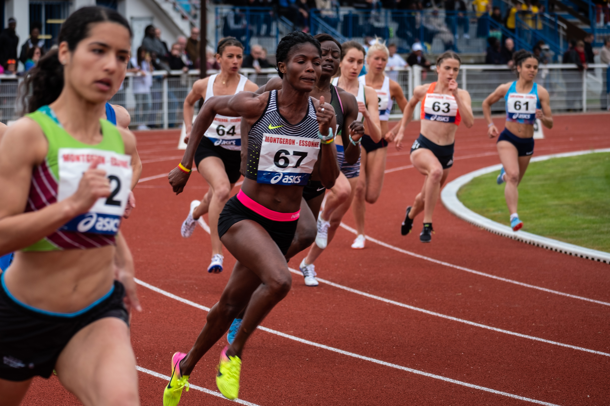
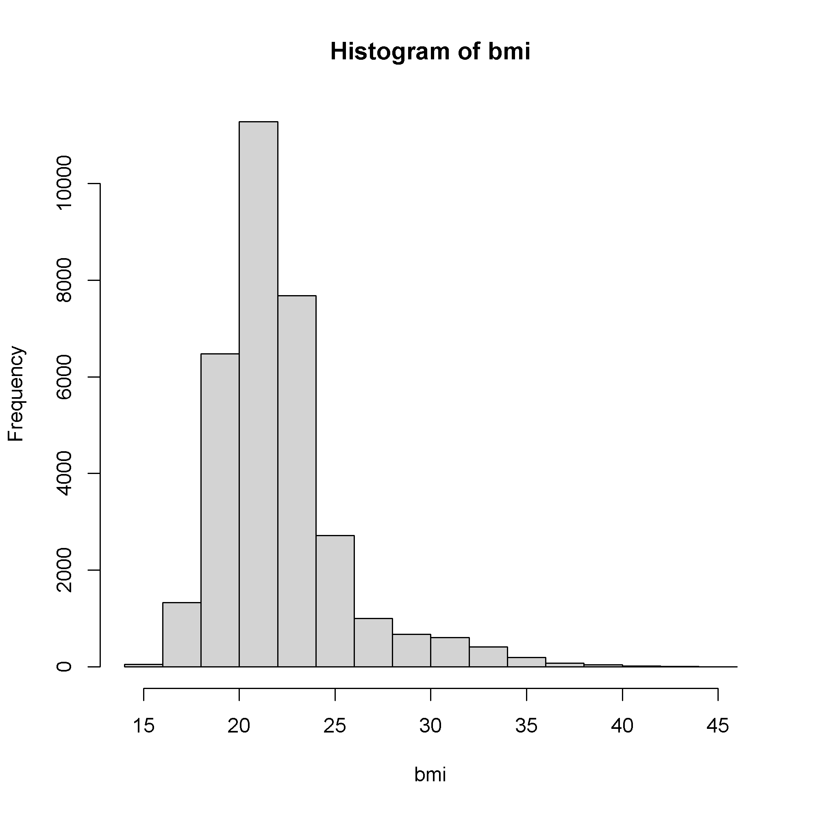
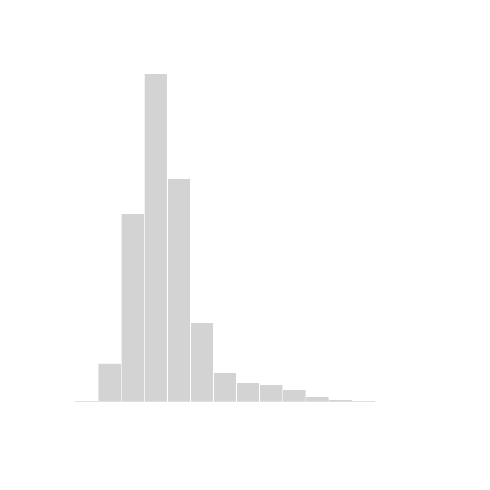
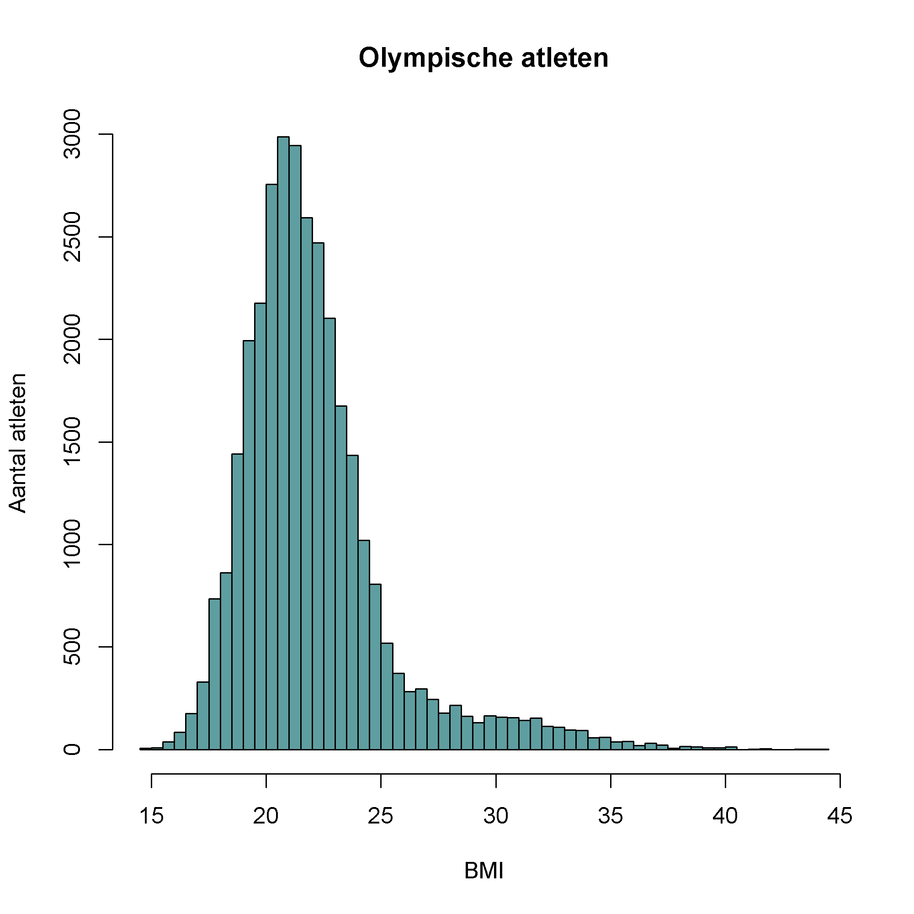
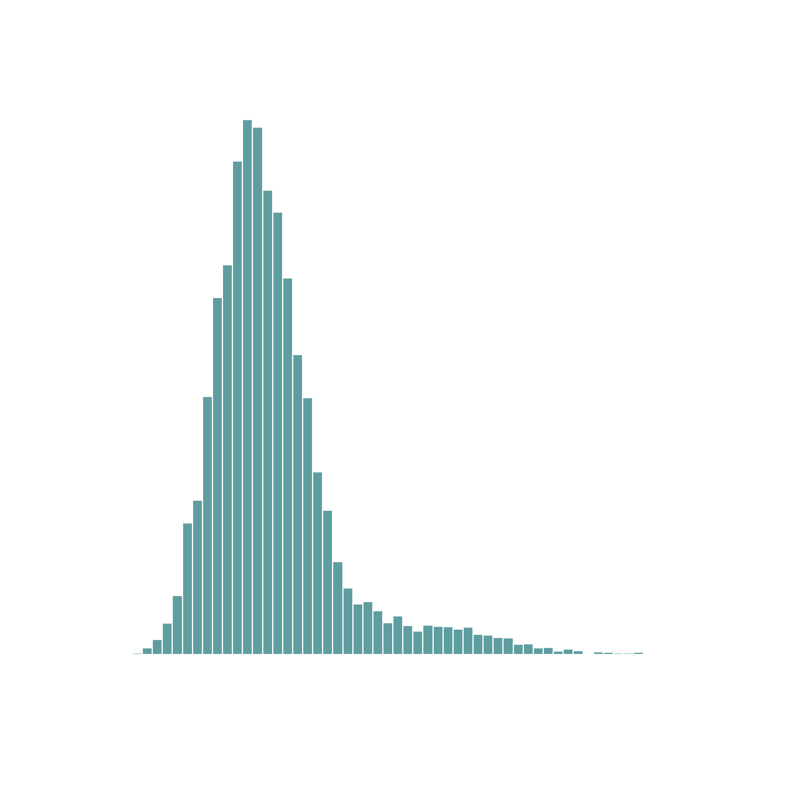

Op de Olympische spelen bestaat de discipline <a href="https://nl.wikipedia.org/wiki/Atletiek" target="_blank">atletiek</a> uit verschillende onderdelen. Denk maar aan de 100 m of de 4 x 100 m estafette, maar ook sporten als hordelopen, hoogspringen, polsstokhoogspringen, verspringen, discuswerpen, kogelstoten enz. 

{:data-caption="Olympische atleten aan het werk op de piste." width="45%"}

Hoe zit het met de *verdeling* van <a href="https://www.gezondleven.be/themas/voeding/obesitas-en-overgewicht/body-mass-index-bmi" target="_blank">het BMI</a> van de Olympische atleten uit deze discipline?

## Gegeven

Importeer <a href="https://github.com/rfordatascience/tidytuesday/blob/master/data/2021/2021-07-27/olympics.csv" target="_blank">deze dataset</a> met behulp van de volgende code.

```R
# Een dataset met gegevens van Olympische atleten.
data <- read.csv("https://raw.githubusercontent.com/rfordatascience/tidytuesday/master/data/2021/2021-07-27/olympics.csv",
                 header = TRUE,
                 colClasses = c("NULL", rep("character", 2), rep("numeric", 3), "NULL", "character", "NULL",
                                "numeric", rep("character", 4), "NULL" ))
# Enkel de gegevens van de atleten worden geselecteer.
data <- data[data$sport == "Athletics" &
               !is.na(data$height) &
               !is.na(data$weight), ]
rownames(data) <- seq_len(nrow(data))
```

Via `head(data)` om een **voorsmaakje** van de gegevens te verkrijgen.

```
                                name sex age height weight noc year season      city     sport                                event
1               Timo Antero Aaltonen   M  31    189    130 FIN 2000 Summer    Sydney Athletics             Athletics Men's Shot Put
2                  Evald rma (rman-)   M  24    174     70 EST 1936 Summer    Berlin Athletics           Athletics Men's Pole Vault
3 Jamale (Djamel-) Aarrass (Ahrass-)   M  30    187     76 FRA 2012 Summer    London Athletics         Athletics Men's 1,500 metres
4               Erling Rudolf Aastad   M  22    177     74 NOR 1920 Summer Antwerpen Athletics Athletics Men's 4 x 100 metres Relay
5               Erling Rudolf Aastad   M  22    177     74 NOR 1920 Summer Antwerpen Athletics            Athletics Men's Long Jump
6               Erling Rudolf Aastad   M  26    177     74 NOR 1924 Summer     Paris Athletics            Athletics Men's Long Jump
```

## Gevraagd

- Maak een vector `bmi` aan waar je het BMI van de atleten bepaalt. Het BMI bereken je door de massa te delen door het kwadraat van de lengte (in m uitgedrukt). Rond dit af op **2 cijfers na de komma**. Gebruik hiervoor de `round()` functie.

- Het heeft weinig zin om een staafdiagram van de BMI's op te stellen, deze kan namelijk heel wat verschillende waarden aannemen. Men noemt het een **kwantitatieve variabele**. In plaats daarvan stelt men een histogram op.

    ```R
hist(bmi)
```

    {:data-caption="Eenvoudige verdeling van het BMI." .light-only width="480px"}

    {:data-caption="Eenvoudige verdeling van het BMI." .dark-only width="480px"}

    Dit histogram toont meteen de **verdeling** van het BMI. In dit geval merken we dat dit niet perfect symmetrisch is, er zijn namelijk nogal wat atleten met een BMI boven de 30. (De kogelstoters hebben meestal een hoger BMI bijvoorbeeld).

    Je kan met de **argumenten** `main`, `xlab, ylab` en `col` opnieuw gemakkelijk de labels en de kleur aanpassen. Specifiek bij het histogram is dat je ook het aantal staven kan aanpassen. Dit doe je via het argument `breaks`.

- We passen het aantal staven aan, door hiervoor de regel van Rice te gebruiken. Deze stelt dat het aantal staven gekozen kan worden via:

$$
\mathsf{ 2 \cdot \sqrt[3]{n}}
$$

   met $$\mathsf{n}$$ het aantal observaties. Maak dus een variabele aan met de naam `n` waar je het aantal observaties in bewaart.

- Bereken nu het `aantal_staven` conform de vorige formule. Rond dit af naar onder met behulp van de `floor()` functie.

- Stel nu een histogram op met het **argument** `breaks = aantal_staven`. Kies zelf een kleur en zorg ervoor dat de titels overeenkomen met het onderstaande voorbeeld.

{:data-caption="Verdeling van het BMI." .light-only width="480px"}

{:data-caption="Verdeling van het BMI." .dark-only width="480px"}