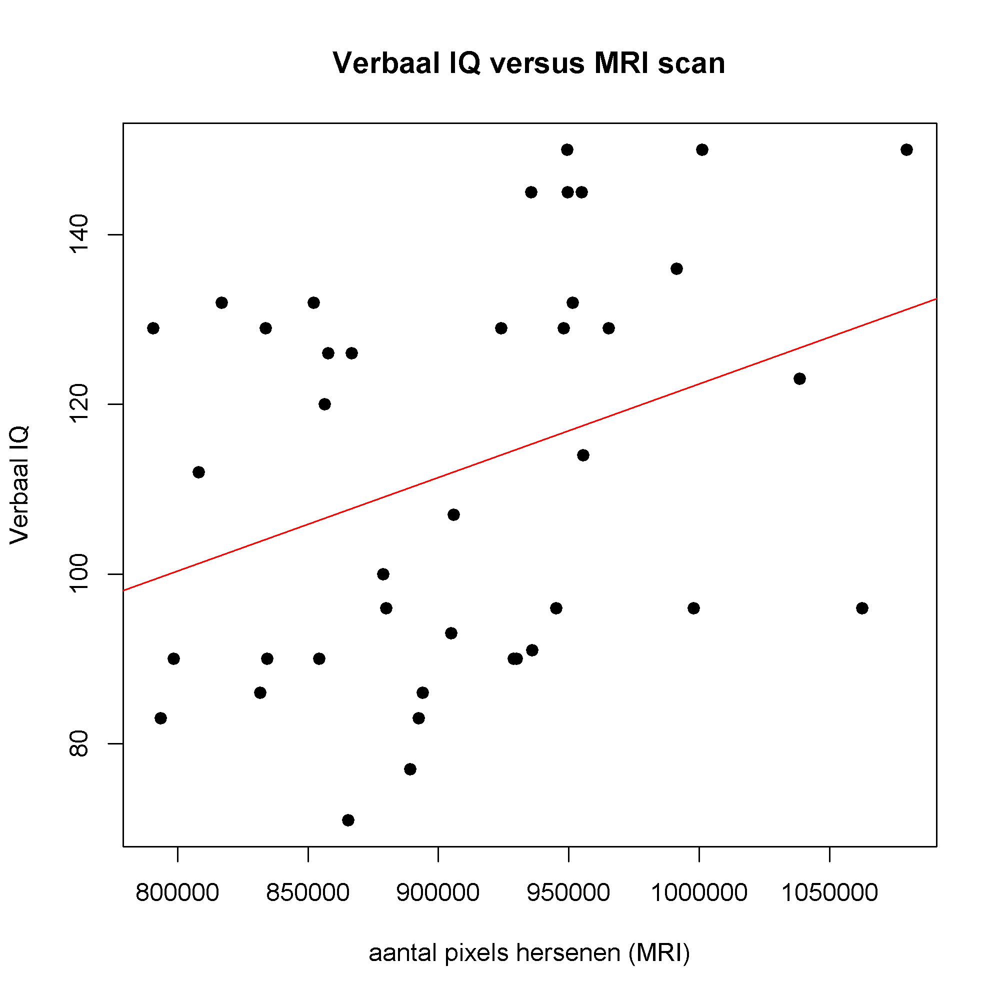

## Gegeven

We gebruiken de gegevens van hetzelfde <a href="http://bcs.whfreeman.com/wWebPub/Statistics/shared_resources/EESEE/BrainSize/index.html" target="_blank">onderzoek</a> dat wetenschapper Willerman voerde in 1991.

In de uiteindelijke dataframe vind je heel wat informatie, via `head(data)` bekomt men bijvoorbeeld als voorsmaakje:

```
  geslacht FSIQ VIQ PIQ    massa  lengte     MRI
1   Female  133 132 124 53.52390 163.830  816932
2     Male  140 150 124       NA 184.150 1001121
3     Male  139 123 150 64.86371 186.182 1038437
4     Male  133 129 128 78.01789 174.752  965353
5   Female  137 132 134 66.67808 165.100  951545
6   Female   99  90 110 66.22449 175.260  928799
```

De kolom `FSIQ` is de volledige uitslag van de 'Wechsler Adult Intelligence Scale', `VIQ` staat voor het verbale IQ (het denken in woorden en het verbale geheugen) en `PIQ` voor het performaal IQ (hoe groot het handelend vermogen is, dit bevat ook de fijne motoriek).

De kolom `MRI` bevat het **totale aantal pixels** van de hersenen dat men heeft geteld op de MRI scans en is dus een maat voor de grootte van de hersenen. De andere kolommen spreken voor zich.

Je kan onderzoeken in welke mate het aantal pixels hersenen (`data$MRI`) het verbaal IQ voorspelt. Een spreidingsdiagram krijg je bijvoorbeeld via de volgende code:

```R
plot(data$MRI~data$VIQ,
     ylab = "Verbaal IQ",
     xlab = "aantal pixels hersenen (MRI)",
     main = "Verbaal IQ versus MRI scan",
     pch = 19)
```

Het argument `pch = 19` (komt van *plot characters*) zorgt voor andere markeringen. Dit kan van 1 tot 25 varieren.


Nog duidelijker wordt het indien een regressierechte (best passende rechte) wordt toegevoegd. Dit kan met het commando `abline()`, waarme je aangeeft wat constante (*a*) en de rico (*b*) is. Het commando `lm(data$MRI~data$VIQ)` bepaalt automatisch de constante en de rico.

```R
plot(data$MRI~data$VIQ,
     ylab = "Verbaal IQ",
     xlab = "aantal pixels hersenen (MRI)",
     main = "Verbaal IQ versus MRI scan",
     pch = 19)
abline(lm(data$MRI~data$VIQ),
       col = "red")
```

## Gevraagd

Maak nu een spreidingsdiagram waarbij je enkel de gegevens van de **vrouwelijke** deelneemsters in een grafiek uitzet.

- Maak eerst een **booleaanse vector** `vrouwen` waarin je opslaat welke proefpersonen van het geslacht `Female` waren.

- Gebruik deze booleaanse vector om de vorige instructies aan te passen zodat je het spreidingsdiagram van enkel de vrouwelijke proefpersonen krijgt.

{:data-caption="Uiteindelijke boxplot." .light-only width="480px"}

{:data-caption="Uiteindelijke boxplot." .dark-only width="480px"}