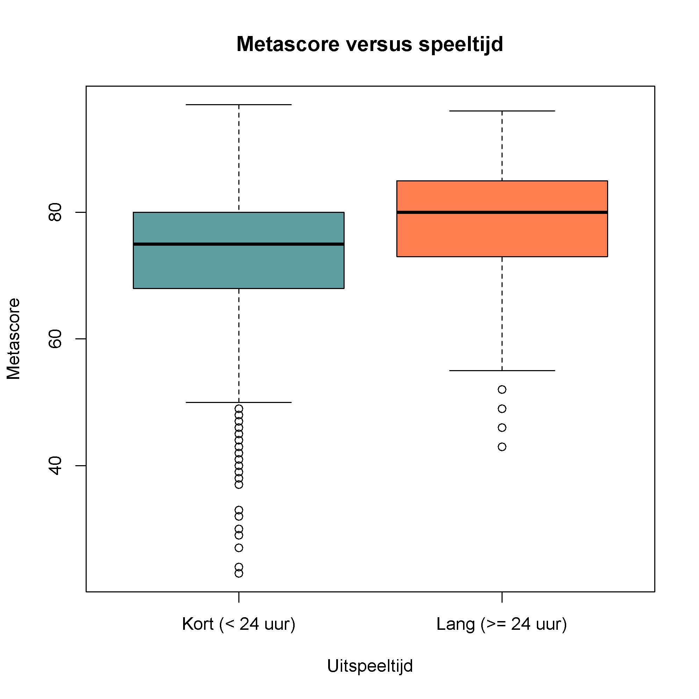

## Gegeven
Via het Steam platform kan je samen met vrienden games spelen. Er wordt dan ook heel wat gegevens bewaard van verschillende computerspellen. Via onderstaande code kan je wat data ophalen:

```R
# Steam data inlezen
data <- read.csv2("http://tinyurl.com/mr4b4bz8",
                  sep=",",dec=".",
                  colClasses = c("NULL", rep("character", 2), rep("numeric", 5), rep("NULL",2)))
data <- na.omit(data)
colnames(data) <- c("title", "year", "metascore", "rating", "positivity_ratio", "time_to_beat","time_to_beat_extra")
rownames(data) <- seq_len(nrow(data))
```

Dit leidt tot een dataframe van de vorm:

```
                   title year metascore rating positivity_ratio time_to_beat time_to_beat_extra
1    The Tiny Bang Story 2011        63      8         7.073879         3.60               3.60
2                Hacknet 2015        82      8        14.548520         7.06               8.73
3              SpaceChem 2011        84      8        11.440415        43.32              57.79
4            Baba Is You 2019        87      9        49.397183         6.84              19.28
5 Human Resource Machine 2015        78      8        15.220833         4.18               7.57
6            Opus Magnum 2017        90      9        37.977444        15.24              26.06
```

In deze dataframe vind je de titel, het jaar van publicatie, `metascore` stelt een beoordeling voor van één of meerdere professionele gamers, `rating` stelt de score van het publiek voor. `positivity_ration` is de verhouding van het aantal goede revieuws gedeeld door het aantal slechte reviews. `time_to_beat` en `time_to_beat_extra` stellen de tijd in uren voor die nodig zijn om het spel te beëindigen, respectievelijk zonder en met extra bonus materiaal.

{:data-caption="Een gamer." width="40%"}

## Gevraagd

Worden games met een langere uitspeeltijd ook beter beoordeeld door de professionals?

- Men zegt dat een *AAA game* (een professioneel spel, ontwikkeld door een grote studio) minstens 24 uren speeltijd moet hebben. Maak een **booleaanse vector** `lang` aan, waar je in opslaat welke games een gewone speeltijd van **minstens** 24 uur hebben.

- Maak nu een boxplot waar je de metascore uitzet tegenover deze booleaanse vector. Maak gebruik van het argument `names = c("categorie1", "categorie2")` om de juiste labels te voorzien. Zorg ook voor de juiste titels op de assen en boven de grafiek. Zorg voor **twee kleuren** per categorie.

{:data-caption="Langere speeltijd versus metascore." .light-only width="480px"}

{:data-caption="Langere speeltijd versus metascore." .dark-only width="480px"}