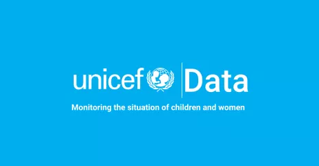
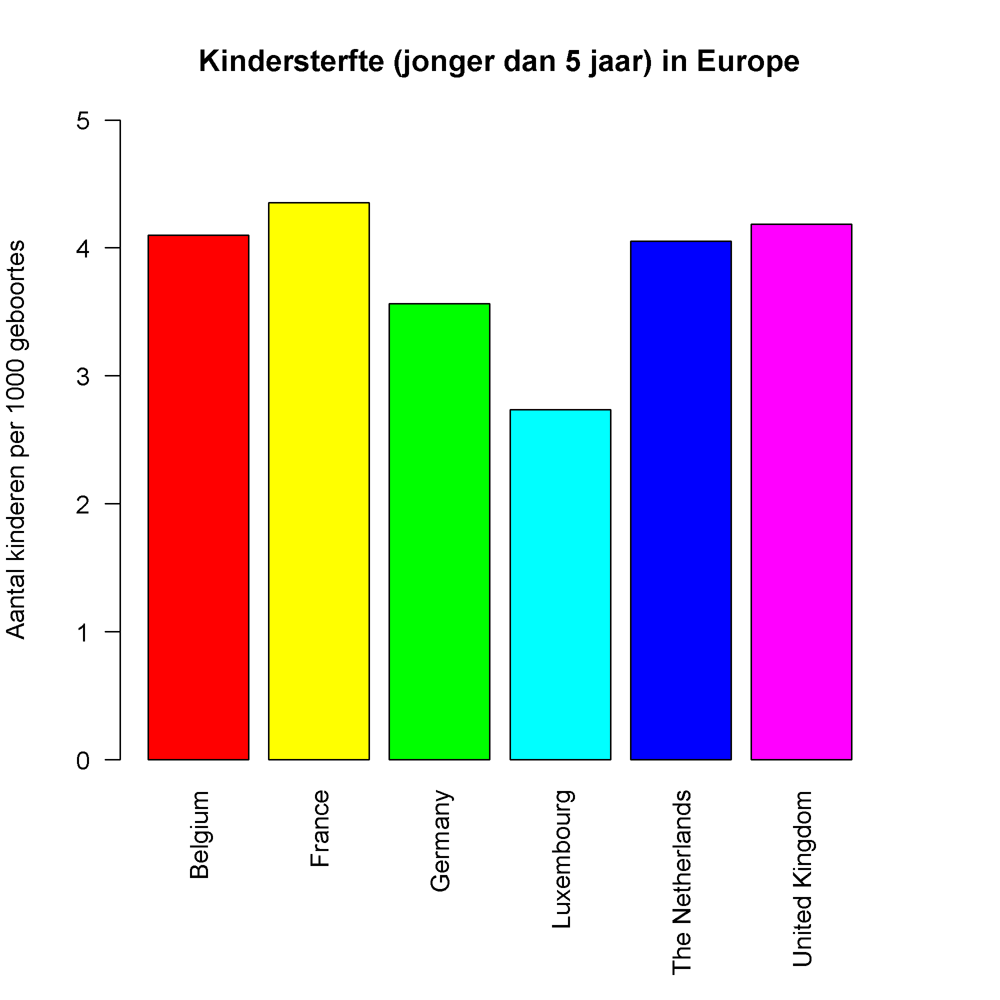

{:data-caption="Unicef Data." width="300px"}

## Gegeven

<a href="https://www.unicef.org/" target="_blank">UNICEF</a> - *United Nations International Children's Emergency Fund* - is een organisatie binnen de Verenigde Naties die zich inzet voor het welzijn van kinderen. Hierbij hoort het bijhouden van armoedecijfers, ongelijkheid en allerhande andere gegevens per land en per jaar.

UNICEF houdt bijvoorbeeld gegevens bij over **kindersterfte**, uitgedrukt in aantal kinderen dat per 1000 geboren kinderen jammer genoeg sterft.

Dit inladen in R kan via:

```R
# Importeert de data UNICEF en vormt deze om
url <- "https://sdmx.data.unicef.org/ws/public/sdmxapi/rest/data/UNICEF,GLOBAL_DATAFLOW,1.0/BEL+DEU+FRA+GBR+LUX+NLD.CME_MRY0T4._T.?format=csv&startPeriod=2010"
data <- read.csv2(url, sep=",", dec=".",
                  colClasses = c("NULL","character", rep("NULL",4), rep("numeric", 2), rep("NULL", 22)))
colnames(data) <- c("country","year","rate")
data$country[data$country == "Netherlands (Kingdom of the)"] = "The Netherlands"
```

In de uiteindelijke dataframe vind je een overzicht het aantal kinderen jonger dat 5 jaar dat sterft per 1000 geboren kinderen;

```
  country year     rate
1 Belgium 2010 4.459512
2 Belgium 2011 4.362287
3 Belgium 2012 4.270069
4 Belgium 2013 4.186234
5 Belgium 2014 4.120848
6 Belgium 2015 4.078451
```

## Gevraagd

- Sla het meest recente jaar dat voorkomt op in de variabele `max_year`.
- Maak een **booleaanse vector** met welke rijen gegevens bevatten uit het meest recente jaar, noemt dit `selectie`.
- Bepaal het aantal landen dat in deze dataset zit en waarvan gegevens gekend zijn in dit meest recente jaar. Sla dit op in de variabele `aantal_landen`.

- Maak onderstaande grafiek na.

{: .callout.callout-info}
>#### Tips
> - Gebruik `rainbow(aantal_landen)` als parameter bij de kleuren.
> - Gebruik het commando `par(mar = c(8,4,4,4))` **voordat** je de grafiek aanmaakt, om extra marge onderaan te creëren.

{:data-caption="Kindersterfte in 2021." .light-only width="480px"}

{:data-caption="Kindersterfte in 2021." .dark-only width="480px"}