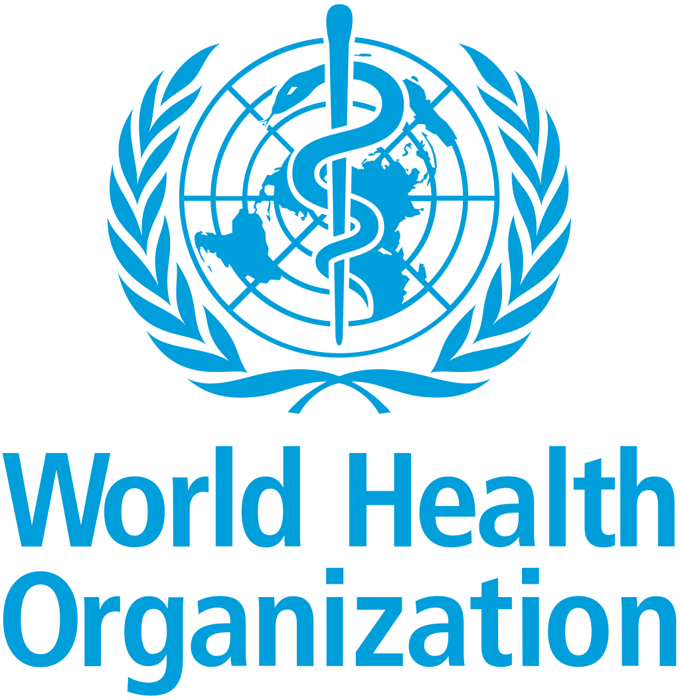
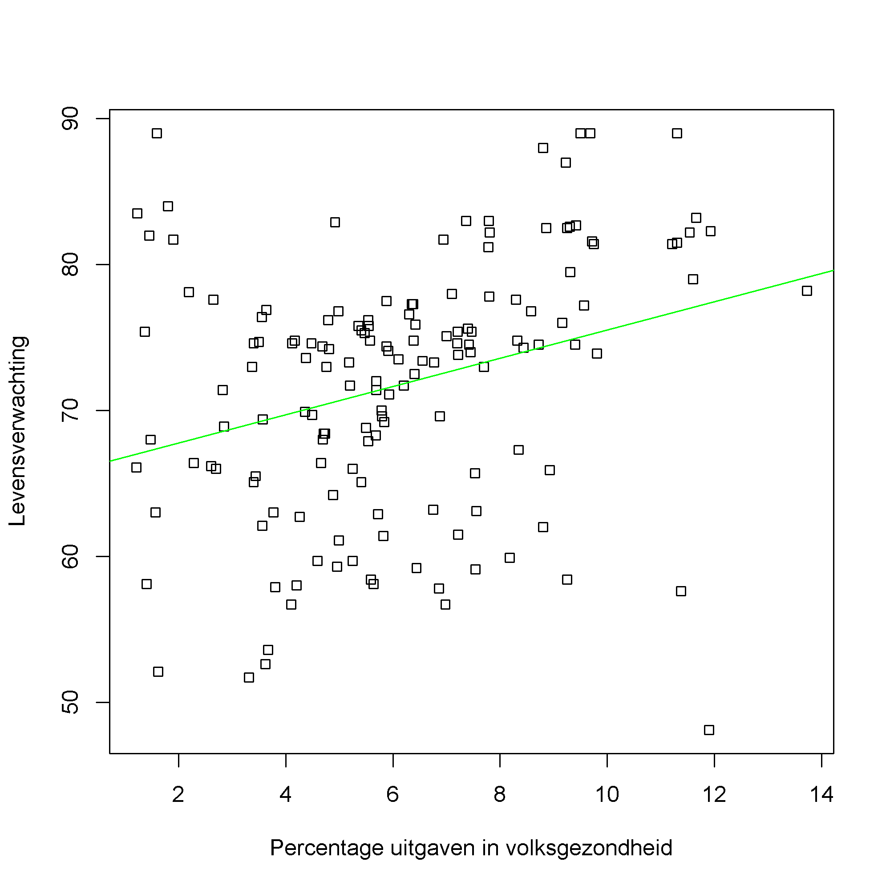

## Gegeven

De <a href="https://www.who.int/" target="_blank">Wereldgezondheidsorganisatie (WHO)</a> is een gespecialiseerd onderdeel van de Verenigde Naties die een sturende en coördinerende rol heeft op het gebied van gezondheid en welzijn.

{:data-caption="Het logo van de WHO." width="25%"}

Deze organisatie houdt van alle landen een veelheid aan statistieken bij, zoals bijvoorbeeld: de levensverwachting, het gemiddelde BMI, het aantal AIDS infecties, enz... 

In onderstaande dataset wordt een voorbeeld van dergelijke informatie ingelezen.

```R
# Data inlezen
data <- read.csv2("https://gist.githubusercontent.com/aishwarya8615/89d9f36fc014dea62487f7347864d16a/raw/8629d284e13976dcb13bb0b27043224b9266fffa/Life_Expectancy_Data.csv",
                  sep=",", dec=".",
                  colClasses=c("character", "NULL", "numeric", "NULL", "numeric", rep("NULL", 2), "numeric", rep("NULL", 3), "numeric",rep("NULL", 2), "character",rep("NULL",2), "numeric", rep("NULL",5)))
colnames(data) <- c("land", "jaar","levensverwachting", "alcohol", "BMI","uitgavepercentage","BBP")
data$uitgavepercentage <- suppressWarnings(as.numeric(data$uitgavepercentage))
data <- na.omit(data)
rownames(data) <- seq_len(nrow(data))
```

In de oorspronkeleijk dataset vind je heel wat informatie, maar er werd reeds een selectie van enkele kolommen gemaakt.
Via `head(data)` bekomt men onderstaand voorbeeld:

```
         land jaar levensverwachting alcohol  BMI uitgavepercentage       BBP
1 Afghanistan 2015              65.0    0.01 19.1              8.16 584.25921
2 Afghanistan 2014              59.9    0.01 18.6              8.18 612.69651
3 Afghanistan 2013              59.9    0.01 18.1              8.13 631.74498
4 Afghanistan 2012              59.5    0.01 17.6              8.52 669.95900
5 Afghanistan 2011              59.2    0.01 17.2              7.87  63.53723
6 Afghanistan 2010              58.8    0.01 16.7              9.20 553.32894
```

Sommige kolommen spreken voor zich. De kolom `alcohol` geeft het gemiddelde **aantal liter alcohol** dat per persoon werd gedronken. (In Afghanistan is het drinken van alcohol verboden). De kolom `uitgavepercentage` bevat hoeveel **procent** van alle overheidsuitgaven die gebruikt worden voor de volksgezondheid. De kolom `BBP` bevat het **bruto binnenlands product** per inwoner (in dollars uitgedrukt), een maat voor de welvaart in een land.

## Gevraagd

We vermoeden dat indien een land meer spendeert aan het departement volksgezondheid, dat de levensverwachting dan ook stijgt. Kunnen we dit ook visualiseren?

- Alhoewel WHO de gegevens goed bijhoudt, zijn de gegevens in deze dataset niet de meest recente. We zullen enkel gebruik maken van de gevens uit het jaar 2014. Maak dus een **booleaanse vector** `meest_recent` waarin je enkel de resultaten van **2014** opslaat. 

- Gebruik deze booleaanse vector onderstaand spreidingsdiagram aan te maken. Verzorg de titels en de labels op de assen.

{:data-caption="Verband uitgaven in volksgezondheid en levensverwachting." .light-only width="480px"}

{:data-caption="Verband uitgaven in volksgezondheid en levensverwachting." .dark-only width="480px"}

{: .callout.callout-info}
>#### Merk op
>
> Uit de grafiek kan je afleiden dat indien de uitgaven met ongeveer 1% stijgen er te verwachten valt dat de levensverwachting met ongeveer 1 jaar zal stijgen. Het loont dus wel degelijk dat een overheid investeert in volksgezondheid.