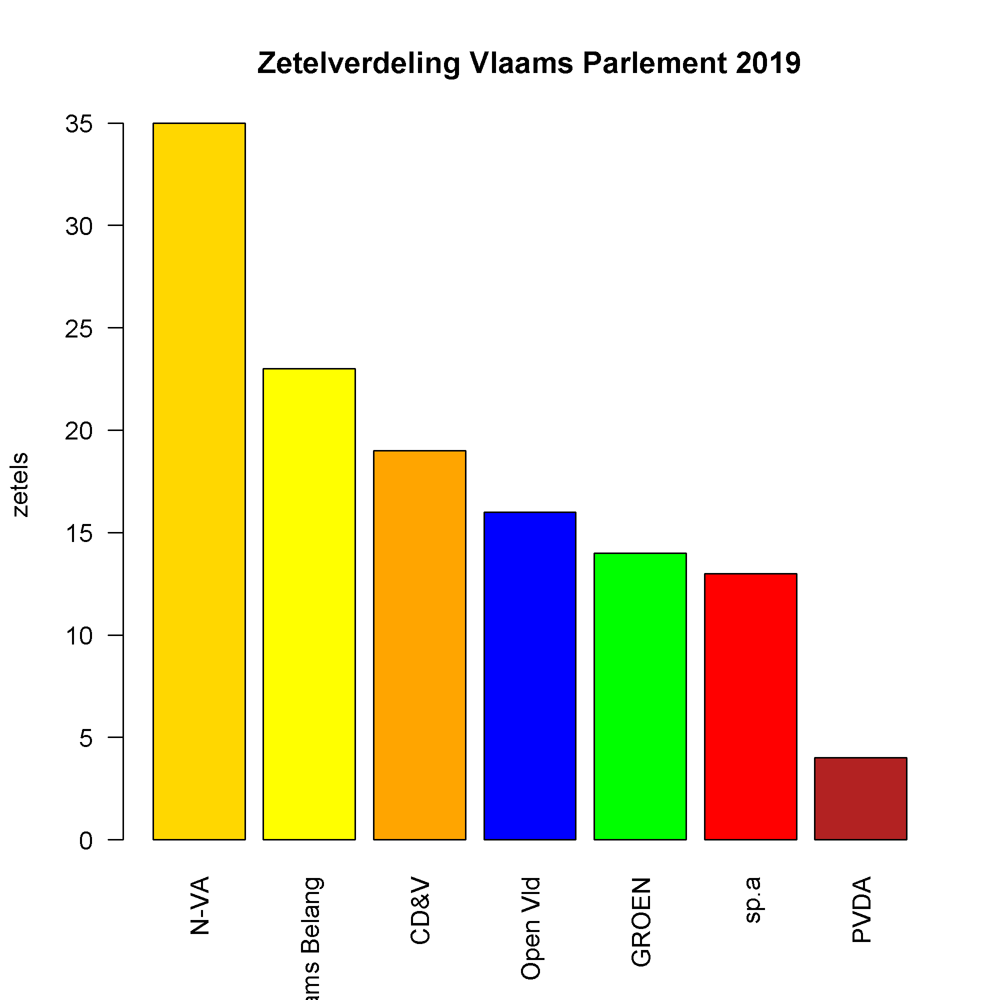
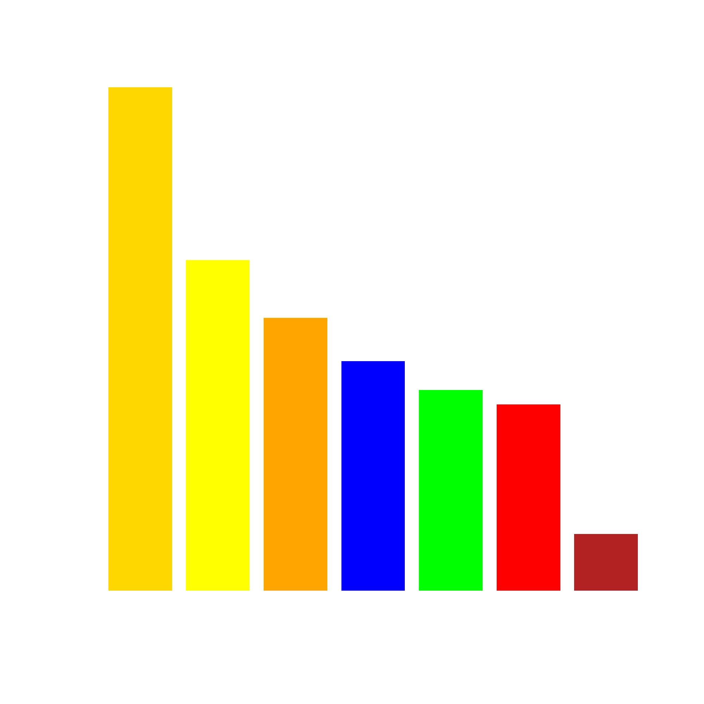

## Gegeven
In 2019 werd een nieuw Vlaams Parlement verkozen. De <a href="https://www.vlaanderenkiest.be/verkiezingen2019/#/parlement/02000" target="_blank">resultaten</a> waren als volgt:

| Lijst             | Stemmen   | Percentage    | Zetels    |
|-------------------|-----------|:-------------:|-----------|
| N-VA              | 1 052 252 | 24,8%         | 35        |
| Vlaams Belang     | 783 977   | 18,5%         | 23        |
| CD&V              | 652 766   | 15,4%         | 19        |
| Open Vld          | 556 630   | 13,1%         | 16        |
| GROEN             | 428 696   | 10,1%         | 14        |
| sp.a              | 429 631   | 10,1%         | 12        |
| PVDA              | 225 593   | 5,3%          | 4         |
| sp.a-one brussels | 8 958     | 0,2%          | 1         |
{:class="table table-striped table-condensed" style="width:auto;margin-left:auto;margin-right:auto;"}

In de praktijk sluit **de ene verkozene voor sp.a-one brussels aan bij de sp.a fractie**, zodat deze uiteindelijk 13 zetels hebben.

## Gevraagd

Maak onderstaand staafdiagram met de zetelverdeling na, gebruik hiervoor de volgende richtlijnen.

- Maak een vector `partijen` met (in volgorde) de namen van de lijsten. (Zonder sp.a-one brussels, zie vorige opmerking)
- Maak een vector `zetels` met het aantal zetels in dalende volgorde.
- R kent heel wat standaardkleuren, in dit <a href="http://www.stat.columbia.edu/~tzheng/files/Rcolor.pdf" target="_blank">document</a> vind je een overzicht van alle kleuren. Gebruik de kleuren `gold` en `firebrick` voor respectievelijk de N-VA en PVDA. Sla de kleuren van de partijen op in de vector `kleuren`.

{: .callout.callout-info}
>#### Tip
> Voeg het argument `las = 2` toe aan de functie `barplot` om **verticale labels** te krijgen. (`las` staat voor *label style* en `2` betekent *loodrecht op de as*.)

{:data-caption="Zetelverdeling Vlaams Parlement 2019" .light-only width="480px"}

{:data-caption="Zetelverdeling Vlaams Parlement 2019" .dark-only width="480px"}