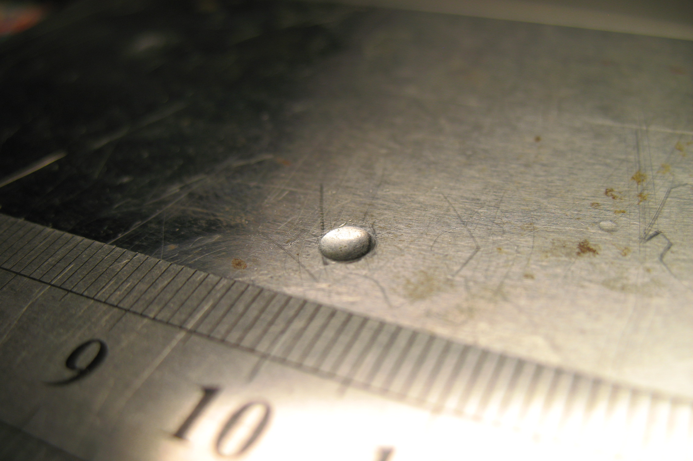

<a class="btn btn-filled with-icon" href="https://dodona.be/nl/courses/2690" target="_blank"><i class="mdi mdi-backburger mdi-24" title="link"></i>Link naar de vorige oefeningen</a>

Om de **hardheid** van een materiaal in een getal te bevatten werd de Brinellhardheid in 1900 door <a href="https://nl.wikipedia.org/wiki/Johan_August_Brinell" target="_blank">Johan August Brinell</a> gedefinieerd.

Bij deze methode wordt een stalen kogel (of een kogel van wolfraamcarbide bij hardere materialen) gedurende een korte periode (ca. 10 seconden) met een bepaalde kracht in een ander materiaal gedrukt. Nadien meet men de diameter $$d$$ van de indeuking.

{:data-caption="Een deuk van Brinell test." width="45%"}

De formule om de Brinell hardheid $$\text{HB}$$ te bepalen werkt dan als volgt:

$$
\text{HB} = 0,102 \cdot \dfrac{2 \cdot \text{F}}{\pi \cdot \text{D} \cdot (\text{D} - \sqrt{\text{D}^2 - \text{d}^2})}
$$

Men gebruikt bijna altijd een kracht $$\text{F}$$ van 29 500 N en een stalen bol met een diameter $$\text{D}$$ van 10 mm om de indeuking te maken.

## Gegeven

Men test verschillende materialen en bekomt de volgende meetresultaten:

| Materiaal             | d (in mm)  | 
|:---------------------:|:----------:|
| Mild staal            | 5,6082     |
| Gehardend staal       | 4,0982     |
| Gehardend aluminium   | 6,7124     |
| Koper                 | 8,8425     |
| Zachte messing        | 7,2415     |
| Gietijzer             | 3,0014     |
| Glas                  | 1,5647     |
{:class="table table-striped table-condensed" style="width:auto;margin-left:auto;margin-right:auto;"}

## Gevraagd

- Vul onderstaande variabelen `kracht_F` en `diameter_D` aan met de gebruikelijke waarden.

- Maak een variabele `diameter_d` aan waar je de diameters als een vector in opslaat. (Behoud de volgorde uit de tabel)

- Maak een vector `brinell` aan waar je de Brinellharheid uitrekent via de gedefinieerde formule. (Tip, R kent `pi`.) Rond de resultaten in deze vector af op **vier cijfers na de komma**.

- **Selecteer** uit de vector `materialen`, deze met een Brinellhardheid van 200 HB of hoger, sla deze op in de vector `harde_materialen`. Maak hiervoor **eerst** een **booleaanse vector** aan.