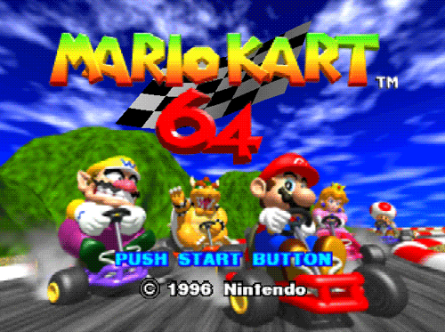

<div class="text-end">
<a class="btn btn-filled with-icon" href="https://dodona.be/nl/courses/2690" target="_blank"><i class="mdi mdi-backburger mdi-24" title="link"></i>Link naar de vorige oefeningen</a>
</div>

Mario Kart is een populair racespel ontwikkeld door Nintendo. De versie <a href="https://nl.wikipedia.org/wiki/Mario_Kart_8" target="_blank">Mario Kart 8 Deluxe</a> is het best verkochte spel voor de Nintendo Switch met maar liefst 46,82 miljoen verkochte exemplaren.

{:data-caption="Het introscherm van Mario Kart 64." width="400px"}

Ook <a href="https://nl.wikipedia.org/wiki/Mario_Kart_64" target="_blank">Mario Kart 64</a> wordt nog vaak gespeeld. Deze <a href="https://github.com/rfordatascience/tidytuesday/blob/master/data/2021/2021-05-25/records.csv" target="_blank">dataset</a> bevat een overzicht van de recordtijden voor de verschillende circuits.

Met onderstaande code kan je deze recordtijden ophalen, dit voor de aparte circuits, het aantal rondjes, het nemen van shortcuts, enz...

```R
# Gegevens ophalen
data <- read.csv("https://raw.githubusercontent.com/rfordatascience/tidytuesday/master/data/2021/2021-05-25/records.csv",
                 header = TRUE)
# Aanpassen naar de recordtijden en wijzing kolomnamen
data <- aggregate(data$time, by = list(track = data$track, type = data$type,
                                       shortcut = data$shortcut), FUN = min)
colnames(data) <- c("track", "type", "shortcut", "record_time")
data <- data[order(data$track, data$type, data$shortcut), ]
rownames(data) <- seq_len(nrow(data))
```

## Gegeven

Via `head(data)` een **voorsmaakje** opvragen resulteert in:

```
              track       type shortcut record_time
1 Banshee Boardwalk Single Lap       No       40.78
2 Banshee Boardwalk  Three Lap       No      124.09
3   Bowser's Castle Single Lap       No       43.15
4   Bowser's Castle  Three Lap       No      132.00
5    Choco Mountain Single Lap       No       38.02
6    Choco Mountain Single Lap      Yes       38.02
```

Er zijn met dus **vier vectoren** terug te vinden in de data frame `data`.

## Gevraagd

Je merkt dat de recordtijd (in seconden) van zowel **Single laps** (één rondje) als **Three laps** (drie rondjes) gegeven wordt, eventueel met of zonder **shortcut**. Verschilt de recordtijd op de **Three laps** veel van het drievoud van de recordtijd op de **Single laps**?

- Maak twee **booleaanse** vectoren `single_lap_no_shortcut` en `three_lap_no_shortcut` aan, waarbij je respectievelijk de tijden op **Single laps** of **Three laps** en dit **zonder shortcut** selecteert.

- Selecteer de namen van de bijbehorende **tracks** in de vector `tracks`. (Kies hiervoor één van de booleaanse vectoren)

- Maak nu twee vectoren `record_single_lap_no_shortcut` en `record_three_lap_no_shortcut` aan, met enkel de recordtijden.

- Bereken het **verschil** de recordtijd op de drie rondjes en het **drievoud** van de recordtijd op één enkel rondje. Sla dit op in de variabele `verschil`. Rond dit verschil af op **twee cijfers na de komma**.

- Voor welke **tracks** is dit verschil *minstens 5 seconden*? Bewaar dit in `trage_tracks`.
