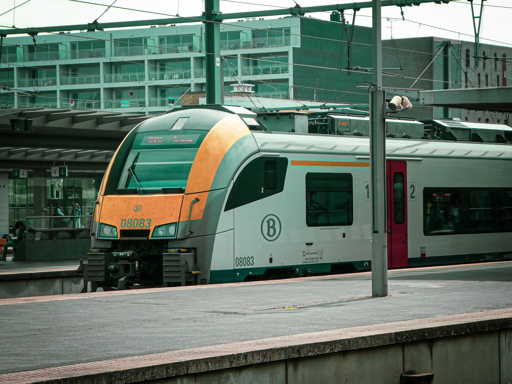

De stiptheid van de Belgische spoorwegen blijft een gevoelig punt. Infrabel deelt via zijn <a href="https://opendata.infrabel.be/explore" target="_blank">Open Data</a> geneutraliseerde cijfers van de stiptheid. Geneutraliseerd betekent dat vertragingen ten gevolge van kabeldiefstallen, agressie, ... niet werden meegerekend.

{:data-caption="Een NMBS Desiro trein in Brugge." width="45%"}

## Gegeven

Maak gebruik van <a href="https://opendata.infrabel.be/explore/dataset/nationale-stiptheid-per-maand/table/?sort=maand" target="_blank">deze dataset</a>, die je kan inlezen via:

```R
# Stiptheidsscijfers Infrabel
data <- read.csv("https://opendata.infrabel.be/api/explore/v2.1/catalog/datasets/nationale-stiptheid-per-maand/exports/csv",
                 sep = ";", header = TRUE,
                 colClasses = c("NULL", "character", rep("numeric", 5)))
# De kolommen hernoemen
colnames(data) <- c("maand", "stiptheid", "aantal", "aantal_min_6", "totale_min_vertraging", "stiptheid_neutr")
```

Gebruik `head(data)` om een **voorsmaakje** van de gegevens te verkrijgen.

## Gevraagd

- allerlei