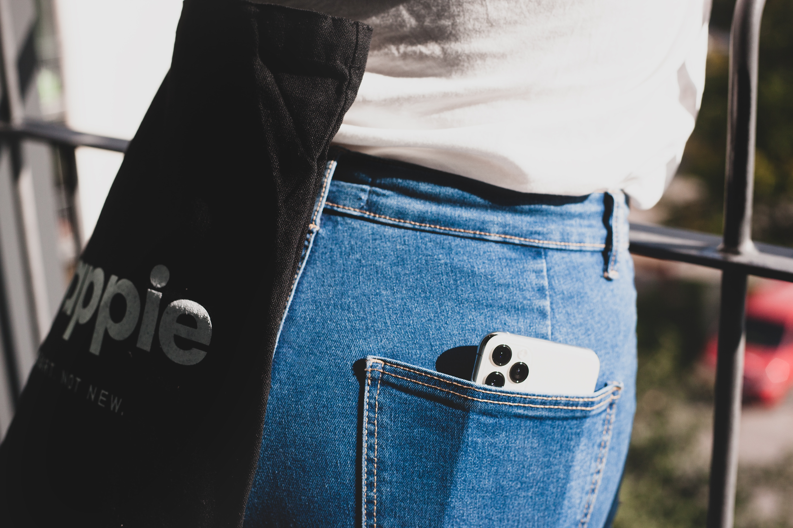

Op 13 september 2023 lazen we op VRT.NWS <a href="https://www.vrt.be/vrtnws/nl/2023/09/13/iphone-12-frankrijk-belgie-stralingen" target="_blank">dit artikel</a> getiteld "Frankrijk verbiedt iPhone 12 door "te hoge straling".

De Franse overheidsinstantie <a href="https://www.anfr.fr/liste-actualites/actualite/retrait-temporaire-du-marche-de-liphone-12-pour-non-conformite-de-ces-appareils-a-la-reglementation-europeenne" target="_blank">ANFR</a> onderzocht de zogenaamde SAR of *specific absorption rate*. Dit getal geeft aan hoeveel energie het toestel via straling afgeeft aan het lichaam. Een smartphone in je broekzak steken zorgt ervoor dat dit toestel energie afgeeft en dit mag volgens Europa niet meer dan 4 watt per kilogram lichaamsgewicht zijn.

{:data-caption="Een smartphone in een broekzak." width="45%"}

De iPhone 12 5G werd door ANFR getest en de absorptie van de straling door het lichaam (in een broekzak) werd vastgesteld op 5,74 watt per kilogram.

## Gegeven

ANFR testte nog verschillende andere toestellen, met onder andere de volgende <a href="https://data.anfr.fr/anfr/visualisation/table/?id=ad8014ec-f631-450e-a259-799188714ef9&sort=-date_controle" target="_blank">meetresultaten</a>:

| Merk      | Model          | SAR broekzak | SAR jaszak |
|:---------:|:--------------:|:----------- :|:-----------|
| OnePlus   | 7 Pro          | 4,42         | 1,43       |
| Asus      | Zenfone 8      | 2,73         | 0,987      |
| OnePlus   | 9 Pro 5G       | 1,94         | 1,79       |
| Xiaomi    | Poco F3        | 1,261        | 0,476      |
| Xiaomi    | Mi 11i         | 1,823        | 0,646      |
| Xiaomi    | Redmi Note 10S | 1,38         | 0,452      |
| Sony      | Xperia 5III    | 3,425        | 1,816      |
| ...       | ...            | ...          | ...        |
{:class="table table-striped table-condensed" style="width:auto;margin-left:auto;margin-right:auto;"}

## Gevraagd

- De maximale SAR waarden vastgelegd door Europa zijn: 2 W/kg voor een smartphone in een jaszak en 4 W/kg in een broekzak. Bepaal een booleaanse vector `niet_conform` waarbij je nagaat welke toestellen **niet voldoen** aan minstens één van deze voorwaarden.

- Gebruik deze booleaanse vector om een vector aan te maken met de toestellen die **wel** binnen de Europese grenzen liggen. Sla deze op in de variabele `modellen_conform`. Plak hierbij de merknaam en de modelnaam aan elkaar met behulp van `paste()`. 

{: .callout.callout-info}
>#### Tip
>
> Het R commando `paste()` werkt op eenzelfde manier als `print()` binnen Python. Zo is `paste("Nokia", "3310")` gelijk aan `Nokia 3310`.

