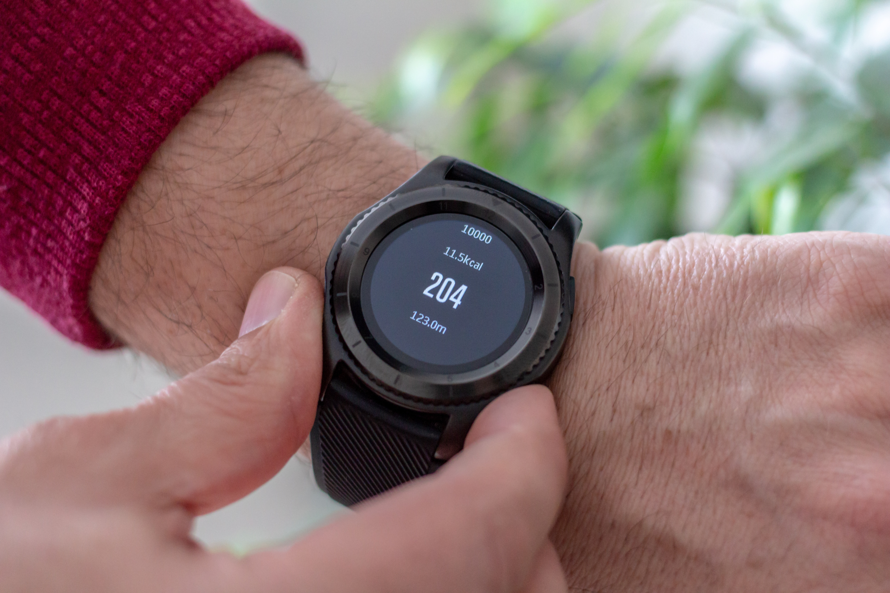

De <a href="https://nl.wikipedia.org/wiki/VO2max">VO2max</a> is het maximale zuurstofopnamevermogen. Dit stelt het maximale volume zuurstofgas voor dat het menselijk lichaam per tijdseenheid kan vervoeren bij lichamelijke inspanning. De waarde van de VO2max is een indicatie van iemands fysieke conditieniveau. 

Deze waarde bepalen is echter niet zo eenvoudig. Voor een nauwkeurige meting moet het proefpersoon een langdurige en oplopende intensieve lichamelijke inspanning leveren. Tijdens deze inspanning wordt de zuurstofiname en uitstoot continu gemeten. Deze test is niet enkel duur maar ook gevaarlijk.

In 2004 werd een onderzoek <a href="https://pubmed.ncbi.nlm.nih.gov/14624296/" target="_blank">gepubliceerd</a> waar men onderstaande formule heeft gevonden die gebruikt kan worden om de VO2max te schatten.

$$
    \text{VO}_2\text{max} = 15 \cdot \dfrac{\text{HR}_\text{max}}{\text{HR}_\text{rust}}
$$

Hierbij stelt HRmax en HRrust de maximale hartslag (Heart Rate) en de hartslag in rust voor. Omdat deze methode snel werkt wordt die in veel sporthorloges toegepast.

{:data-caption="Een sporthorloge." width="45%"}

## Gegeven

Een amateuratlete heeft een VO2max van 52,3 ml/(kg·min). Haar maximale hartslag is 183. 

## Gevraagd

Gebruik R om een schatting te bepalen van haar hartslag in rust. Vul hiervoor de variabelen `VO2max` en `HR_max` in onderstaand programma aan. 

Gebruik `round()` om net zoals in Python het resultaat **af te ronden op 2 cijfers**. Zo geldt er bijvoorbeeld dat `round(49.7842, 2)` gelijk is aan`49.78`.