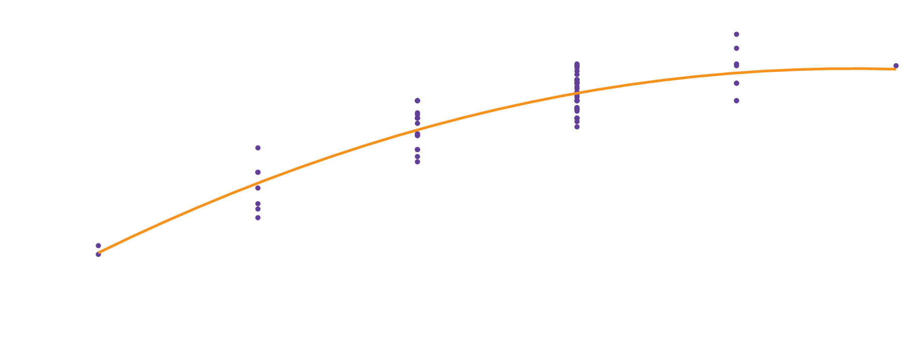

De **blauwkeel zonnebaars** of <a href="https://nl.wikipedia.org/wiki/Lepomis_macrochirus" target="_blank">Lepomis macrochirus</a> is een relatief kleine straalvinnige vis, die voorkomt in Noord-Amerika, waar soms op gehengeld wordt. De vis is de officiele *state fish* van de Amerikaanse staat Illinois.

{:data-caption="Een zonnebaars." width="45%"}

In 1981 werden 78 van deze vissen willekeurig uit <a href="https://en.wikipedia.org/wiki/Lake_Mary_Township,_Douglas_County,_Minnesota" target="_blank">Lake Mary</a> (Minnesota) gehengeld. Van deze vissen werden lengte en leeftijd bestudeerd door de onderzoekers <a href="https://books.google.be/books?hl=nl&lr=&id=PI2FJzBh2vMC&oi=fnd&pg=PR3&ots=3Axdp6hJeJ&sig=ChSK61zesxlUPurWDvy3ayfbZ_0&redir_esc=y#v=onepage&q&f=false" target="_blank">Cook and Weisberg</a>.

Cook en Weisberg merkten een verband op tussen deze variabelen. Een grafiek met de verschillende meetwaarden (paarse punten) illustreert dit.

{:data-caption="DEen verband tussen lengte en leeftijd.." .light-only width="700px"}

{:data-caption="Een verband tussen lengte en leeftijd." .dark-only width="700px"}

## Gegeven

Via een *regressiemodel* (zie later) kan men volgens de onderzoekers de lengte van een blauwkeel zonnebaars **schatten** (de oranje kromme) via de volgende formule:

$$
13,6 + 54,05 \cdot \text{leeftijd} - 4,179\cdot \text{leeftijd}^2
$$

In hun artikel geven ze zelf aan dat deze zonnebaars tot wel 10 jaar oud kan worden. Gebruik dit model om de lengtes van vissen met leeftijden 2, 4, 6, 8 en 10 jaar te **schatten**.

## Gevraagd

- Maak een variabele `leeftijden` aan met de gevraagde leeftijden.

- Maak een variabele `schatting_lengtes` aan, waarbij je de bovenstaande formule gebruikt om de lengtes te *voorspellen*. 

{: .callout.callout-info}
>#### Tip
>
> In R bereken je het kwadraat via deze operator `^`. Er geldt dus `5^2` is `25`.