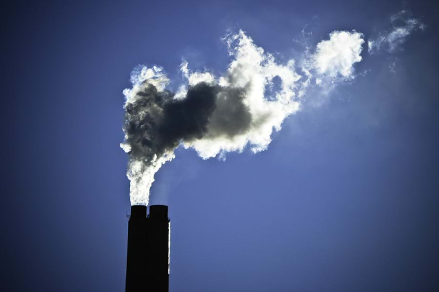

<a href="https://nl.wikipedia.org/wiki/Fijnstof" target="_blank">Fijnstof</a> is een mengsel van microscopisch kleine vaste deeltjes. Dit is een vorm van luchtvervuiling, die ernstige gezondheidsklachten kan veroorzaken. Zo verliest in Vlaanderen elke inwoner gemiddeld ongeveer één gezond levensjaar door de chronische gezondheidseffecten van fijnstof.

Niet ver van onze school, in de <a href="https://aqicn.org/station/@66337#/z/18" target="_blank">Tussen 't Pas straat</a> (zijstraat van de Volmolenstraat) wordt continu de luchtkwaliteit in de gaten gehouden door het aantal PM<sub>2,5</sub> stofdeeltjes te meten. Dit zijn stofdeeltjes die kleiner dan 2,5 µm zijn. Ook het aantal PM<sub>10</sub> deetjes van kleiner dan 10µm wordt constant gemeten.

{:data-caption="Een rokende schouw." width="45%"}

## Gegeven

Bij het uitvoeren van je code zal de data vanop bovenstaande website in een dataframe `data` gemporteerd worden. De code om deze data op te halen is echter vrij complex.

De dataframe `data` zal er als volgt uit zien:

```
       datum  pm25  pm10
1 2023-09-16  6.32  8.85
2 2023-09-15  4.34  7.13
3 2023-09-14  4.12  7.24
4 2023-09-13  4.55 10.35
5 2023-09-12 27.16 43.02
6 2023-09-11 10.32 17.33
```

Er zijn hier dus **drie vectoren**. Gebruik deze dataset (met de bijbehorende vectoren) om de volgende vragen te beantwoorden.

## Gevraagd

- Bereken AQI