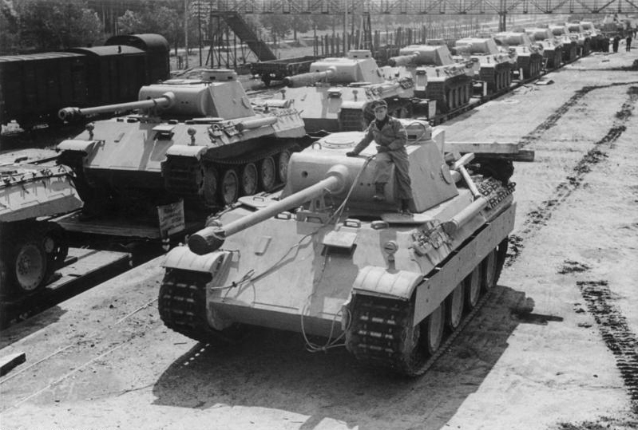

Tijdens de tweede wereldoorlog probeerden de geallieerden het aantal Duitse tanks in te schatten. Hiervoor werd de geheime dienst ingeschakeld, maar ook statistici. Zo ging kort voor D-day het gerucht de ronde dat een grote hoeveelheid <a href="https://nl.wikipedia.org/wiki/Panzerkampfwagen_V_Panther" target="_blank">Panzer V tanks (Panther)</a> in gebruik waren genomen door de Duitse bezetter.

Om te controleren of dit waar was gebruikte men serienummers van vernietigde tanks. Veronderstellende dat de serienummers beginnen vanaf 1, werkt de schatting als volgt. Stel dat er $$k$$ tanks buit gemaakt werden, waarbij $$m$$ het grootste serienummer is, dan kan men het totale aantal geproduceerde tanks $$N$$ schatten met deze formule.

$$
    \mathsf{N = m + \dfrac{m}{k} - 1}
$$

{:data-caption="De Panzerkampfwagen V type 'Panther'." width="40%"}

## Gegeven

Stel dat er verschillende Panzer V tanks gevonden worden met de serienummers 3, 117, 21, 30 en 87. Schat dan met behulp van de bovenstaande formule het aantal produceerde tanks.

## Gevraagd

- Maak een **vector** `serienummers` waar je de serienummers (in de gegeven volgorde) in opslaat.
- Maak een variabele `m` waar je het grootste serienummer uit deze vector in opslaat. (Tip: gebruik de functie `max()`)
- Maak een variabele `k` met het aantal serienummers. (Tip: gebruik de functie `length()`)
- Bepaal nu de schatting voor het aantal tanks en geef deze weer. Rond af op een geheel.