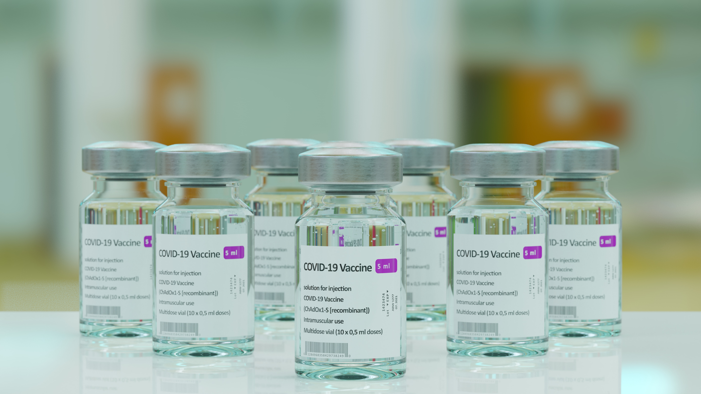

In medisch onderzoek is het vaak essentieel om verschillende patiëntgegevens bij te houden, zoals hun namen en specifieke gezondheidsgegevens. In deze oefening zullen we R gebruiken om enkele variabelen combineren in een **data frame**.

**Antistoffen** vormen een onderdeel van het lichamelijke afweer- en immuunsysteem. Deze stoffen worden aangemaakt na vaccinatie of infectie. Bij de bestrijding van de COVID-pandemie kon men twee soorten antistoffen vaststellen, namelijk N-antistoffen en S-antistoffen. N-antistoffen worden alleen aangemaakt na een infectie met het coronavirus en niet na vaccinatie. De S-antistoffen worden enkel aangemaakt na vaccintatie.

{:data-caption="Het Astra-Zeneca COVID-19-vaccin ChAdOx1." width="45%"}

## Gegeven

Stel je voor dat je een onderzoeker bent die werkt aan een kleine studie waar vijf patiënten bij betrokken zijn. Van deze patiënten werd twee weken na hun eerste vaccinatie en twee weken na de eerste boosterprik het aantal S-antistoffen bepaald. Het aantal antistoffen wordt uitgedrukt in *Binding Antibody Units per ml* oftewel *BAU/ml*.

| Naam  | Geboortejaar | Hobby | Favoriete vak |
|:-----:|:----:|:-------------:|:--------:|
| Alice | 1991 | Voetbal       | Chemie   |
| Bob   | 2003 | Muziek        | Wiskunde |
| Karen | 1407 | Gamen         | Latijn   |
| David | 1965 | Voetbal       | LO       |
| Eva   | 2010 | Bloemschikken | Beeld    |
{:class="table table-striped table-condensed" style="width:auto;margin-left:auto;margin-right:auto;"}

## Gevraagd

- Maak vier variabelen `namen`, `geboortejaren`, `hobbies` en `favoriete_vakken` met de respectievelijke waarden.

- **Combineer** deze in een **data frame** `personen` via het volgende commando:

    ```R
    personen <- data.frame("naam" = namen,
                            "geboortejaar" = geboortejaren,
                            "hobby" = hobbies,
			    "vak" = favoriete_vakken)
    ```
- Bereken tot slot hoeveel antistoffen er **bijkwamen** na het toedienen van de boosterprik en **geef dit weer**. Gebruik bij deze berekening de **accessor** `$` op het data frame. Bijvoorbeeld `coviddata$booster`.


