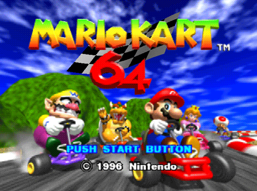

Mario Kart is een populair racespel ontwikkeld door Nintendo. De versie <a href="https://nl.wikipedia.org/wiki/Mario_Kart_8" target="_blank">Mario Kart 8 Deluxe</a> is het best verkochte spel voor de Nintendo Switch met maar liefst 46,82 miljoen verkochte exemplaren.

{:data-caption="Het introscherm van Mario Kart 64." width="400px"}

Ook <a href="https://nl.wikipedia.org/wiki/Mario_Kart_64" target="_blank">Mario Kart 64</a> wordt nog vaak gespeeld. Deze <a href="https://github.com/rfordatascience/tidytuesday/blob/master/data/2021/2021-05-25/records.csv" target="_blank">dataset</a> bevat een overzicht van de recordtijden voor de verschillende circuits.

Met onderstaande code kan je deze recordtijden ophalen, dit voor de aparte circuits, het aantal rondjes, enz...

```R
# Gegevens ophalen
data <- read.csv(paste0("https://raw.githubusercontent.com/rfordatascience/ti",
                        "dytuesday/master/data/2021/2021-05-25/records.csv"),
                 header = TRUE)
# Aanpassen naar de recordtijden en wijzing kolomnamen
data <- aggregate(data$time, by = list(track = data$track, type = data$type,
                                       shortcut = data$shortcut), FUN = min)
data <- data[data$shortcut == "No", ]
data$shortcut <- NULL
colnames(data) <- c("track", "type", "record_time")
data <- data[order(data$track, data$type), ]
rownames(data) <- NULL
```

## Gegeven

Via `head(data)` een **voorsmaakje** opvragen resulteert in:

```
              track       type record_time
1 Banshee Boardwalk Single Lap       40.78
2 Banshee Boardwalk  Three Lap      124.09
3   Bowser's Castle Single Lap       43.15
4   Bowser's Castle  Three Lap      132.00
5    Choco Mountain Single Lap       38.02
6    Choco Mountain  Three Lap      115.93
```

Er zijn met dus **drie vectoren** terug te vinden in de data frame `data`.

## Gevraagd

Je merkt dat de recordtijd (in seconden) van zowel **Single laps** (één rondje) als **Three laps** (drie rondjes) gegeven wordt. Elke track staat dus twee keer in deze dataframe. Verschilt de recordtijd op de **Three laps** veel van het drievoud van de recordtijd op de **Single laps**?

Om deze vraag te beantwoorden zullen we de data in **twee aparte delen** opsplitsen:

```
              track       type record_time
1 Banshee Boardwalk Single Lap       40.78
3   Bowser's Castle Single Lap       43.15
5    Choco Mountain Single Lap       38.02
```

en 


```
              track       type record_time
2 Banshee Boardwalk  Three Lap      124.09
4   Bowser's Castle  Three Lap      132.00
6    Choco Mountain  Three Lap      115.93
```

Vervolgens is het gemakkelijk om te onderzoeken of drie rondjes veel verschillen van één enkel rondje. Volg het volgende stappenplan.

- Maak twee **booleaanse** vectoren `single_lap` en `three_lap` aan, waarbij je respectievelijk de rijen van de **Single laps** en **Three laps** selecteert.

- Maak nu twee vectoren `record_single_lap` en `record_three_lap` aan, met enkel de recordtijden.

- Bereken het **verschil** de recordtijd op de drie rondjes en het **drievoud** van de recordtijd op één enkel rondje. Sla dit op in de variabele `verschil`. Rond dit verschil af op **twee cijfers na de komma**.

- Selecteer de namen van de bijbehorende **tracks** in de vector `tracks`. (Kies hiervoor één van de booleaanse vectoren)

- Voor welke **tracks** is dit verschil *minstens 5 seconden*? Toon deze track(s).