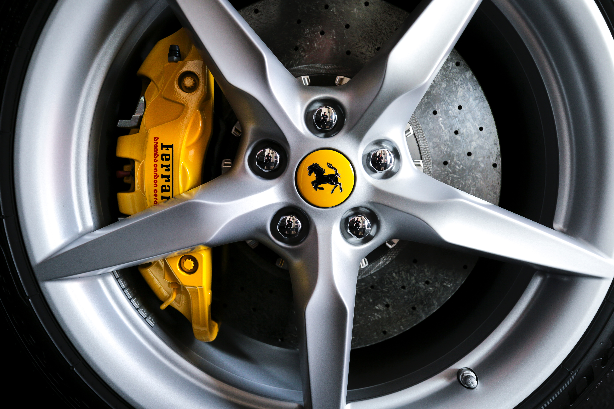

Het Duitse magazine <a href="https://www.auto-motor-und-sport.de/test/sportwagen-im-test-wer-bremst-am-besten/" target="_blank">Auto Motor und Sport</a> onderzocht in 2020 welke sportwagen het kortst stopt nadat deze eerst versnelde naar 100 km/u.

{:data-caption="De remschijf van een Ferrari." width="45%"}

Dit resulteerde in onder andere in deze - **reeds gesorteerde** - gegevens:

| Type sportwagen | Remweg (in m) |
|:--------------------------|:----:|
|Porsche 911 GT3 RS         | 28.2 |
|MCLaren Senna              | 28.5 |
|Porsche 911 GT2 RS         | 29.3 |
|Ferrari 488 Pista          | 29.6 |
|Lamborghini Aventador SVJ  | 29.9 |
|Ferrari 488 GTB            | 30.2 |
|McLaren 720S               | 30.6 |
|Porsche 911 Carrera        | 30.6 |
|Porsche 911 Carrera GTS    | 30.6 |
|Mercedes-AMG GT R Pro      | 30.7 |
{:class="table table-striped table-condensed" style="width:auto;margin-left:auto;margin-right:auto;"}

Hoe bepaalt men de mediaan van de remweg?

In Python zou je dit als volgt aanpakken:

```python
remweg = [28.2, 28.5 ,29.3 ,29.6 ,29.9, 30.2, 30.6, 30.6, 30.6, 30.7]
n = len(remweg)
if n % 2 != 0: # oneven aantal waarnemingen
    mediaan = remweg[( n - 1 ) // 2]
else: # even aantal waarnemingen
    a = remweg[n // 2]
    b = remweg[n // 2 - 1]
    mediaan = ( a + b ) / 2
```

In R kan dit natuurlijk ook:
```R
remweg <- c(28.2, 28.5 ,29.3 ,29.6 ,29.9, 30.2, 30.6, 30.6, 30.6, 30.7)
n <- length(remweg)
if (n %% 2 != 0) { # oneven aantal waarnemingen
  mediaan <- remweg[(n + 1) / 2]
} else { # even aantal waarnemingen
  a <- remweg[n / 2]
  b <- remweg[n / 2 + 1]
  mediaan <- (a + b)/2
}
```

{: .callout.callout-warning}
>#### Opgelet!
>
> Hier zie je een **keuzestructuur** in R. Let op de syntax van de `if-else`-selectie. Opnieuw wordt er gebruik gemaakt van **haakjes** `()` en **accolades** `{}`. De **modulo** operator wordt binnen R geprogrammeer dals `%%`.

## Gegeven

Bovenstaande tabel is maar een selectie uit het volledige onderzoek. Gebruik nu de **volledige dataset** die je inlaadt naar een dataframe via:

```R
data <- read.table("https://tinyurl.com/yf2jjmc8", header = TRUE)
```

Je kan steeds een *voorsmaakje* van de data opvragen via `head(data)`, dit resulteert in:

```
                      model remweg
1        Porsche 911 GT3 RS   28.2
2             MCLaren Senna   28.5
3        Porsche 911 GT2 RS   29.3
4         Ferrari 488 Pista   29.6
5 Lamborghini Aventador SVJ   29.9
6           Ferrari 488 GTB   30.2
```

## Gevraagd

Bereken de **mediaan** van de remweg, pas daarvoor bovenstaande voorbeeldcode aan en gebruik de juiste **accessor** `$`. Toon deze mediaan uiteindelijk op het scherm.