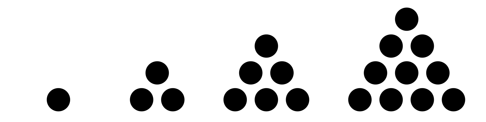
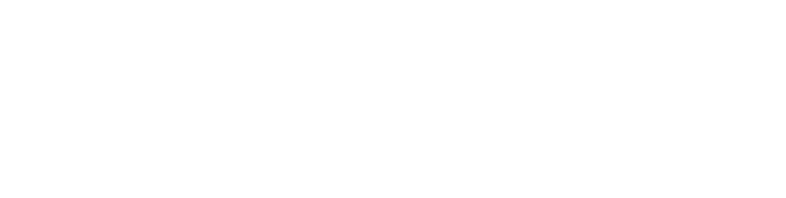

Wiskundig kan men bewijzen dat de som van de omgekeerden van alle driehoeksgetallen gelijk is aan 2, met andere woorden:

$$
\mathsf{ \dfrac{1}{1}+\dfrac{1}{3}+\dfrac{1}{6}+\dfrac{1}{10}+\dfrac{1}{15}+\ldots = 2}
$$

Hierbij zijn 1, 3, 6, 10, ... driehoeksgetallen omdat je ze kan vormen door het aantal cirkels in een driehoek te stapelen.

{:data-caption="Driehoeksgetallen." .light-only width="45%"}

{:data-caption="Driehoeksgetallen." .dark-only width="45%"}

Bovenstaande som kan herschreven worden in de volgende vorm:

$$
\mathsf{ \sum_{n=1}^\infty \dfrac{2}{n\cdot (n+1)}}
$$

## Gevraagd

- Maak een functie `som_driehoek(aantal)` waarbij `aantal` het aantal termen uit de som voorstelt. Zo geldt dat `som_driehoeks(3)` overeenkomt met 

$$
\mathsf{ \dfrac{1}{1}+\dfrac{1}{3} +\dfrac{1}{6}= \dfrac{9}{6} = 1,5}
$$

- Laat R het resultaat van het product afronden op **6 cijfers na de komma**.

#### Voorbeelden

De eerste `3` termen van de som berekenen resulteert in:

```R
> som_driehoek(3)
1.5
```

De eerste `10` termen van de som berekenen resulteert in:

```R
> som_driehoek(10)
1.818182
```
