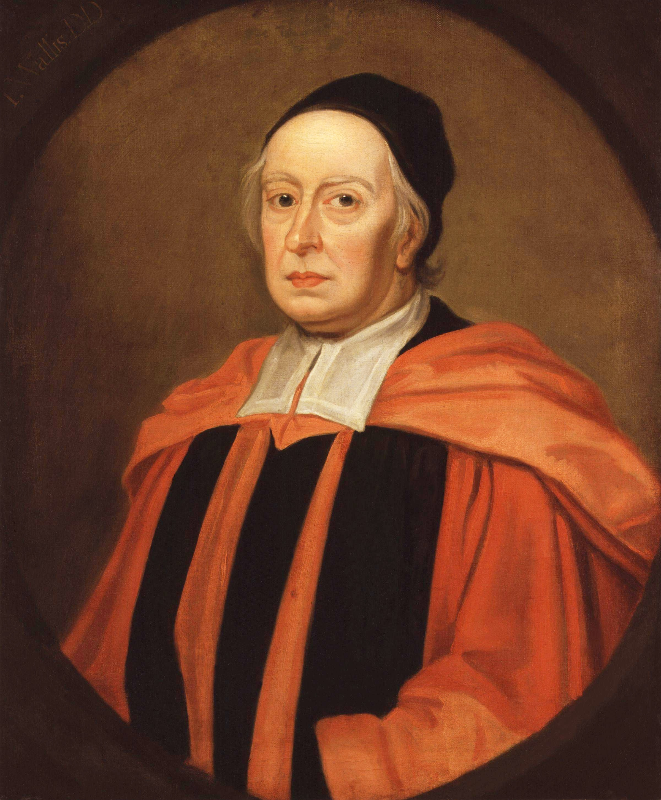

Wiskundige <a href="https://en.wikipedia.org/wiki/John_Wallis" target="_blank">John Wallis</a> vond een iteratieve methode om $$\pi$$ te berekenen, het zogenaamde Wallis-product:

$$
  \dfrac{\pi}{2} = \prod_{n=1}^\infty \dfrac{4n^2}{4n^2-1}
$$

{:data-caption="John Wallis, door Sir Godfrey Kneller." width="33%"}

## Gevraagd

Maak een functie `wallis(aantal)` waarbij `aantal` het aantal factoren in het product voorstelt. Zo geldt dat `wallis(2)` overeenkomt met 

$$
\prod_{n=1}^2 \dfrac{4n^2}{4n^2-1} = \dfrac{4 \cdot 1^2}{4\cdot 1^2 -1} \cdot \dfrac{4\cdot 2^2}{4\cdot 2^2 -1} = \dfrac{4}{3}\cdot \dfrac{16}{15} \approx 1,422\ldots
$$

- Laat R het resultaat van het product afronden op **6 cijfers na de komma**.

- Je kan **controleren** of het resultaat inderdaad $$\dfrac{\pi}{2}$$ benadert. Probeer bijvoorbeeld `wallis(10000)` uit te rekenen en controleer of dit ongeveer gelijk is aan `pi / 2`.

#### Voorbeelden

```R
> wallis(2)
[1] 1.422222
```

```R
> wallis(10)
[1] 1.533852
```

```R
> wallis(100)
[1] 1.566894
```