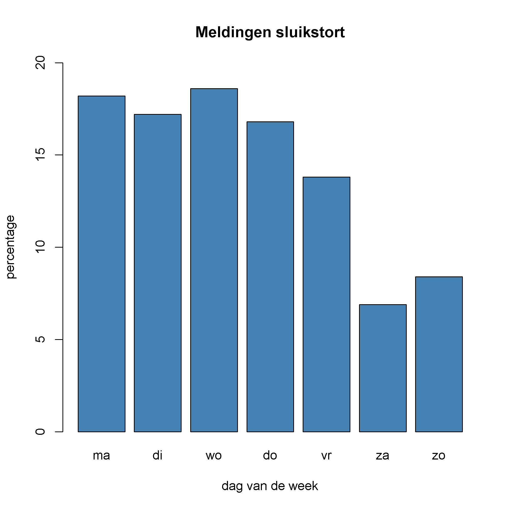

{:data-caption="Zwerfvuil." width="30%"}

## Gegeven

Sluikstorten is een echte plaag. In Gent kan je onder andere via een app een melding maken, want hoe sneller zwerfvuil wordt opgeruimd, hoe minder dit aantrekt. Het overzicht van alle meldingen uit 2023 vind je <a href="https://data.stad.gent/explore/dataset/sluikstort-meldingen-gent-2023/" target="_blank">hier</a>.

Dit inladen in R kan via:

```R
# Benodigde bibliotheken
library('jsonlite')
library('httr')

# Importeert de data van Stad Gent en vormt om
res <- GET("https://data.stad.gent/api/explore/v2.1/catalog/datasets/sluikstort-meldingen-gent-2023/records?select=2023%20as%20jaar%2C%20count(*)%20as%20aantal&group_by=date_format(gemaakt_op%2C%20%27E%27)%20as%20dag%2C%20date_format(gemaakt_op%2C%20%27e%27)%20as%20weekday&order_by=weekday")
data <- fromJSON(rawToChar(res$content))$results
data$weekday <- NULL
```

In de uiteindelijke dataframe vind je een overzicht met het aantal meldingen per dag. Dit ziet er als volgt uit:

```
  jaar dag aantal
1 2023  ma  10926
2 2023  di  10326
3 2023  wo  11134
4 2023  do  10101
5 2023  vr   8289
6 2023  za   4152
7 2023  zo   5056
```

## Gevraagd

- Hoeveel sluikstortmeldingen waren er in 2023? Bepaal het totale aantal meldingen in de variabele `totaal`.
- Sla in een vector `percentages` op hoeveel procent van de meldingen kwamen op maandag, dinsdag, enz... Rond af op **één cijfer na de komma**.
- Maak onderstaande grafiek na.

{: .callout.callout-info}
>#### Tip
> - Kies zelf <a href="https://r-charts.com/colors/" target="_blank">een kleur</a> en vergeet de titel en labels op de x- en y-as niet.
>
> - Je zal binnen posit Cloud eerst de twee bibliotheken `jsonlite` en `httr` eenmalig moeten installeren. Dit kan door het volgende commando uit te voeren:
> 
>      ```R
install.packages(c("httr", "jsonlite"))
```


{:data-caption="Percentage meldingen sluikstorten 2023." .light-only width="480px"}

{:data-caption="Percentage meldingen sluikstorten 2023." .dark-only width="480px"}

