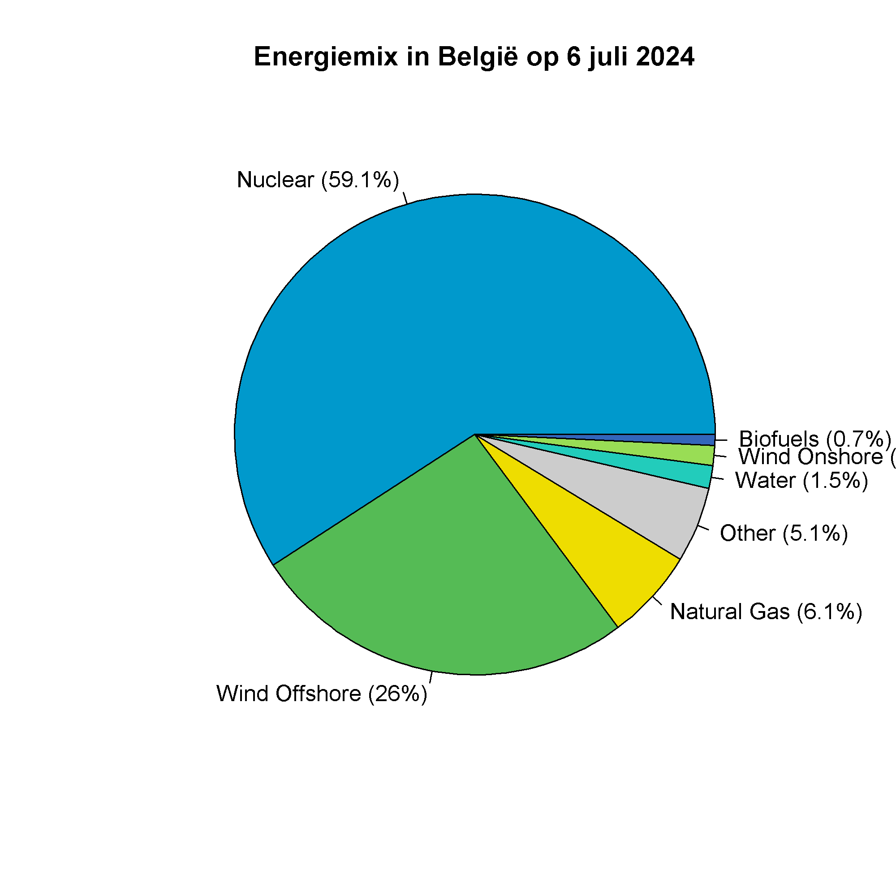

## Gegeven

De beheerder van het Belgische energienetwerk Elia, stelt via zijn <a href="https://opendata.elia.be/explore/dataset/ods177/table/?sort=datetime" target="_blank">Open Data portaal</a> ter beschikking hoeveel stroom er wordt opgewekt per energiebron.

{:data-caption="Koeltorens van een kernreactor." width="40%"}

Dit inladen in R kan via:

```R
# Benodigde bibliotheken
library('jsonlite')
library('httr')

# Data ophalen van Elia
kleuren <- c("Biofuels" = "#3366BB", "Other Fossil Fuels" = "#AA3366", "Other Fuel" = "#BB4466", "Natural Gas" = "#EEDD00", "Nuclear" = "#0099CC", 
             "Solar" = "#EEDD00", "Water" = "#22CCBB", "Wind Offshore" = "#55BB55", "Other" = "#cccccc", "Wind Onshore" = "#99DD55")
res <- GET("https://opendata.elia.be/api/explore/v2.1/catalog/datasets/ods177/records?select=sum(generatedpower)%20as%20power&where=datetime%20%3E%20now(days%3D-7%2C%20hour%3D0%2C%20minute%3D0)%20and%20datetime%20%3C%20now(days%3D-1%2Chour%3D23%2Cminute%3D59)%20and%20generatedpower%20%3E0&group_by=date_format(datetime%2C%20%27YYYY%2FMM%2Fdd%27)%20as%20date%2C%20fueltypepublication%20as%20fuel&order_by=date%20DESC")
data <- fromJSON(rawToChar(res$content))$results
data <- data[order(data$power, decreasing = TRUE), ]
row.names(data) <- NULL
data$color <- kleuren[data$fuel]
```

In de uiteindelijke dataframe vind je heel wat informatie, via `head(data)` bekomt men bijvoorbeeld als voorsmaakje:

```
        date    fuel    power   color
1 2024/07/05 Nuclear 373059.2 #0099CC
2 2024/07/03 Nuclear 372994.0 #0099CC
3 2024/07/02 Nuclear 372374.3 #0099CC
4 2024/07/01 Nuclear 372229.9 #0099CC
5 2024/07/04 Nuclear 368899.1 #0099CC
6 2024/06/30 Nuclear 367297.0 #0099CC
```

De volledige dataframe bevat gegevens van de **laatste zeven dagen**. `fuel` stelt de energiebron voor. `power` bevat de hoeveelheid gegenereerde energie op die dag, uitgedrukt in MW (megawatt). De kolom `color` bevat een hexadecimale kleurcode. R kan die code meteen inlezen.

## Gevraagd

Beantwoord nu onderstaande vragen om uiteindelijk onderstaande grafiek te maken met de energiemix van **gisteren**.

- Maak eerst een **booleaanse vector** `gisteren` aan, waar je nagaat welke gegevens van gisteren afkomstig zijn.

- Bepaal de totale hoeveelheid gegenereerde energie **gisteren**, en sla deze op in de variabele `totaal`.

- Bereken het percentage energie dat elke bron gisteren leverde, sla dit op in de variabele `percentages` en rond af op **één cijfer na de komma**.

- Om straks een duidelijkere grafiek te kunnen maken maak je nu eerst een variabele `energielabels`. Gebruik daarbij de `paste0()` functie zoals in de vorige oefening. (Zie ook onderstaande grafiek)

- Maak nu onderstaand schijfdiagram en gebruik de **booleaanse variabele**  bij *sommige* parameters om enkel de gegevens van gisteren te selecteren.

{:data-caption="Energiemix in België op 6 juli 2024." .light-only width="480px"}

{:data-caption="Energiemix in België op 6 juli 2024." .dark-only width="480px"}