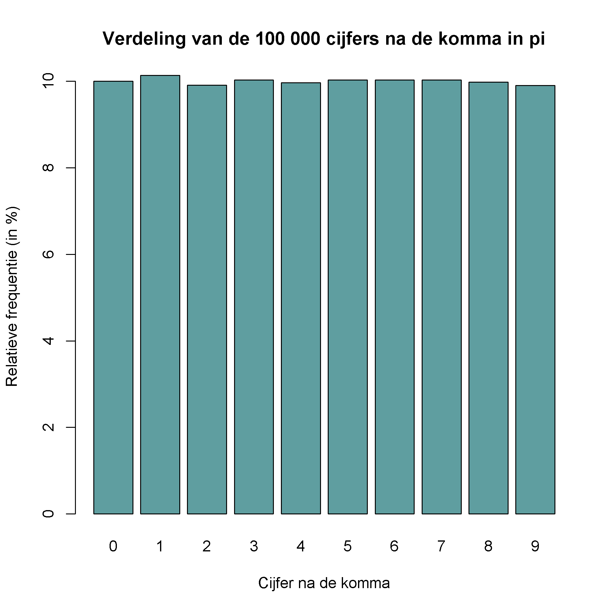

## Gegeven

Het is **nog niet bewezen** wat de verdeling is van de cijfers na de komma in het getal π. Voorlopig **vermoedt** men dat indien je een willekeurig cijfer na de komma kiest er een kans van 1 op 10 is dat dit bijvoorbeeld een 5 is. Zijn de cijfers uit de decimale schrijfwijze van π inderdaad **uniform** (of gelijk) verdeeld?

{:data-caption="Het getal pi..." width="30%"}

Dit kunnen we *empirisch* onderzoeken in R. We laden hiervoor de eerste 100 000 getallen van het cijfer π in. Dat kan via onderstaande code:

```R
# needed library
library(readr)

# downloading 100 000 digits of pi
url <- "https://www.angio.net/pi/digits/100000.txt"
getalpi.raw <- readr::read_file(url)

# splitting string into single characters
getalpi <- data.frame(strsplit(getalpi.raw, "")[1])
# removing the "." i.e. 2nd row
getalpi <- data.frame(getalpi[-c(1,2),])
data <- as.data.frame(table(getalpi[,1], dnn = list("cijfer")), responseName = "aantal")
```

In de dataframe `data` vind je nu de frequentie van de getallen na de komma. Via `head(data)` bekomen we:

```
  cijfer aantal
1      0   9999
2      1  10137
3      2   9908
4      3  10025
5      4   9971
6      5  10026
```

## Gevraagd


- Hoeveel getallen na de komma werden hier opgehaald? Sla dit op in de variabele `aantal_cijfers`.

- Maak nu een nieuwe vector `relatieve_frequentie` waar je de relatieve frequenties in opslaat. Denk hierbij aan hoeveel procent van de cijfers een `0`, `1`, `2`, ... is. Rond af op 2 cijfers na de komma.

- Maak vervolgens onderstaand staafdiagram.


{: .callout.callout-info}
>#### Tip
> Je zal binnen posit Cloud eerst de bibliotheek `readr` eenmalig moeten installeren. Dit kan door het volgende commando uit te voeren:
> 
>  ```R
install.packages("readr")
```


{:data-caption="Verdeling van de eerste 100 000 cijfers van π." .light-only width="480px"}

{:data-caption="Verdeling van de eerste 100 000 cijfers van π." .dark-only width="480px"}