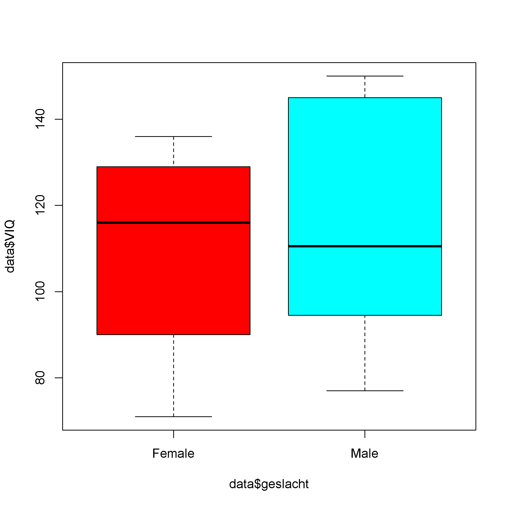
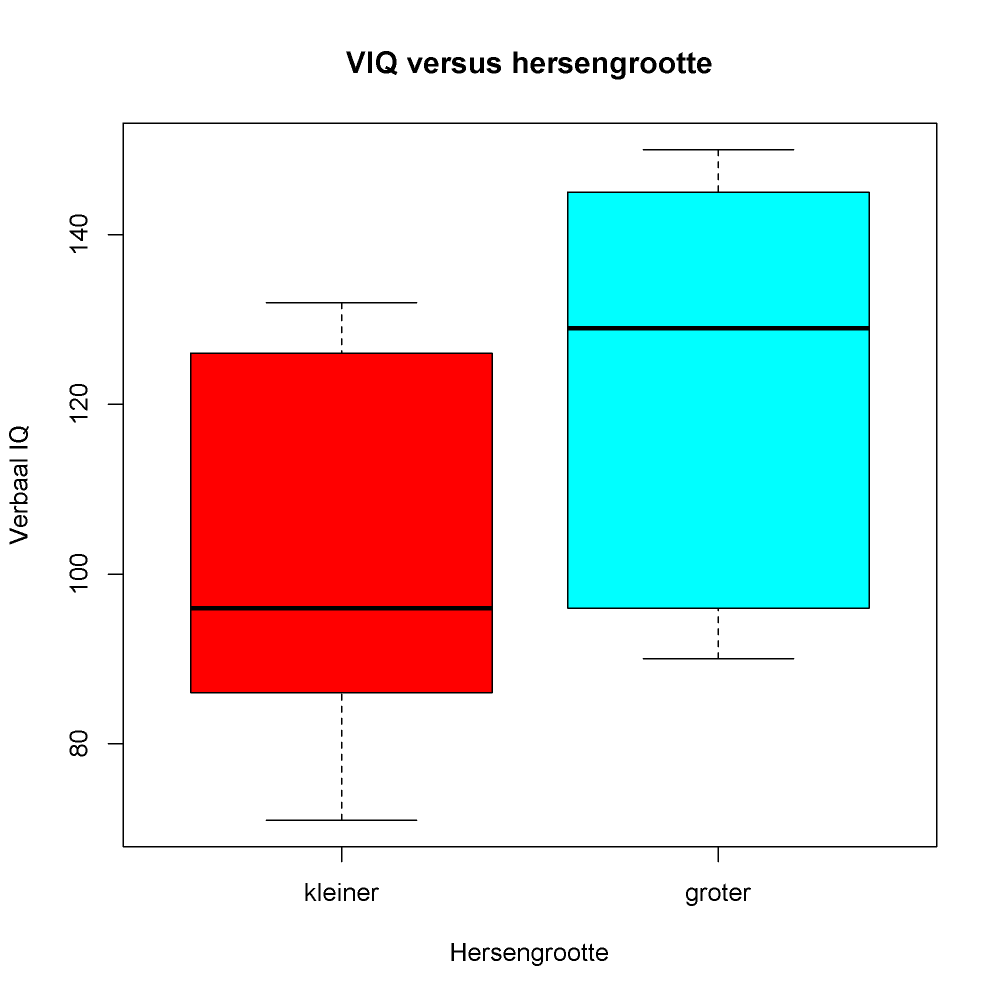

## Gegeven

Is er een verband tussen hersengrootte en IQ? Wetenschapper Willerman voerde in 1991 een <a href="http://bcs.whfreeman.com/WebPub/Statistics/shared_resources/EESEE/BrainSize/index.html" target="_blank">onderzoek</a> uit en bepaalde van verschillende proefpersonen het IQ en de hersengrootte met behulp van MRI scans.

{:data-caption="Foto door Robina Weermeijer op Unsplash." width="45%"}

Je kan de resultaten van het onderzoek inladen via onderstaande code:

```R
library(dplyr)  
# Data inlezen
data <- read.csv2("http://bcs.whfreeman.com/WebPub/Statistics/shared_resources/EESEE/BrainSize/Data_Files/BRAINSZE.TXT",
                  sep="\t")
data <- data %>% mutate(across(where(is.character), ~na_if(., ".")))
data <- as.data.frame(data)
data$Weight <- as.numeric(data$Weight)*0.45359237
data$Height <- as.numeric(data$Height)*2.54
colnames(data) <- c("geslacht", "FSIQ", "VIQ", "PIQ", "massa", "lengte", "MRI")
```

In de uiteindelijke dataframe vind je heel wat informatie, via `head(data)` bekomt men bijvoorbeeld als voorsmaakje:

```
  geslacht FSIQ VIQ PIQ    massa  lengte     MRI
1   Female  133 132 124 53.52390 163.830  816932
2     Male  140 150 124       NA 184.150 1001121
3     Male  139 123 150 64.86371 186.182 1038437
4     Male  133 129 128 78.01789 174.752  965353
5   Female  137 132 134 66.67808 165.100  951545
6   Female   99  90 110 66.22449 175.260  928799
```

De kolom `FSIQ` is de volledige uitslag van de 'Wechsler Adult Intelligence Scale', `VIQ` staat voor het verbale IQ (het denken in woorden en het verbale geheugen) en `PIQ` voor het performaal IQ (hoe groot het handelend vermogen is, dit bevat ook de fijne motoriek).

De kolom `MRI` bevat het **totale aantal pixels** van de hersenen dat men heeft geteld op de MRI scans en is dus een maat voor de grootte van de hersenen. De andere kolommen spreken voor zich.

Het is meteen mogelijk een boxplot op te stellen van het verbale IQ via `boxplot(data$VIQ)`. Dit leidt tot:

{:data-caption="Een eenvoudige boxplot." .light-only width="480px"}

{:data-caption="Een eenvoudige boxplot." .dark-only width="480px"}

Maar het is interessanter om groepen te vergelijken. Is het verbaal IQ bijvoorbeeld sterk verschillend voor mannen versus vrouwen? Dat doe je met behulp van het commando: `boxplot(data$VIQ~data$geslacht)`. Dit resulteert in:

{:data-caption="Verbaal IQ, mannen versus vrouwen." .light-only width="480px"}

{:data-caption="Verbaal IQ, mannen versus vrouwen." .dark-only width="480px"}

## Gevraagd

We maken nu een boxplot waarin we de verbale IQ waarden van personen met bovengemiddelde vergelijken met ondergemiddelde hersengrootte.

- Sla de gemiddelde hersengrootte (uit de kolom `MRI`) op in `gemiddeld_MRI`.

- Maak nu een **booleaanse vector** `bovengemiddeld_MRI` waarin je opslaat welke personen een MRI score van meer dan het gemiddelde MRI hebben.

- Maak nu een boxplot via `boxplot(data$VIQ~bovengemiddeld_MRI)`. Je zal merken dat er `FALSE` en `TRUE` verschijnt als namen van de categorieën. Dit kan je aanpassen via het **argument** `names = c("kleiner", "groter")`. Pas ook de titels aan op de verschillende assen en kies een **vector** met <a href="https://r-charts.com/colors/" target="_blank">kleuren</a> voor het argument `col`.

{:data-caption="Uiteindelijke boxplot." .light-only width="480px"}

{:data-caption="Uiteindelijke boxplot." .dark-only width="480px"}