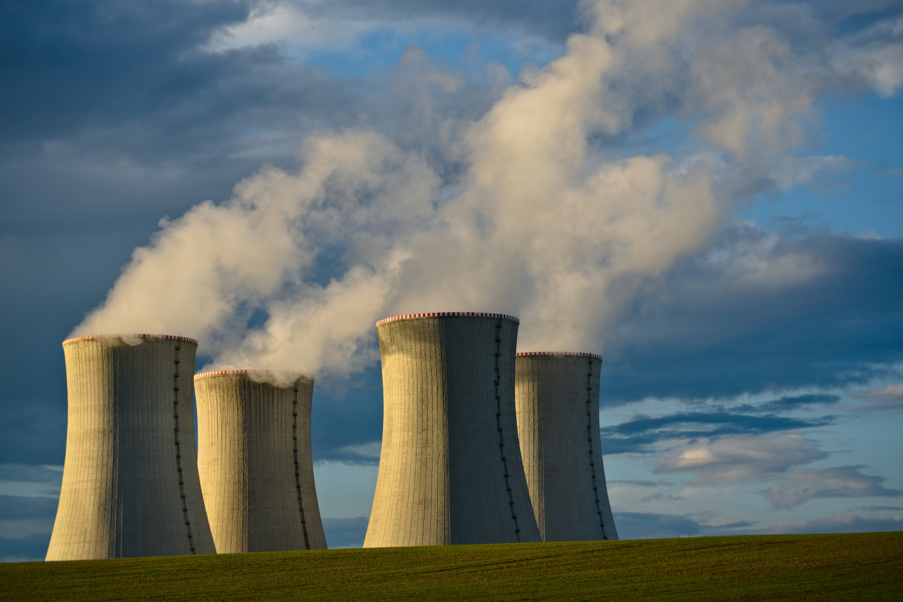
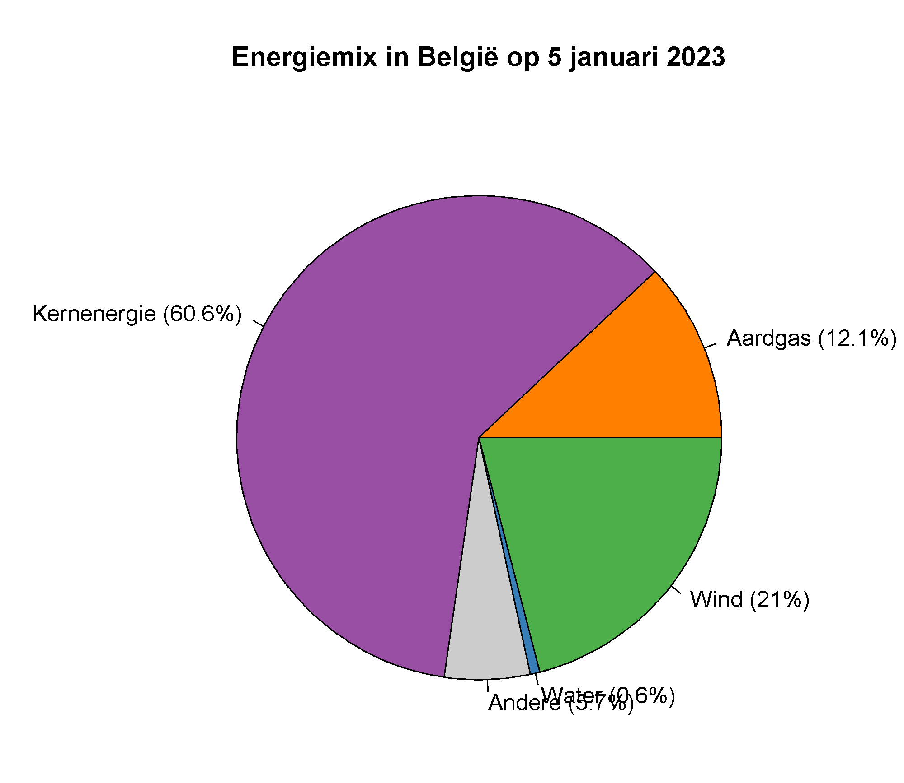
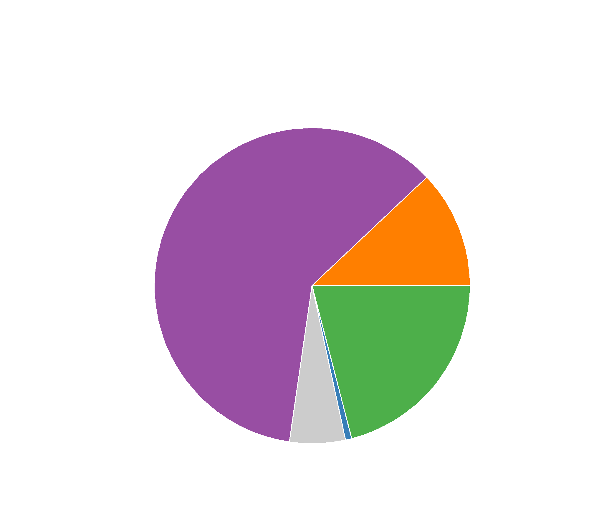

## Gegeven

De beheerder van het Belgische energienetwerk Elia, stelt via zijn <a href="https://opendata.elia.be/explore/dataset/ods033/table/?sort=datetime" target="_blank">Open Data portaal</a> ter beschikking hoeveel stroom er wordt opgewekt per energiebron.

{:data-caption="Koeltorens van een kernreactor." width="40%"}

Dit inladen in R kan via:

```R
# Benodigde bibliotheken
library('jsonlite')
library('httr')

# Data ophalen van Elia
bronnen <- c(CP = "Kolen", LF = "Aardolie", NG = "Aardgas", NU = "Kernenergie", SO = "Zon", WA = "Water", WI = "Wind", Other = "Andere")
kleuren <- c(CP = "#a65628", LF = "#e41a1c", NG = "#ff7f00", NU = "#984ea3", SO = "#ffff33", WA = "#377eb8", WI = "#4daf4a", Other = "#cccccc")
res <- GET("https://opendata.elia.be/api/explore/v2.1/catalog/datasets/ods033/records?select=sum(generatedpower)%20as%20generatedpower&where=datetime%20%3E%20now(hour%3D0%2Cminute%3D0)&group_by=date_format(datetime%2C%20%27YYYY%2FMM%2Fdd%27)%20as%20date%2C%20fuelcode&order_by=date%20DESC&limit=20")
data <- fromJSON(rawToChar(res$content))$results
data$bron <- bronnen[data$fuelcode]
data$kleurcode <- kleuren[data$fuelcode]
```

In de uiteindelijke dataframe vind je heel wat informatie, via `head(data)` bekomt men bijvoorbeeld als voorsmaakje:

```
        date fuelcode generatedpower        bron kleurcode
1 2024/01/06       CP          0.000       Kolen   #a65628
2 2024/01/06       LF          0.000    Aardolie   #e41a1c
3 2024/01/06       NG      15807.790     Aardgas   #ff7f00
4 2024/01/06       NU      79416.539 Kernenergie   #984ea3
5 2024/01/06    Other       7468.365      Andere   #cccccc
6 2024/01/06       WA        819.939       Water   #377eb8
```

`fuelcode` is een afkorting van de energiebron, zo staat `CP` voor *Coal Pulverized*. De vertaling vind je reeds in de kolom `data$bron`. `generatedpower` bevat de hoeveelheid gegenereerde energie op die dag, uitgedrukt in MW (megawatt). De kolom `kleurcode` bevat een hexadecimale kleurcode. R kan dat meteen inlezen.

## Gevraagd

Beantwoord nu onderstaande vragen om uiteindelijk onderstaande grafiek te maken met de energiemix van **gisteren**.

- Bepaal de totale hoeveelheid gegenereerde energie en sla deze op in de variabele `totaal`.
- Bereken het percentage energie dat elke bron gisteren leverde, sla dit op in de variabele `percentages` en rond af op **één cijfer na de komma**.
- Om straks een duidelijkere grafiek te kunnen maken maak je nu eerst een variabele `energielabels`. Gebruik daarbij de `paste0()` functie zoals in de vorige oefening. (Zie ook onderstaande grafiek)
- Niet alle energiebronnen worden op een dag aangesproken, zo gaat men niet snel kolen gaan verbranden omwille van de uitstoot. Maak een **booleaanse** variabele `niet_nul` waarin je opslaat welke energiebronnen gisteren **wel degelijk** energie produceerden.
- Maak nu onderstaand schijfdiagram en gebruik de booleaanse variabele bij elke parameter enkel diegene te selecteren die wel degelijk een bijdrage leveren.

{:data-caption="Energiemix in België op 5 januari 2023." .light-only width="480px"}

{:data-caption="Energiemix in België op 5 januari 2023." .dark-only width="480px"}