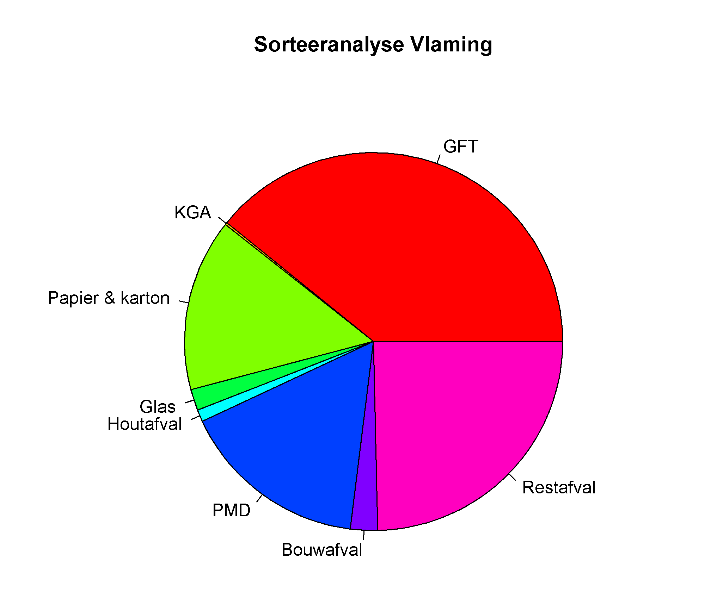
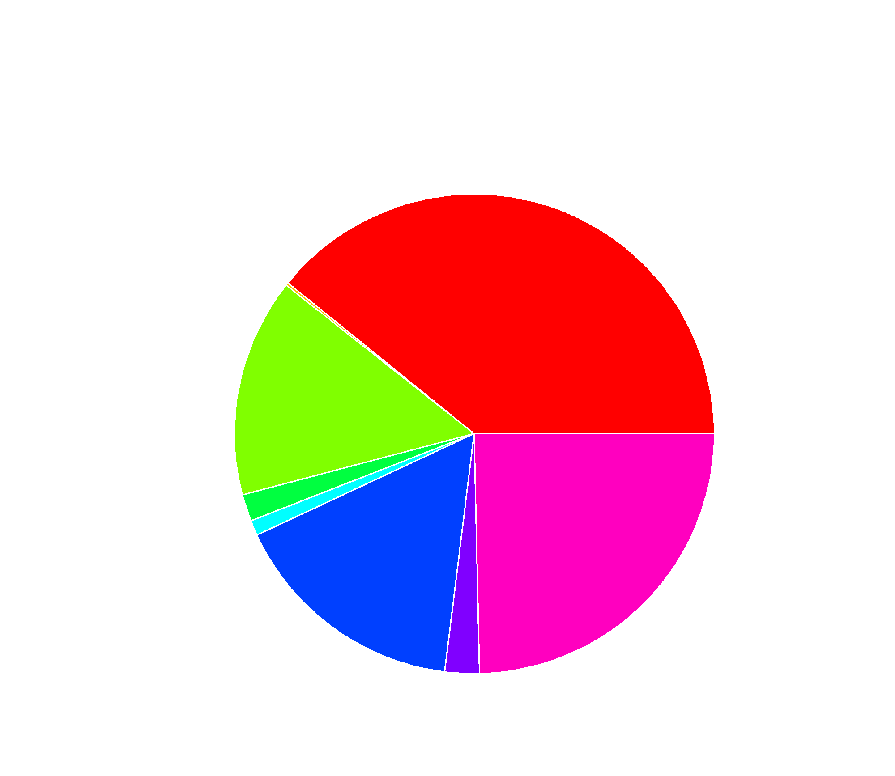

## Gegeven

In 2019-2020 liet Vlaanderen een onderzoek uitvoeren naar het sorteergedrag bij huisvuil. In <a href="https://publicaties.vlaanderen.be/view-file/49047" target="_blank">dit rapport</a> lezen we dat in 2020 elke inwoner uit een stedelijke gemeente gemiddeld 118,15 kg aan de deur plaatste of naar het containerpark bracht.

Onderstaande tabel bevat een benadering van het aantal kg per inwoner per jaar:

| Fractie           | Aantal kg |
|-------------------|:---------:|
| GFT               | 46,26     |
| KGA               | 0,23      | 
| Papier & karton   | 17,43     |
| Glas              | 2,14      |
| Houtafval         | 1,22      |
| PMD               | 19        |
| Bouwafval         | 2,75      |
{:class="table table-striped table-condensed" style="width:auto;margin-left:auto;margin-right:auto;"}

## Gevraagd

- Sla in de variabele `restafval` op hoeveel kg er nog resteert. Gebruik hierbij de functie `sum()` en de informatie die je reeds krijgt. 
- Voeg deze variabele vervolgens toe aan de vector `afval` via `afval <- c(afval, restafval)`.
- Maak een gelijkaardig schijfdiagram van deze gegevens.

{: .callout.callout-info}
>#### Tip
> Je hoeft niet zelf voor elke categorie een kleur te kiezen, maar je kan het argument `col` gelijkstellen aan `rainbow(length(afval))` om een kleurrijke grafiek te bekomen.

{:data-caption="Afvalanalyse 2020." .light-only width="480px"}

{:data-caption="Afvalanalyse 2020." .dark-only width="480px"}
