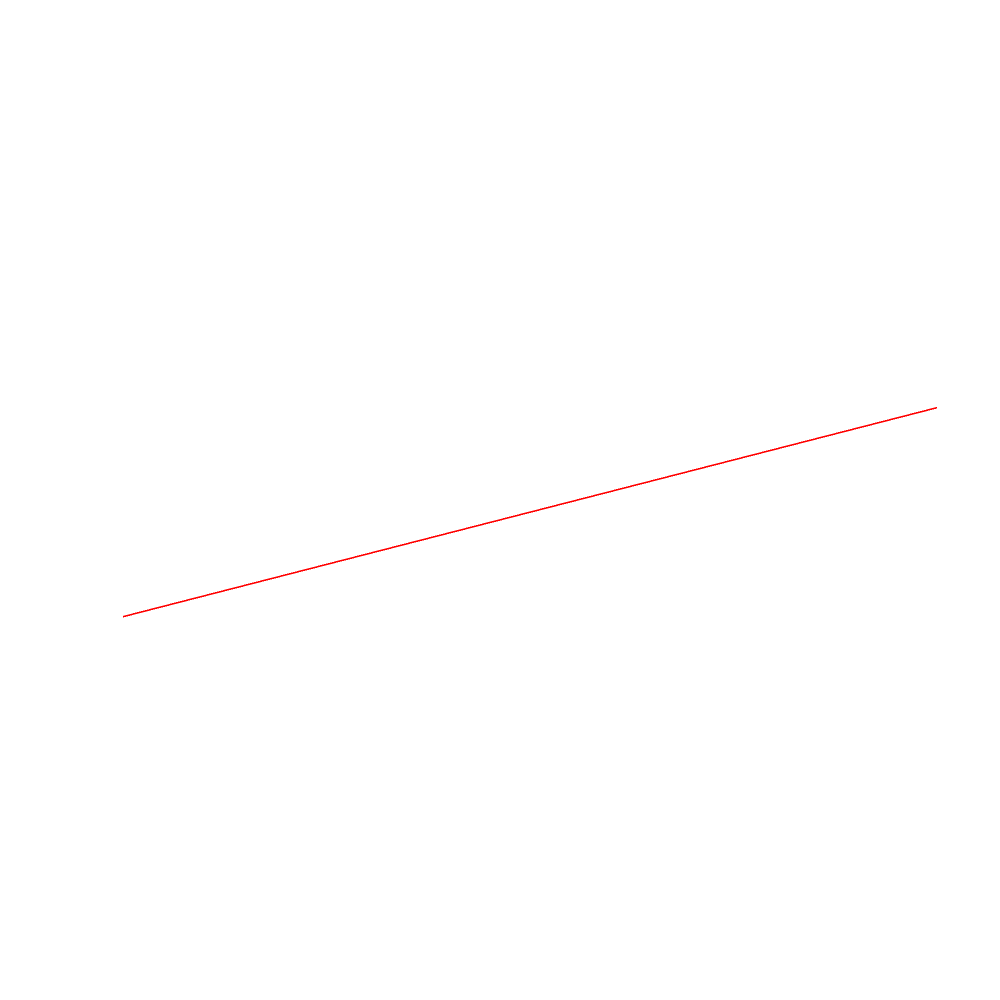

## Gegeven

Misschien ken je wel de <a href="https://www.vivino.com/BE/nl/" target="_blank">Vivino</a> smartphone-app. Deze app laat je toe wijnen te beoordelen en na een eindje krijg je suggesties van wijnen die bij je smaakvoorkeuren passen.

{:data-caption="De Vivino app in werking." width="45%"}

De goede werking van deze app steunt op een gigantische dataset, waarbij van zo goed als alle wijnen heel wat karakterstieken worden bijgehouden. In dit <a href="https://www.semanticscholar.org/paper/Modeling-wine-preferences-by-data-mining-from-Cortez-Cerdeira/bf15a0ccc14ac1deb5cea570c870389c16be019c" target="_blank">onderzoek</a> uit 2009 ging men van heel wat wijnen allerlei gegevens opmeten, wat uiteindelijk in onderstaande dataset resulteerde.

```R
# Data inlezen
data <- read.csv2("https://raw.githubusercontent.com/shrikant-temburwar/Wine-Quality-Dataset/master/winequality-red.csv",
                  sep=";", dec=".",
                  colClasses=c(rep("NULL", 4), "numeric", rep("NULL", 2),rep("numeric", 5)))
```

In de uiteindelijke dataframe vind je heel wat informatie, via `head(data)` bekomt men bijvoorbeeld als voorsmaakje:

```
  chlorides density   pH sulphates alcohol quality
1     0.076  0.9978 3.51      0.56     9.4       5
2     0.098  0.9968 3.20      0.68     9.8       5
3     0.092  0.9970 3.26      0.65     9.8       5
4     0.075  0.9980 3.16      0.58     9.8       6
5     0.076  0.9978 3.51      0.56     9.4       5
6     0.075  0.9978 3.51      0.56     9.4       5
```

De kolommen `chlorides` en `sulphates` bevat de hoeveelheid natrium chloride en hoeveel sulfaten men in de wijn terug vond. De **dichtheid** staat in de kolom `density`, uitgedrukt in gram per milliliter. Tot slot is zijn er nog de kolommen `pH` met de **zuurtegraad**, `alcohol` met het **alcoholpercentage** en de **kwaliteit** die wijn toegekend kreeg.

## Gevraagd

We onderzoeken of je de zuurtegraad van goede wijnen goed kan voorspellen met behulp van het alcoholpercentage. Zijn wijnen met een hoger alcoholpercentage ook zuurder? Of net niet?

- Bepaal de mediaan van de kwaliteit in de variabele `mediaan`.

- Maak vervolgens een **booleaanse vector** waarin je de wijnen bewaart die een kwaliteit toegekend kregen van meer dan de mediaan. Bewaar deze in de vector `goede_wijnen`.

- Gebruik deze booleaanse vector om onderstaand spreidingsdiagram aan te maken. Verzorg de titels en de labels op de assen.

{:data-caption="Verband tussen alcoholpercentage en zuurtegraad." .light-only width="480px"}

{:data-caption="Verband tussen alcoholpercentage en zuurtegraad." .dark-only width="480px"}