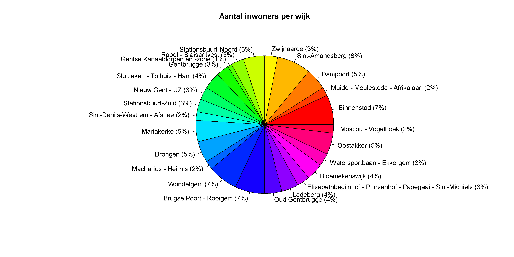
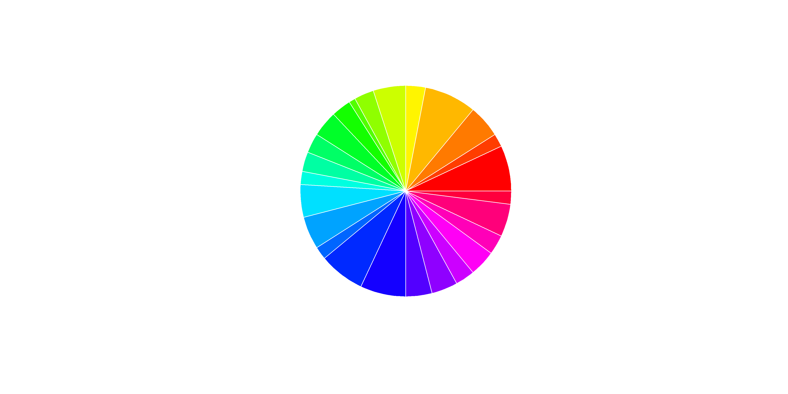

## Gegeven
Gent bestaat uit 25 wijken, je kan opvragen in welke wijk je woont via <a href="https://stad.gent/nl/stadsplan" target="_blank">het stadsplan</a>.

Via het <a href="https://data.stad.gent/explore/dataset/bevolkingsaantal-per-wijk-per-jaar-gent/table" target="_blank">Open Data Portaal</a> van Stad Gent kan het aantal inwoners van Gent opvragen per jaar, per wijk.

De volgende code vraagt deze aantallen op.
```R
# Importeert de data van Stad Gent
data <- read.csv2("https://data.stad.gent/api/explore/v2.1/catalog/datasets/bevolkingsaantal-per-wijk-per-jaar-gent/exports/csv",
                  sep = ";",
                  colClasses = c(rep("NULL", 5), "numeric", "character", "NULL","character", rep("NULL", 2)) )
colnames(data) <- c("jaar", "aantal", "wijk")
data$aantal <- as.integer(data$aantal)
data <- data[order(data$jaar),]
rownames(data) <- seq_len(nrow(data))
```

Het resultaat is een dataframe van de vorm:

```
  jaar aantal                                                       wijk
1 2000   4862                            Muide - Meulestede - Afrikalaan
2 2000   3658                               Gentse Kanaaldorpen en -zone
3 2000   7387                                            Nieuw Gent - UZ
4 2000   7430                                         Stationsbuurt-Zuid
5 2000   6096 Elisabethbegijnhof - Prinsenhof - Papegaai - Sint-Michiels
6 2000   7293                                       Rabot - Blaisantvest
```

## Gevraagd

Maak onderstaand taartdiagram met de bevolkingscijfers van het laatste jaar, gebruik hiervoor de volgende richtlijnen.

- Maak een **booleaanse** vector `laatste` aan, waarin je opslaat welke rijen van het jaar 2023 zijn.
- Bereken het totaal aantal inwonders van 2023 in de variabele `totaal`.
- Maak een vector `percentages` aan, waarin je berekent het relatieve aandeel van elke wijk berekent. Rond af op een geheel.
- Maak met behulp van de `paste0()` functie een vector `labels`, die voor elke wijk het percentage bevat `Binnenstad (7%)`.

- Maak nu onderstaand taartdiagram, gebruik hierbij `col = rainbow(25)` om 25 kleuren te genereren.

{:data-caption="Bevolkingsaantal Gent per wijk." .light-only width="960px"}

{:data-caption="Bevolkingsaantal Gent per wijk." .dark-only width="960px"}
