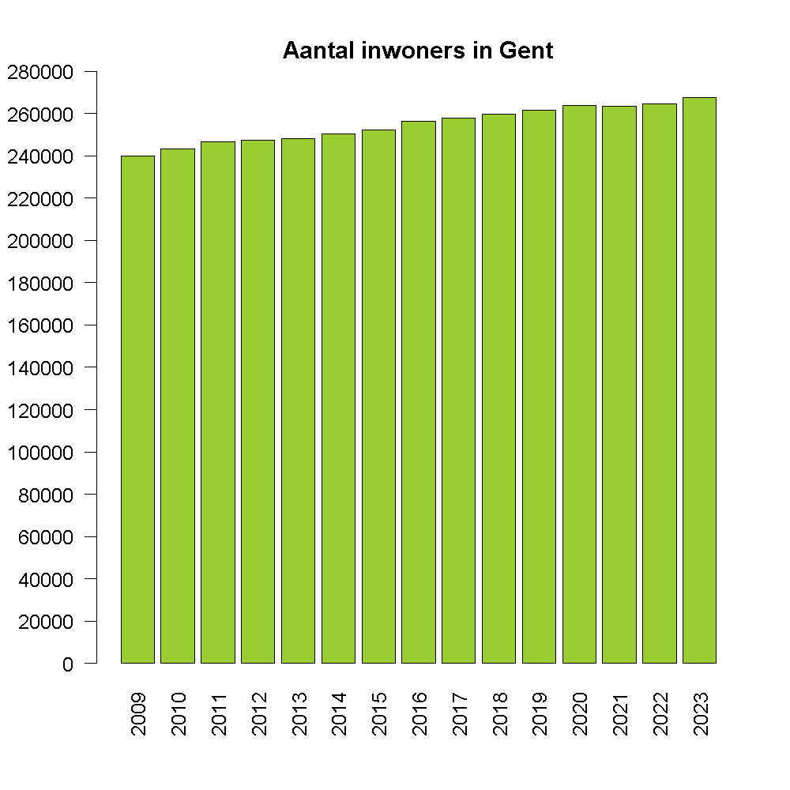

## Gegeven
Via het <a href="https://data.stad.gent/explore/dataset/bevolkingsaantal-per-jaar-gent/table/?sort=-period" target="_blank">Open Data Portaal</a> van Stad Gent kan het aantal inwoners van Gent opvragen per jaar.

De volgende code vraagt deze aantallen op.
```R
# Importeert de data van Stad Gent
data <- read.csv2("https://data.stad.gent/api/explore/v2.1/catalog/datasets/bevolkingsaantal-per-jaar-gent/exports/csv",
                  sep = ";",
                  colClasses = c(rep("NULL", 5), "numeric", "character") )
colnames(data) <- c("jaar", "aantal")
data$aantal <- as.integer(data$aantal)
data <- data[order(data$jaar),]
rownames(data) <- seq_len(nrow(data))
```

Het resultaat is een dataframe van de vorm:

```
  jaar aantal
1 2000 224042
2 2001 224424
3 2002 225956
4 2003 227848
5 2004 229137
6 2005 230723
```

## Gevraagd

Maak onderstaand staafdiagram met de bevolkingscijfers van de laatste 15 jaar na, gebruik hiervoor de volgende richtlijnen.

- Maak een **booleaanse** vector `laatste_15` aan, waarin je opslaat wat de laatste 15 jaren zijn. (De gegevens van dit jaar zijn nog niet beschikbaar)
- Maak het staafdiagram, kies zelf een kleur uit deze <a href="https://r-charts.com/colors/" target="_blank">website</a>. Om de y-as juist onder te verdelen gebruik je het argument `yaxp = c(0, 280000, 14)`. Gebruik ook `las = 2` om de labels op de x-as te draaien.

{:data-caption="Bevolkingsaantal Gent." .light-only width="480px"}

{:data-caption="Bevolkingsaantal Gent." .dark-only width="480px"}
