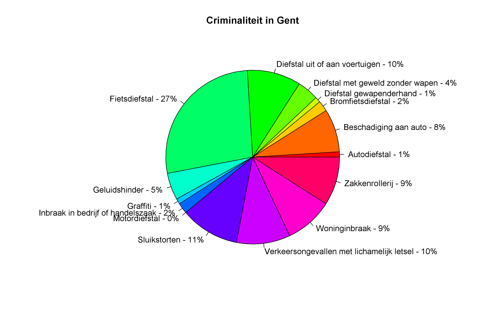
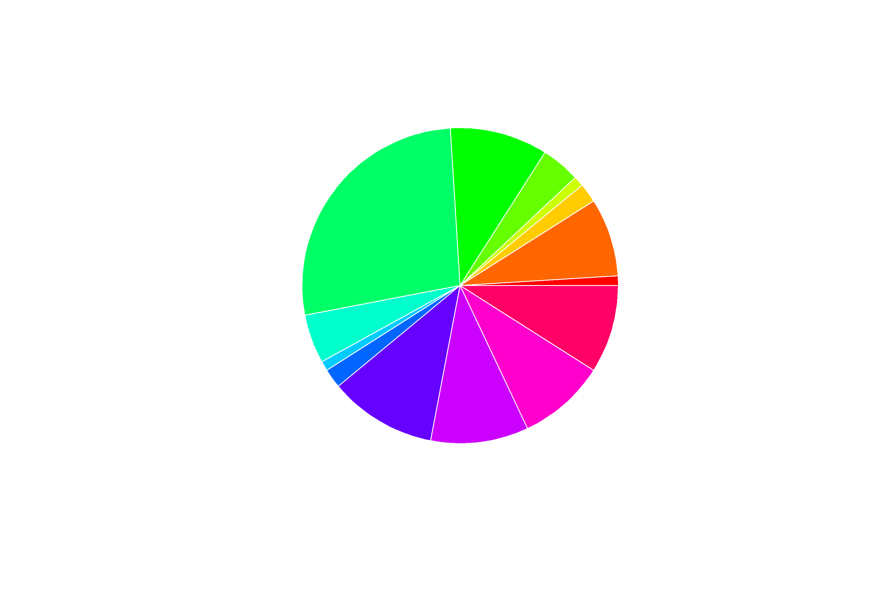

<div class="text-end">
    <a class="btn btn-filled with-icon" href="https://dodona.be/nl/courses/2690" target="_blank"><i class="mdi mdi-backburger mdi-24" title="link"></i>Link naar de vorige oefeningen</a>
</div>

## Gegeven
Via het <a href="https://data.stad.gent/explore/dataset/criminaliteitscijfers-per-wijk-per-maand-gent-2023/table" target="_blank">Open Data Portaal</a> van Stad Gent kan men de criminaliteitscijfers van 2023, per maand, per wijk opvragen.

De volgende code vraagt deze aantallen op.
```R
# Benodigde bibliotheken
library('jsonlite')
library('httr')

# Importeert de data van Stad Gent en vormt om
res <- GET("https://data.stad.gent/api/explore/v2.1/catalog/datasets/criminaliteitscijfers-per-wijk-per-maand-gent-2023/records?select=sum(total)&group_by=fact_category")
data <- fromJSON(rawToChar(res$content))$results
colnames(data) <- c("categorie","aantal")
```

Het resultaat is een dataframe, met per categorie, het aantal incidenten.

```
                         categorie aantal
1                     Autodiefstal     59
2            Beschadiging aan auto    639
3                Bromfietsdiefstal    172
4          Diefstal gewapenderhand     56
5 Diefstal met geweld zonder wapen    330
6   Diefstal uit of aan voertuigen    759
```

## Gevraagd

Maak onderstaand taartdiagram met de criminaliteitscijfers per categorie, gebruik hiervoor de volgende richtlijnen.

- Veruit de grootste categorie is `Parkeerovertredingen`. We sluiten deze categorie uit van onze analyse. Maak een **booleaanse** vector `misdrijven` waarin je opslaat welke rijen **niet** van de categorie `Parkeerovertredingen` zijn.
- Bereken het totaal aantal misdrijven (**zonder** de parkeerovertredingen) in de variabele `totaal`.
- Maak een vector `percentages` aan, waarin je berekent het relatieve aandeel van elke categorie berekent. Rond af op een geheel.
- Maak met behulp van de `paste0()` functie een vector `labels`, die voor elke categorie het percentage bevat. Deze zijn van de vorm: `Autodiefstal - 1%`.
- Maak nu onderstaand taartdiagram, gebruik hierbij `col = rainbow(15)` om verschillende kleuren te genereren.

{:data-caption="Criminaliteit in Gent." .light-only width="720px"}

{:data-caption="Criminaliteit in Gent." .dark-only width="720px"}
