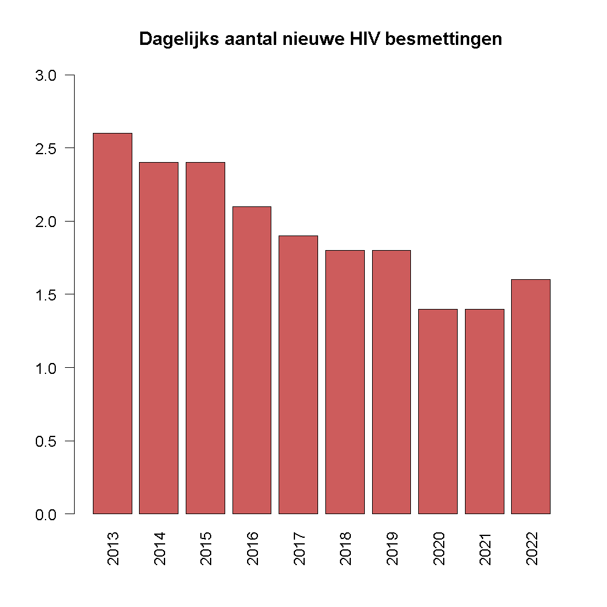

## Gegeven
HIV blijft ook in België slachtoffers maken. HIV of **humaan immunodeficiëntievirus** is een snel muterend virus dat verantwoordelijk is voor **aids**, een ziekte die het immuunsysteem zodanig verzwakt dat zich levensbedreigende infecties en bepaalde vormen van kanker kunnen ontwikkelen. Zonder behandeling wordt de gemiddelde overlevingstijd na infectie met HIV geschat op 9 tot 11 jaar.

{:data-caption="Foto door Tomfiqu Barbhuiya op Pexels." width="40%"}

Sciensano volgt de gegevens op en publiceert jaarlijks het aantal nieuwe infecties op healthybelgium.be. Via onderstaande kan je de laatste gegevens ophalen.

```R
read.csv2("https://tinyurl.com/376hakzy")
```

Het resultaat is een dataframe. Via `head(data)` kan je dit inkijken.

```
  jaar new_AIDS new_HIV
1 1986       71     729
2 1987      121     895
3 1988      139     726
4 1989      162     735
5 1990      203     796
6 1991      252     773
```

## Gevraagd

Maak onderstaand staafdiagram met het gemiddeld aantal besmettingen per dag gedurende de laatste 10 jaar na, gebruik hiervoor de volgende richtlijnen.

- De kolom `new_HIV` bevat het aantal nieuwe HIV infecties per jaar. Reken dit om naar het aantal besmettingen per dag in een variabele `dagelijks`. Gebruik voor één jaar 365,25 dagen (om te compenseren voor eventuele schrikkeljaren) en **rond af** op 1 cijfer na de komma.
- Maak een **booleaanse** vector `laatste_10` aan, waarin je opslaat wat de laatste 10 jaren zijn.
- Maak nu onderstaand staafdiagram, kies zelf een kleur.

{:data-caption="Gemiddeld aantal besmettingen per dag." .light-only width="480px"}

{:data-caption="Gemiddeld aantal besmettingen per dag." .dark-only width="480px"}

{: .callout.callout-info}
>#### Ter info
> In 2022 werden elke dag gemiddeld gesproken 1,6 nieuwe HIV infecties vastgesteld... Het virus is dus zeker niet verdwenen.