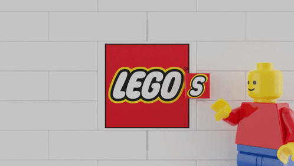
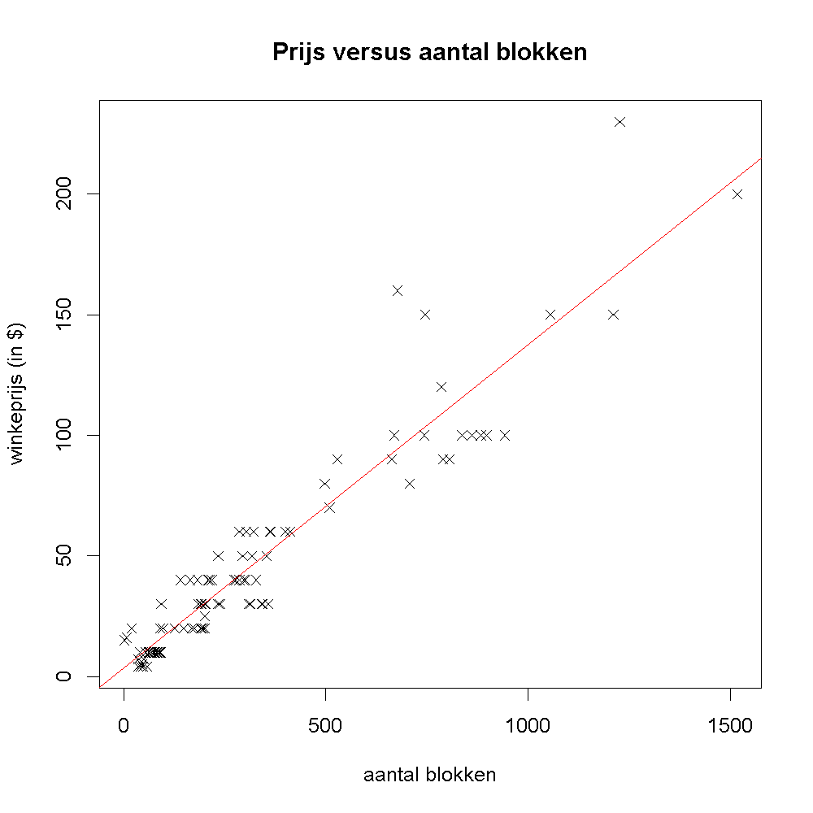
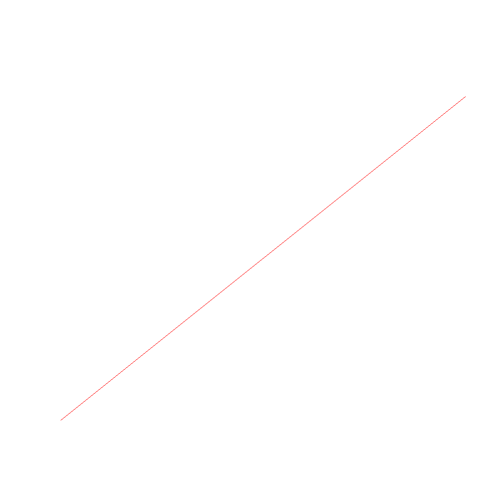

<div class="text-end">
    <a class="btn btn-filled with-icon" href="https://dodona.be/nl/courses/2690" target="_blank"><i class="mdi mdi-backburger mdi-24" title="link"></i>Link naar de vorige oefeningen</a>
</div>

## Gegeven

Via <a href="https://rebrickable.com/" target="_blank">Rebrickable</a> kan je de waarde van je oude Lego blokken inschatten. Achter de website zit een databank met alle sets die LEGO ooit heeft in de markt gezet.

{:data-caption="LEGO." width="450px"}

Via onderstaande code kan je de sets die LEGO heeft uitgebracht tussen 2018 en 2020 ophalen. 
```R
# Importeert de data
data <- read.csv2("https://www.openintro.org/data/csv/lego_population.csv",
                  sep = ",")
data <- data[,c(2,3,4,5,7,8)]
data$price <- as.numeric(data$price)
data <- data[complete.cases(data),]
```

via `head(data)` krijgen we een (beperkt) overzicht van deze gegevens:

```
                  set_name   theme pieces price year    ages
1    Extra Dots - Series 2    DOTS    109  3.99 2020 Ages_6+
2    Extra Dots - Series 1    DOTS    109  3.99 2020 Ages_6+
3     Creative Blue Bricks Classic     52  4.99 2020 Ages_4+
4    Creative Green Bricks Classic     60  4.99 2020 Ages_4+
5   Funky Animals Bracelet    DOTS     33  4.99 2020 Ages_6+
6 Sparkly Unicorn Bracelet    DOTS     33  4.99 2020 Ages_6+
```

Je vindt er de naam van de set, `theme` stelt het thema voor, `pieces` het aantal stukken in een doos, `price` de verkoopprijs (in $), `year` het jaar van uitgave en `ages` de doelgroep.

## Gevraagd

In welke mate voorspelt het aantal stukken de verkoopprijs?

- Analyseer hiervoor enkel de LEGO sets uit het *thema* `City`. Maak een **booleaanse** vector `thema_city` aan, waarin je bewaart welke sets dit *thema* hadden.
- Maak het volgende spreidingsdiagram en kies ook voor een ander symbool. Voeg ook een best passende rechte toe.

{:data-caption="Verband tussen kostprijs en aantal stukken." .light-only width="480px"}

{:data-caption="Verband tussen kostprijs en aantal stukken." .dark-only width="480px"}
