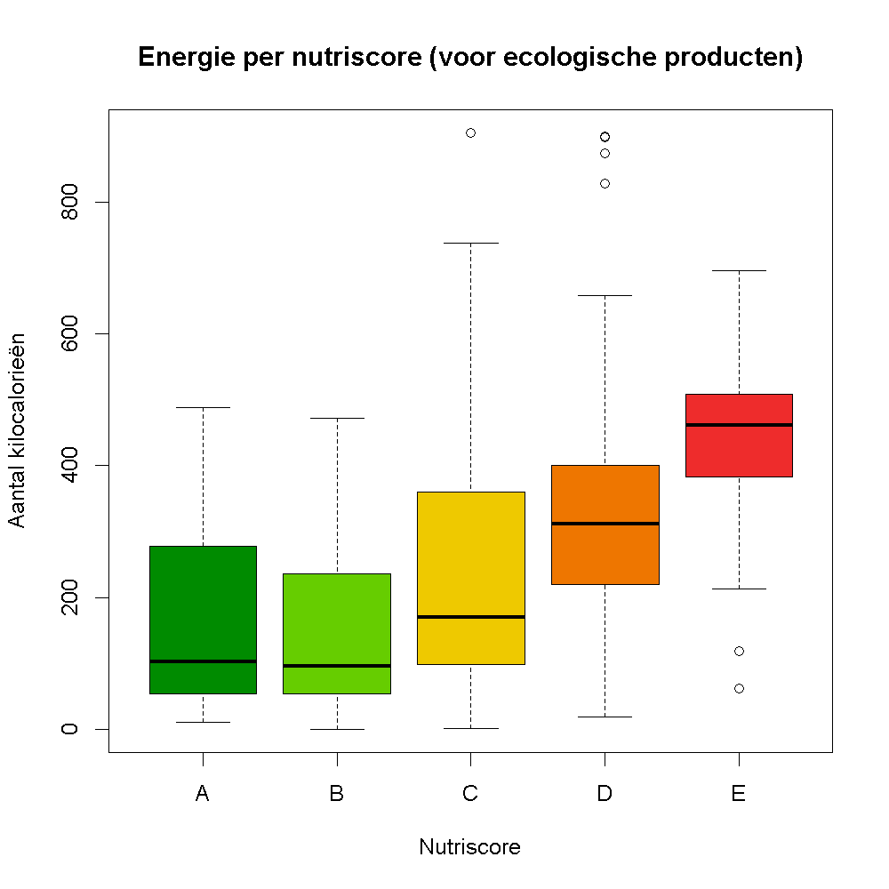

## Gegeven

<a href="https://be.openfoodfacts.org/" target="_blank">Open Food Facts</a> is een gratis, online en crowdsourced database van voedingsmiddelen van over de hele wereld. Net zoals Wikipedia kan iedereen er informatie over voeding aan toevoegen. Het resultaat is ondertussen een gigantische databank met een schat aan informatie. Er bestaat bijvoorbeeld een <a href="https://play.google.com/store/apps/details?id=org.openfoodfacts.scanner&hl=nl" target="_blank">smartphone app</a> en na het scannen van een barcode krijg je informatie over hoe gezond het product is.

{:data-caption="Open Food Facts." width="40%"}

Voor deze oefening gebruiken we geen live-query meer, maar een momentopname van de gegevens. 
Via onderstaande code kan je deze momentopname inlezen. De data bevat informatie over producten die verkocht worden in Belgische afdelingen van Delhaize.

```R
# Importeert de data uit de GitHub-repo en vormt die om
data <- read.csv2(
  "https://raw.githubusercontent.com/RobbeW/Data_Statistiek_R/main/bronnen/openfood_belgium_delhaize.csv",
  sep = ",",
  dec = "."
)

colnames(data) <- c("update", "naam", "nutriscore", "nutri", "nova", "ecoscore", "eco",
                    "kcal", "vet", "verz_vet", "koolhydr", "suiker", "vezels", "eiwit", "zout")

# Datumstring (met tijd) omzetten naar datum
data$update <- as.Date(data$update, format = "%Y-%m-%dT%H:%M:%SZ")

# Nutriscore- en ecoscore-letters in hoofdletters
data$nutri <- toupper(data$nutri)
data$eco   <- toupper(data$eco)
```

via `head(data)` krijgen we een (beperkt) overzicht van deze gegevens:

```
      update                             naam nutriscore nutri nova ecoscore eco kcal vet verz_vet koolhydr suiker vezels eiwit zout
1 2025-11-27              Ananas in Scheiben         -2     A    1       77   A 53.00   0    0.00    14.04  12.28    0.9  0.40 0.00
2 2025-09-30 Monte ananas scheiben in saft          -3     A    1       72   B 59.00   0    0.00    14.00   9.80    0.2  0.40 0.00
3 2025-07-21                                      2     B    4       86   A 60.00   0    0.00    15.00  11.00    0.8  0.40 0.05
4 2025-03-31                   Aprikosenhälften         2     B    4       82   A 60.00   0    0.00    14.00  12.00    0.6  0.40 0.07
5 2025-04-01                    Piña en rodajas        -2     A    1       76   A 63.00   0    0.00    14.00  12.00    0.6  0.40 0.00

```

Er hoort wat extra informatie bij deze gegevens. De kolom `update` geeft aan wannneer de gegevens laatst werden aangepast. `nutriscore` bevat een beoordeling over de *gezondheid* van het product. De kolom `nutri` geeft een beoordeling van A (gezond) tot E (ongezond). `ecoscore` bevat een beoordeling over de ecologische impact van het product (zowel qua verpakking als bijvoorbeeld transport). De kolom `eco` zet dit om in een beoordeling A (zeer goed) tot E (zeer slecht). De kolom `nova` geeft aan hoe bewerkt het voedsel is, van 1 (minimaal bewerkt) tot 4 (ultrabewerkt). 

De andere kolommen bevatten voedingsinformatie. `kcal` bevat het aantal kilocalorieën per 100g. `vet` en `verz_vet` het aantal gram vetten en verzadidge vetzuren per 100g. Analoog voor de kolommen koolhydraten (`koolhydr`), `suiker`, `vezels`, `eiwit` en `zout`.

## Gevraagd

Bevatten ongezondere producten ook meer kilocalorieën (dus meer energie)?

- We beschouwen in onze analyse **enkel** producten met een ecoscore `A` of `B`. Maak dus een **booleaanse** vector `ecologisch` aan, waarin je opslaat welke producten deze ecoscore hebben. Tip: *of* programmeer je in R met behulp van `|`.
- Maak onderstaande boxplot (enkel van de ecologische producten!) en gebruik als kleuren `green4`, `chartreuse3`, `gold2`, `darkorange2` en `firebrick2`

{:data-caption="Energie per nutriscore." .light-only width="480px"}

{:data-caption="Energie per nutriscore." .dark-only width="480px"}
