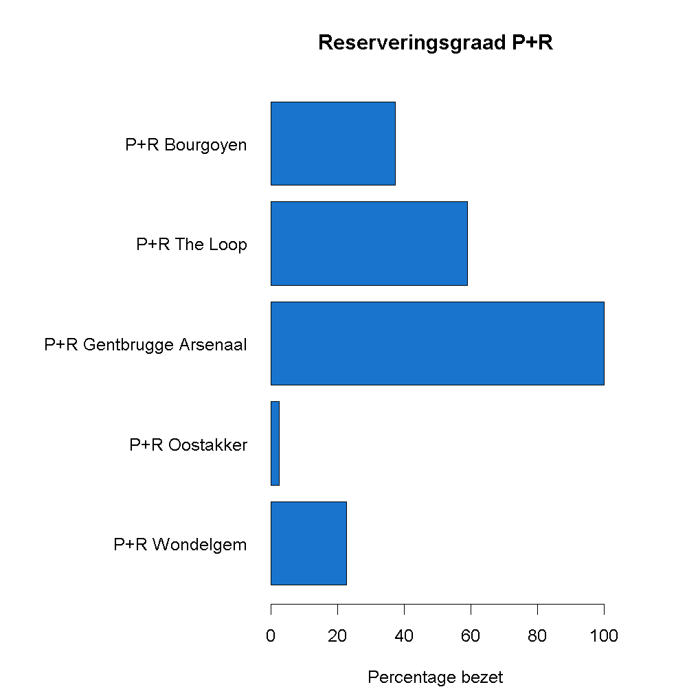

## Gegeven
Gent probeert het verkeer buiten de stad te houden en voorziet hiervoor in verschillende 'Park and Ride' zones. Via het <a href="https://data.stad.gent/explore/dataset/real-time-bezetting-pr-gent/information/" target="_blank">Open Data Portaal</a> van Stad Gent kan je realtime de bezetting opvragen.

{:data-caption="Park and ride 'The Loop'." width="40%"}

De volgende code vraagt de bezetting op.
```R
# Importeert de data van Stad Gent
data <- read.csv2("https://data.stad.gent/api/explore/v2.1/catalog/datasets/real-time-bezetting-pr-gent/exports/csv",
                  sep = ";",
                  colClasses = c("character", rep("NULL", 3),"numeric", rep("NULL", 4), rep("numeric", 2), rep("NULL", 7)) )
colnames(data) <- c("naam", "nu_open", "aantal_plaatsen", "beschikbaar")
data$nu_open <- data$nu_open == 1
```

via `head(data)` krijgen we een overzicht van deze gegevens:

```
                     naam nu_open aantal_plaatsen beschikbaar
1           P+R Wondelgem    TRUE              62          16
2 P+R Gentbrugge Arsenaal    TRUE             280           0
3           P+R Bourgoyen    TRUE             255         134
4            P+R The Loop    TRUE             168          16
5           P+R Oostakker    TRUE             201         196
```

## Gevraagd

Maak onderstaand staafdiagram met de reserveringsgraad na, gebruik hiervoor de volgende richtlijnen.

- Maak een vector `reserveringsgraad` aan, waar je het percentage gereserveerde plaatsen berekent. Rond hier af op **1 cijfer na de komma**.
- Maak het staafdiagram, kies zelf een kleur uit dit <a href="http://www.stat.columbia.edu/~tzheng/files/Rcolor.pdf" target="_blank">document</a>. Gebruik enkele extra argumenten om het staafdiagram horizontaal te plaatsen, namelijk `horiz = TRUE` en `las = 1`. Om de linkermarge te vergroten geef je het commando `par(mar = c(4,20,4,4))` in **voordat** je `barplot()` oproept.

{:data-caption="Reserveringsgraad P+R Gent" .light-only width="480px"}

{:data-caption="Reserveringsgraad P+R Gent" .dark-only width="480px"}
