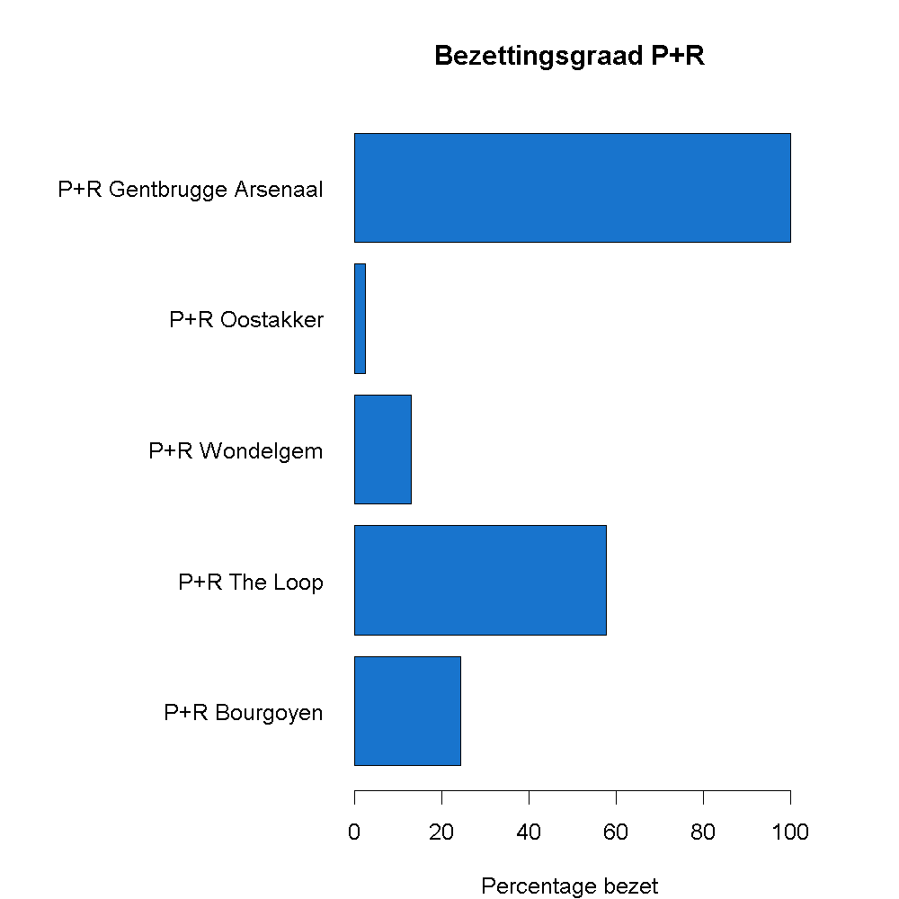

## Gegeven
Gent probeert het verkeer in en rond de stad vlot te houden en voorziet hiervoor in verschillende parkeergarages en park-and-ridezones. Via het <a href="https://data.stad.gent/explore/dataset/bezetting-parkeergarages-real-time/information/" target="_blank">Open Data Portaal</a> van Stad Gent kan je realtime de bezetting van deze parkeergarages opvragen.

{:data-caption="Park and ride 'The Loop'." width="45%"}

De volgende code vraagt de bezetting op.

```r
# Importeert de data van Stad Gent
data <- read.csv2(
  "https://data.stad.gent/api/v2/catalog/datasets/bezetting-parkeergarages-real-time/exports/csv",
  sep = ";",
  dec = ","
)

# Hou enkel de kolommen die we nodig hebben
data <- data[, c("name", "isopennow", "totalcapacity", "availablecapacity")]
colnames(data) <- c("naam", "nu_open", "aantal_plaatsen", "beschikbaar")
data$nu_open <- data$nu_open == 1
```

via `head(data)` krijgen we een overzicht van deze gegevens:

```
          naam    nu_open        aantal_plaatsen beschikbaar
1          Reep   TRUE              460         255
2       Tolhuis   TRUE              150         101
3      The Loop   TRUE             2490        2490
4  Sint-Michiels TRUE              455         258
5   Savaanstraat TRUE              510         371
```

## Gevraagd

Maak onderstaand staafdiagram met de bezettingsgraad na, gebruik hiervoor de volgende richtlijnen.

* Maak een vector bezettingsgraad aan, waar je het percentage bezette plaatsen berekent. Rond hier af op 1 cijfer na de komma.

* Maak het staafdiagram, kies zelf een kleur uit deze <a href="https://r-charts.com/colors/" target="_blank">website</a>. Gebruik enkele extra argumenten om het staafdiagram horizontaal te plaatsen, zoals las = 1. Om de linkermarge te vergroten geef je het commando par(mar = c(4, 13, 4, 4)) in voordat je de grafiek aanmaakt.

{:data-caption="Bezettingsgraad P+R Gent" .light-only width="480px"}

{:data-caption="Bezettingsgraad P+R Gent" .dark-only width="480px"}
