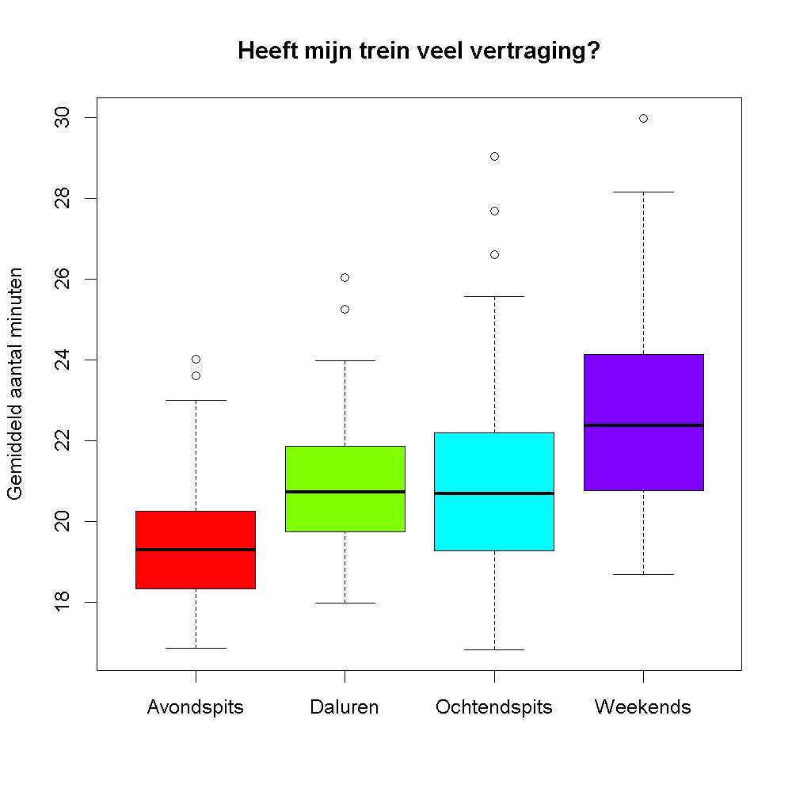

## Gegeven

Begin februari kon je in de <a href="https://www.nieuwsblad.be/cnt/dmf20240209_93685873" target="_blank">krant</a> lezen: *"Stiptheid bij NMBS blijft historisch laag: meer dan 6000 treinen afgeschaft in januari"*. Gelukkig biedt Infrabel een kijkje in hun gegevens via hun <a href="https://opendata.infrabel.be/explore/dataset/nationale-stiptheid-per-moment-en-per-maand" target="_blank">open data portaal</a>.

{:data-caption="Foto door Danny De Vylder op Unsplash." width="45%"}

De volgende code vraagt de bezetting op.
```R
# Importeert de data van Stad Gent
data <- read.csv2("https://opendata.infrabel.be/api/explore/v2.1/catalog/datasets/nationale-stiptheid-per-moment-en-per-maand/exports/csv",
                  sep = ";",
                  colClasses = c(rep("character",2), rep("NULL", 3), rep("numeric", 3), "NULL") )
colnames(data) <- c("maand", "tijdstip", "totaal_trein", "totaal_trein_stipt", "totaal_min")
data$maand <- as.Date(paste0(data$maand,"-01"))
```

via `head(data)` krijgen we een overzicht van deze gegevens:

```
       maand     tijdstip totaal_trein totaal_trein_stipt totaal_min
1 2016-01-01 Ochtendspits        14610              12246      45679
2 2016-01-01   Avondspits        15439              13404      41218
3 2016-02-01     Weekends        18206              17214      23460
4 2016-02-01      Daluren        50472              46293      95695
5 2016-03-01     Weekends        19974              18771      27107
6 2016-04-01   Avondspits        16053              14104      37760
```

`totaal_min` stelt het totale aantal minuten vertraging per maand voor, `totaal_trein` het totale aantal treinen dat reed en `totaal_trein_stipt` het totale aantal treinen dat **zonder** (noemenswaardige) vertraging reed.

## Gevraagd

Indien je tijdens de ochtendspits vertraging hebt, is deze dan gemiddeld gesproken langer of korter dan 's avonds?

Maak onderstaande boxplot met de gemiddelde vertraging.

- Maak een vector `trein_vertraging` aan, waarin je per maand berekent hoeveel treinen er **wel** (noemenswaardige) vertraging hadden.
- Je kan nu gaan *inschatten* hoeveel minuten deze treinen gemiddelde gesproken te laat kwamen. Je kent immers het totale aantal minuten vertraging. Sla dit op in de variabele `minuten_vertraging` en rond af op 2 cijfers na de komma.

- Maak onderstaande boxplot en gebruik `rainbow(4)` als kleur.

{:data-caption="Gemiddeld aantal minuten vertraging per tijdstip." .light-only width="480px"}

{:data-caption="Gemiddeld aantal minuten vertraging per tijdstip." .dark-only width="480px"}
