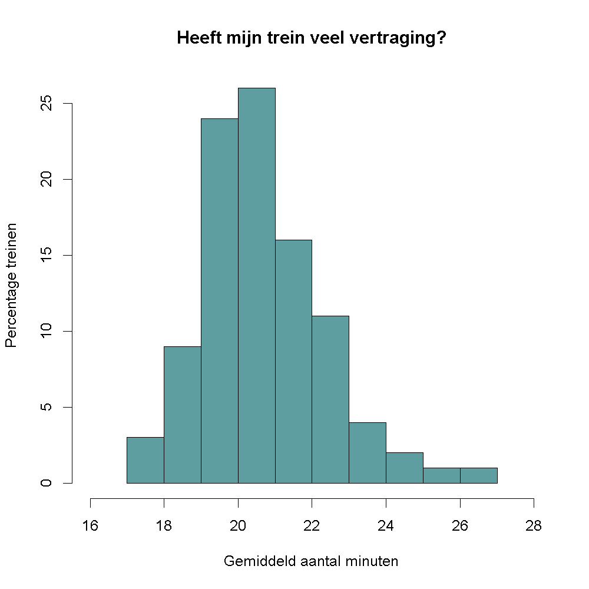
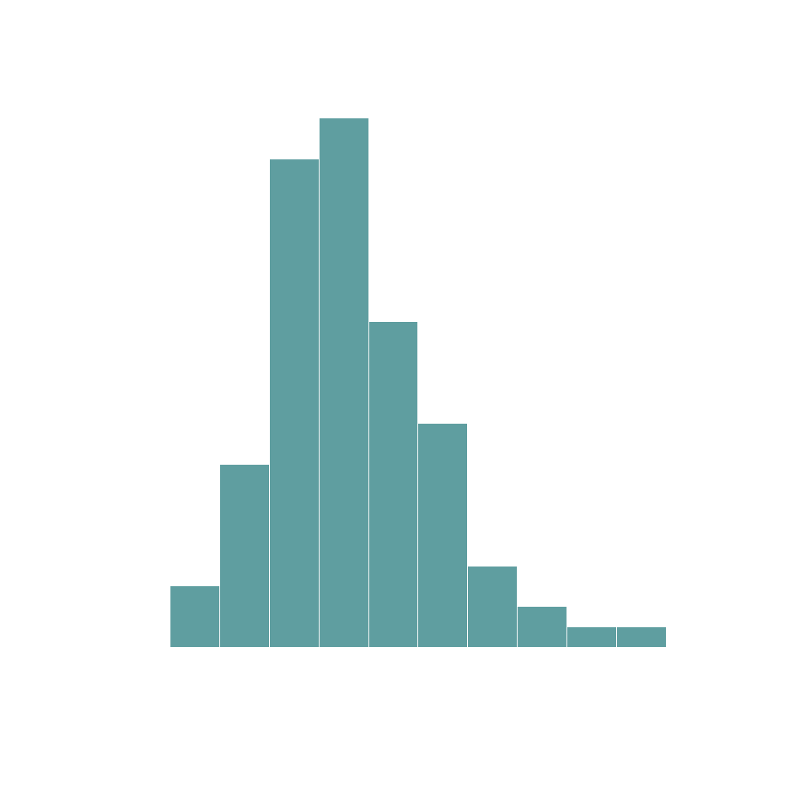

<div class="text-end">
    <a class="btn btn-filled with-icon" href="https://dodona.be/nl/courses/2690" target="_blank"><i class="mdi mdi-backburger mdi-24" title="link"></i>Link naar de vorige oefeningen</a>
</div>

## Gegeven

Begin februari kon je in de <a href="https://www.nieuwsblad.be/cnt/dmf20240209_93685873" target="_blank">krant</a> lezen: *"Stiptheid bij NMBS blijft historisch laag: meer dan 6000 treinen afgeschaft in januari"*. Gelukkig biedt Infrabel een kijkje in hun gegevens via hun <a href="https://opendata.infrabel.be/explore/dataset/nationale-stiptheid-per-moment-en-per-maand" target="_blank">open data portaal</a>.

{:data-caption="Foto door Danny De Vylder op Unsplash." width="45%"}

De volgende code vraagt de bezetting op.
```R
# Benodigde bibliotheken
library('jsonlite')
library('httr')

# Importeert de data van Infrabel
res <- GET("https://opendata.infrabel.be/api/explore/v2.1/catalog/datasets/nationale-stiptheid-per-moment-en-per-maand/records?select=sum(min_rt)%20as%20totaal_min%2Csum(tel)%20as%20totaal_trein%2Csum(reg)%20as%20totaal_trein_stipt&group_by=maand")
data <- fromJSON(rawToChar(res$content))$results
data$maand <- as.Date(data$maand)
```

via `head(data)` krijgen we een overzicht van deze gegevens:

```
       maand totaal_min totaal_trein totaal_trein_stipt
1 2016-01-01     212787       100033              89899
2 2016-02-01     203292       102233              92905
3 2016-03-01     209805       104678              94993
4 2016-04-01     195684        99369              89996
5 2016-05-01     210082        91478              81611
6 2016-06-01     261317        96715              84004
```

`totaal_min` stelt het totale aantal minuten vertraging per maand voor, `totaal_trein` het totale aantal treinen dat reed en `totaal_trein_stipt` het totale aantal treinen dat **zonder** (noemenswaardige) vertraging reed.

## Gevraagd

Maak onderstaand histogram met de gemiddelde vertraging.

- Maak een vector `trein_vertraging` aan, waarin je per maand berekent hoeveel treinen er **wel** (noemenswaardige) vertraging hadden.
- Je kan nu gaan *inschatten* hoeveel minuten deze treinen gemiddelde gesproken te laat kwamen. Je kent immers het totale aantal minuten vertraging. Sla dit op in de variabele `minuten_vertraging` en rond af op 2 cijfers na de komma.
- Om de grenswaarden van het histogram te bepalen maak je twee variabelen `xmin` en `xmax`. In `xmin` bewaar je de kleinste waarde van dit gemiddeld aantal minuten vertraging. Rond hierbij naar beneden af via `floor()`. Doe hetzelfde voor `xmax`, maar rond daarbij naar boven af via `ceiling()`.
- Maak het histogram, kies zelf een kleur uit deze <a href="https://r-charts.com/colors/" target="_blank">website</a>. Gebruik `xlim = c(xmin - 1, xmax + 1)` om voldoende marge te hebben op de x-as.

{:data-caption="Gemiddeld aantal minuten vertraging." .light-only width="480px"}

{:data-caption="Gemiddeld aantal minuten vertraging." .dark-only width="480px"}
