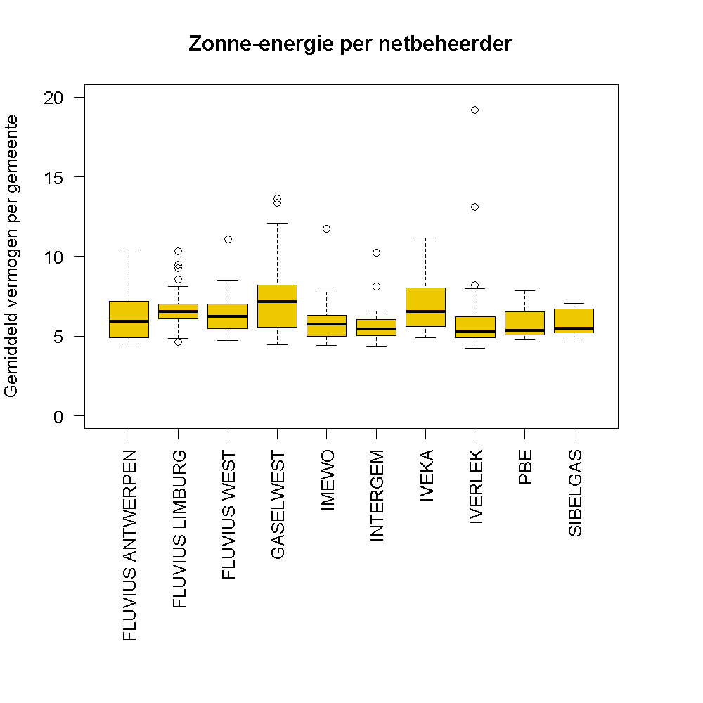

## Gegeven
Fluvius houdt het vermogen en het aantal lokale productie-installaties bij per gemeente en publiceert deze data op <a href="https://opendata.fluvius.be/explore/dataset/1_33-lp-open-data-fluvius/information/" target="_blank">het open data portaal</a>. 

{:data-caption="Lokale zonne-energie." width="45%"}

Via onderstaande code kan je deze gegevens ophalen

```R
# Importeert de data van Fluvius
data <- read.csv2("https://data.opendatasoft.com/api/explore/v2.1/catalog/datasets/1_33-lp-open-data-fluvius@fluvius/exports/csv",
                  sep = ";",
                  colClasses = c("NULL", rep("character", 3), "numeric", "character") )
colnames(data) <- c("netbeheerder", "gemeente", "technologie", "aantal", "vermogen")
data <- data[data$netbeheerder != "Niet toegewezen" & data$gemeente != "Niet toegewezen",]
data$vermogen <- as.numeric(data$vermogen)
rownames(data) <- seq_len(nrow(data))
```

Het resultaat is onderstaande dataframe. Hier merken we bijvoorbeeld dat er in Antwerpen 20061 installaties van zonnepanelen zijn, met een totaal **vermogen** van 141367.1 kVA (kilo voltampère). Deze getallen door elkaar delen betekent dat een lokale productie in Antwerpen een gemiddeld vermogen van 7,05 kVA heeft.

```
       netbeheerder   gemeente         technologie aantal vermogen
1 FLUVIUS ANTWERPEN AARTSELAAR        BRANDSTOFCEL      5     15.5
2 FLUVIUS ANTWERPEN  ANTWERPEN     NOODGROEP TYPE2      2    940.0
3 FLUVIUS ANTWERPEN  ANTWERPEN         WINDENERGIE     25 107150.0
4 FLUVIUS ANTWERPEN  ANTWERPEN WKK BIOMASSA/BIOGAS      2  13232.0
5 FLUVIUS ANTWERPEN  ANTWERPEN       ZONNE-ENERGIE  20061 141367.1
6 FLUVIUS ANTWERPEN   BORSBEEK         WKK AARDGAS      2   3120.0
```

## Gevraagd

Is er een groot verschil tussen deze gemiddelde vermogens per netbeheerder? Of met andere woorden, plaatst men in de provincie Antwerpen (waar vooral Fluvius Antwerpen actief is) gemiddeld gesproken meer zonnenpanelen per installatie?

- Maak variabele `gemiddeld_vermogen` waar je voor alle technologieën het gemiddeld vermogen per individuele installatie berekent. **Rond** dit **af** op 2 cijfers na de komma.
- Maak een **booleaanse** vector `zon` waar je enkel de installaties met zonne-energie in opslaat.

- Maak nu onderstaand boxplots, gebruik hierbij `par(mar=c(13,4,4,4))` om extra ruimte te creëren onderaan de grafiek. Kies zelf voor een andere kleur voor de grafiek.

{:data-caption="Gemiddeld vermogen zonne-energie per netbeheerder." .light-only width="480px"}

{:data-caption="Gemiddeld vermogen zonne-energie per netbeheerder." .dark-only width="480px"}

{: .callout.callout-info}
>#### Ter info
> In Gent is IMEWO de distributienetbeheerder.