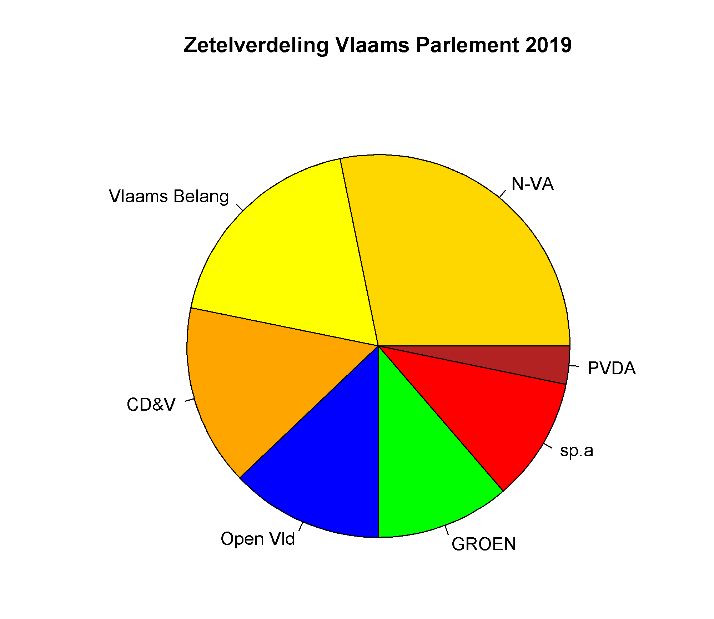

## Gegeven

Het is misschien duidelijker de zetelverdeling van het Vlaams Parlement uit 2019 als een schijfdiagram weer te geven. Dit laat de verhoudingen ten opzichte van elkaar beter zien.

## Gevraagd

Kopieer je vorige code en voer nu de volgende instructies uit:

- Gebruik daarvoor in plaats van de functie `barplot()` gewoon de functie `pie()`. (een schijfdiagram wordt ook wel een taartdiagram genoemd)
- Er is natuurlijk **geen label** nodig voor de y-as. Het argument `names.arg` vervang je nu door `labels`. Het commando `las = 2` kan je gewoon weglaten.

{:data-caption="Zetelverdeling Vlaams Parlement 2019" .light-only width="480px"}

{:data-caption="Zetelverdeling Vlaams Parlement 2019" .dark-only width="480px"}